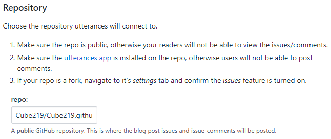
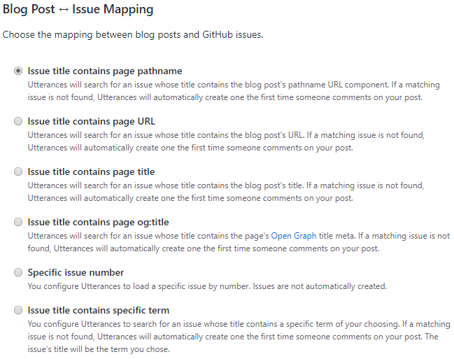
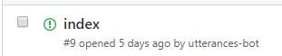
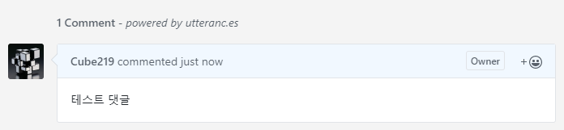
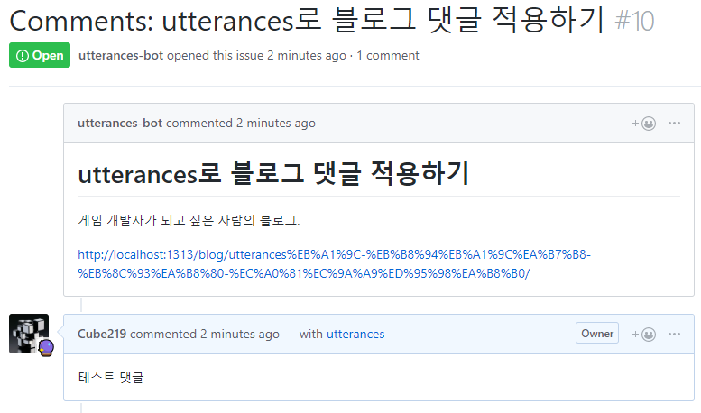

+++
banner = "images/cover.png"
categories = ["Blog", "2019"]
date = "2019-06-06"
description = ""
images = []
menu = ""
tags = []
title = "utterances로 블로그 댓글 적용하기"
slug = "apply-blog-comments-with-utterances"
+++

이 블로그는 [Hugo](https://gohugo.io/)라는 정적 웹 페이지 생성기로 만들었는데,  정적 웹 페이지인 경우 서버에 있는 데이터를 실시간으로 수정하지 않기 때문에 댓글 기능을 구현하기가 힘들다. 그래서 이러한 댓글 기능을 추가하는 여러 서비스들이 있다.  이 테마에서는 [disqus](https://disqus.com/)하고 [staticman](https://staticman.net/)을 지원해서 한 번 적용시켜봤는데, 둘 다 만족스럽지가 않았다.

-----

### Disqus의 경우

* **장점**
  1. 구현하기가 쉽다. (Hugo의 경우 기본적으로 지원) 
* **단점**
  1. disqus 계정에 가입을 해야 댓글을 달 수 있다.

### Staticman의 경우

* **장점**
  1. 댓글의 내용이 자동으로 서버에 저장된다.
  2. 따로 계정을 만들 필요가 없다.
* **단점**
  1. 서버에 저장하고 배포하는 과정이 필요해서 댓글을 다는데 시간이 걸린다.
  2. GitHub Page만 지원한다.

이러한 단점들이 있어서 다른 것이 있나 찾아보다가, [utterances](https://utteranc.es/)를 발견하게 된다.

-----

## Utterances

이 서비스는 GitHub의 issue를 이용해 댓글을 달고 표시를 한다. Issue를 각 게시글과 연결하고, 댓글을 달면 그 Issue에 글을 쓰는 방식으로 동작한다. 단점이라면 GitHub계정이 있어야 한다는 점이지만, 이 블로그는 개발자 블로그라서 괜찮을 것 같았다.(다들 GitHub 계정이 있지 않을까?)

## Utterances 적용

먼저 Issue들을 생성할 GitHub 저장소를 준비한다. 이때 저장소는 public으로 만들어야 한다. 새로 댓글 전용 저장소를 만들어도 되지만, 필자는 기존의 [GitHub Blog](https://github.com/Cube219/Cube219.github.io)를 이용했다.

그리고 [utterances 홈페이지](https://utteranc.es/)로 가서 설정을 하면 된다.



Repository에서는 아까 준비한 저장소 이름을 넣으면 된다.



블로그 글과 Issue를 어떻게 mapping할 것인지 정하는 설정이다. 보통은 pathname이나 title을 써도 잘 작동을 하나, 필자의 블로그는 그럴수가 없었다.

필자의 블로그의 처음 화면은 가장 최근에 쓴 글을 띄우게 되어있다. 그래서 mapping을 pathname이나 title로 하게 될 경우, 처음 화면에서 댓글을 달면 기존의 issue가 아닌 새로운 issue에 써지게 된다.



처음 화면의 pathname은 /이기 때문에 해당 글의 제목이 아닌 index로 issue가 생성되어 버리고, 연결도 엉뚱하게 된다.

이러한 경우 때문에 수동으로 mapping을 해야 했다. 다행히 Hugo에서 .Title을 하면 해당 글의 제목을 알 수가 있어서 이것을 이용해 구현했다.

```html
<script src="https://utteranc.es/client.js"
        repo="Cube219/Cube219.github.io"
        issue-term="Comments: {{ .Title }}"
        theme="github-light"
        crossorigin="anonymous"
        async>
</script>
```

이외에 다른 설정들을 하고 나면 위와 같은 html코드가 보일 것이다. 이것을 복사해서 사이트에 붙여넣으면 된다. 필자의 경우에는 기존 테마에 있던 comments.html 파일에 넣었다.

> Issue mapping에서 **Specific issue number**나 **Issue title contains specific term**을 선택할 경우 **issue-term**이 **[ENTER TERM HERE]**나 **[ENTER ISSUE NUMBER HERE]**라고 나올텐데, 이는 수동으로 mapping을 해야 하는 경우이므로 사용자가 저 위치에다가 페이지마다 알맞은 값을 넣어야 한다.





적용 후 이 글에 댓글을 달아보았다. 댓글을 달면 자동으로 GitHub issue를 생성해서 댓글을 다는 것을 볼 수 있다.