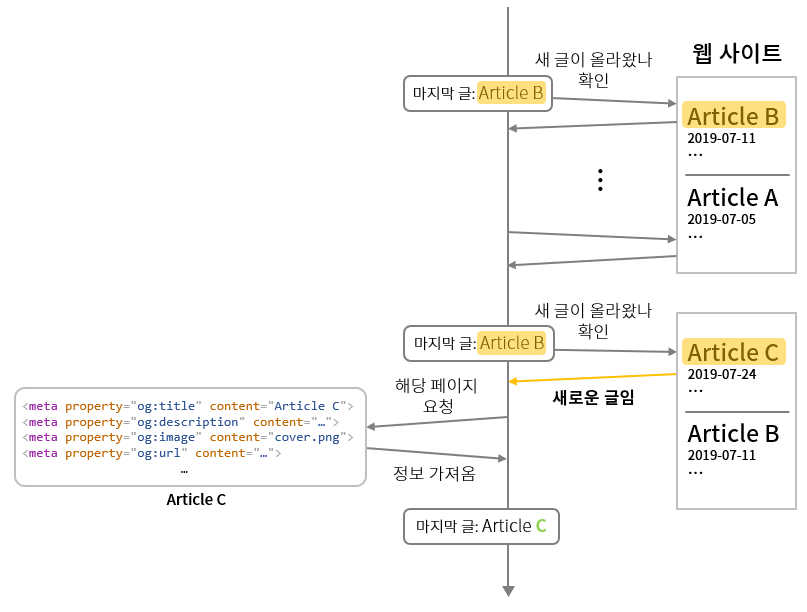
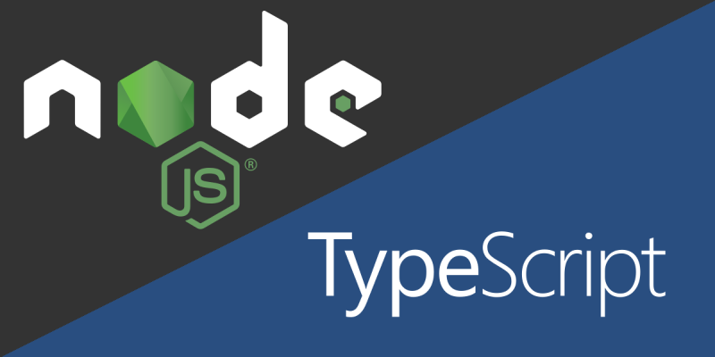
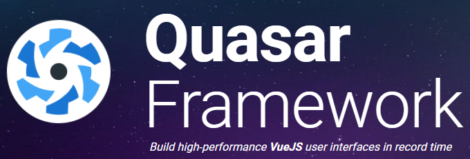

+++
banner = "images/architecture.png"
categories = ["Project","WebPageAlerter"]
date = "2019-09-13"
description = ""
images = []
menu = ""
tags = []
title = "블로그 새 글을 알려주는 알리미 만들기 Part 1: 기본 구조/기술 스택 선택"
slug = "making-a-alerter-for-new-blog-posts-part1"

+++

요즘 [게임 엔진 프로젝트](https://github.com/Cube219/CubeEngine)만 계속 진행하다 보니까 너무 지루하고 힘들어서 의욕이 나질 않았다. 그래서 잠깐 쉴 겸 새로운 서브 프로젝트를 하나 진행해야 겠다고 생각했다. 어떤 것을 할까 생각하다가 예전부터 필요하다고 생각했던 것을 구현하기로 했다.

나는 여러 개발자 블로그나 웹사이들을 자주 둘러보는 편이다. 재미있어 보이는 글이 올라오는 블로그나 사이트들을 발견하면 즐겨찾기해서 자주 살펴본다. 하지만 이런 사이트들에서 새로운 글이 올라왔나 매번 확인하는 것은 많이 귀찮은 일이다. 그래서 이러한 확인을 자동으로 하고 새로운 글이 올라오면 따로 저장을 해 알려주는 알리미 서버를 만들면 좋겠다는 생각을 자주 했다. 그래서 이번 서브 프로젝트로 이것을 구현하기로 결정했다.

-----

## 기획

먼저 어떠한 기능들이 있어야 하는지 생각을 해보았다.

### 웹 사이트

- 새 글들을 저장할 웹 사이트 정보
  - 이름 / 주소 / 설명 / 카테고리 / 크롤링주소 / CSS Selector / ...
- 등록한 웹 사이트들을 추가, 제거, 조회할 수 있어야 함
- 새 글들을 확인하기 위해서는 주기적으로 웹 크롤링을 해서 확인
  - 보통 최근 글 리스트가 나오는 페이지를 크롤링
  - CSS Selector를 이용해 가장 최신 글로 가는 \<a> 태그의 링크로 최신 글인지 확인

### 글

- 새 글이 올라오면 푸시 알림으로 알려주고 따로 서버에 저장해둠
- 저장된 글들은 최신 글부터 차례대로 보여지며, 여러 분류로 나눠서 볼 수 있음
- 저장된 새 글들은 읽었으면 읽었다는 체크가 자동으로 됨
- 글은 수정은 불가능하나, 제거는 가능함
- 글은 별도의 장소에 보관할 수 있음 (중요한 글)
- 글의 정보
  - 제목 / 내용 / 주소 / 카테고리 / 작성시간 / 커버이미지 / ...

### 새로운 글은 어떻게 확인하나?

1. 일정 주기마다 등록한 웹사이트 페이지를 크롤링한다.
2. 크롤링한 페이지에서 가장 마지막에 작성된 글의 정보를 가져온다. 이때 CSS Selector를 이용한다.
3. 저장된 마지막 글 정보를 위에서 크롤링한 정보와 비교한다. 그림에서는 제목을 저장하지만, 실제로는 글의 주소(\<a> 태그의 href)를 저장한다.
4. 둘이 서로 다를 경우, 새로운 글이 올라왔다는 것이므로 해당 글에 접근해 정보들을 가져온다. 이때 [Open Graph](https://ogp.me/) 정보를 이용한다.
5. 마지막 글 정보를 업데이트 한다.

## 기본 구조

위 기획을 바탕으로, 기본적인 구조를 구상해봤다.

최대한 기능 별로 분리를 하려고 헀고, 흐름을 무조건 중심(**Core**)을 거치게 해서 최대한 깔끔하게 처리하려고 했다.

#### WebSiteWatcher

말 그대로 웹 사이트에 새로운 글이 올라왔는지 감시하는 감시자(Watcher)이다. 일정 주기로 새로운 글이 올라왔는지 확인하고, 새로운 글이 올라오면 해당 글의 정보를 저장한다.

#### DB

데이터들을 저장하는 곳이다. 이곳에 알림을 받을 사이트 정보, 저장한 페이지 정보 등이 들어가며, 이런 정보들을 추가/수정/제거할 수 있다.

#### APIServer

웹 사이트를 등록/수정하거나 저장된 페이지들을 볼 수 있는 RESTful API 서버이다. 외부하고 유일하게 통신할 수 있는 곳이다.

#### PushServer

새로운 글이 올라왔을 때 알려주는 서버이다.

#### Core

서버의 중심 부분이며, WebSiteWatcher들을 관리한다. 또한 기능들간의 연결고리 역할을 한다.

-----

## 기술 스택 설정

백엔드쪽으로는 [Node.js](https://nodejs.org) + [**TypeScript**](https://www.typescriptlang.org/)를 선택했다. 그 이유는,

1. Node.js를 해본 경험이 있어서 빠르게 개발할 수 있을 것 같았다.
2. 많지는 않지만, Node.js로 웹 크롤링을 만드는 정보들이 어느정도 있었다.
3. 여기에 TypeScript같은 정적 타입 언어를 써보고 싶었다. 최근 JavaScript를 쓰다보니, 타입이 정적으로 정해져 있지 않아 모듈에 있는 함수를 쓰는데 매개변수로 어떤 값을 넣어야 하는지, 어떤 값들이 반환되는지 주석이나 문서를 계속 보게 되어서 너무 불편했다. 그래서 한 번 정적 타입 언어인 TypeScript를 써서 JavaScript에 비해 얼마나 더 쉽고 견고하게 개발할 수 있는지 알아보고 싶었다.

여기에 DB는 [MongoDB](https://www.mongodb.com/)를 사용했다. MySQL도 고려해보았으나, 뭔가 새로운 것을 해보고 싶었다.

프론트엔드로는 [Vue.js](https://vuejs.org/) + [Quasar framework](https://quasar.dev/)를 선택했다. 프론트엔드쪽을 정말 고민을 많이 했는데, 서브 프로젝트로 시간을 많이 쓰고 싶지 않아서 새로운 것보단 기존에 써본 Vue.js를 선택했다. 여기에 UI 프레임워크로 Quasar framework를 선택했는데, 기본으로 제공되는 기능들이 많이 있기 때문이다(알림, Infinite Scroll, 버튼에 진행중 표시...). 커스터마이징이 어렵다는 이야기가 있지만 필요하지 않으므로 상관없다.

-----

여기까지 새 글 알리미의 기본적인 구조 설계와 선택한 기술 스택에 대해서 썻다. 다음 글에서는 실제 내부 구현을 어떻게 했는지 써볼 예정이다.

