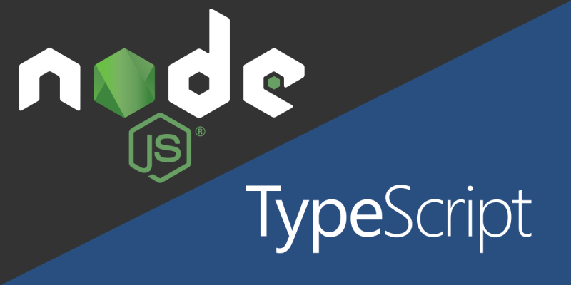
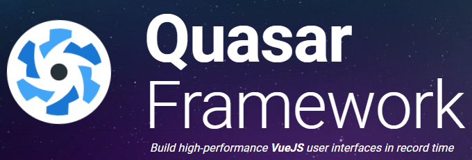
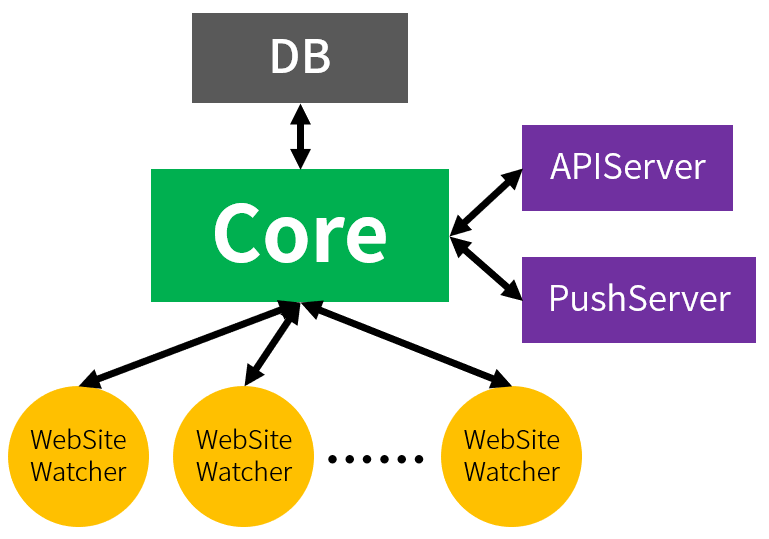
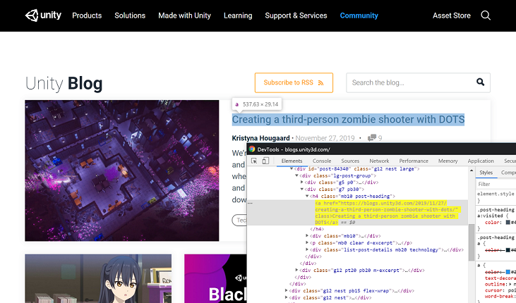
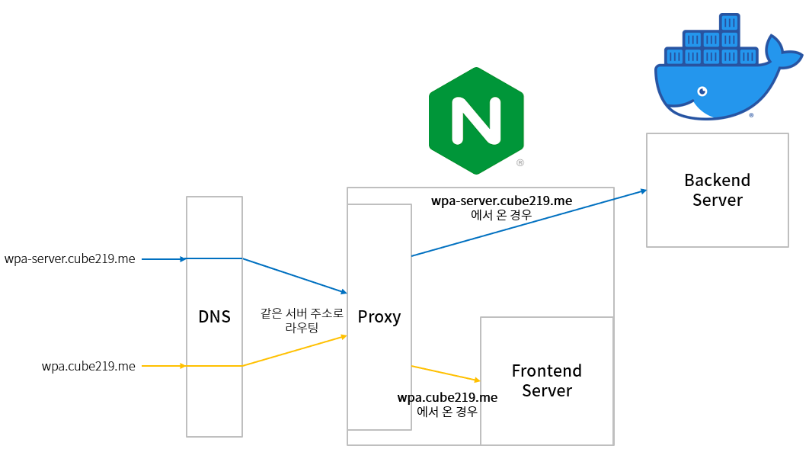
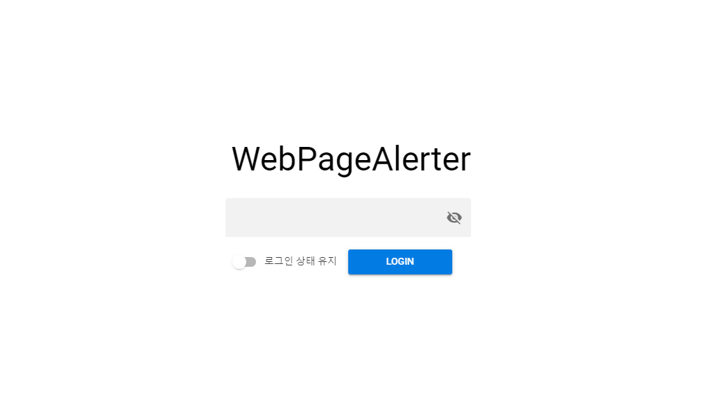
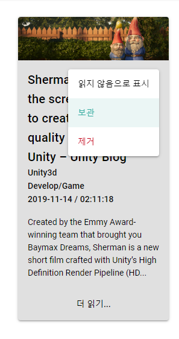
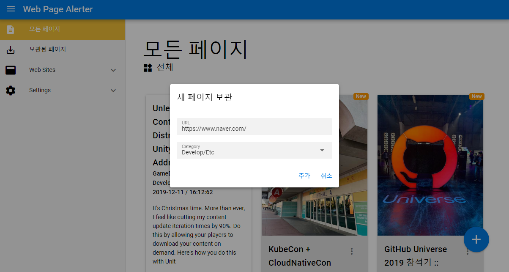

요즘 [게임 엔진 프로젝트](https://github.com/Cube219/CubeEngine)만 계속 진행하다 보니까 너무 지루하고 힘들어서 의욕이 나지 않았다. 그래서 잠깐 쉴 겸 새로운 서브 프로젝트를 하나 진행해야겠다고 생각했다. 어떤 것을 할까 생각하다가 예전부터 필요하다고 생각했던 것을 떠올렸다.

나는 여러 개발자 블로그나 웹사이트들을 자주 둘러보는 편이다. 재미있어 보이는 글이 올라오는 블로그나 사이트들을 발견하면 즐겨찾기해서 자주 살펴본다. 하지만 이런 사이트들에서 새로운 글이 올라왔나 매번 확인하는 것은 많이 귀찮은 일이다. 그래서 이러한 확인을 자동으로 하고 새로운 글이 올라오면 따로 저장을 해 알려 주는 알리미 서비스를 만들면 좋겠다는 생각을 자주 했다. 그래서 이번 서브 프로젝트로 이것을 구현하기로 결정했다.

-----

# 무엇으로 만들까?

새로운 글이 올라왔는지 확인하기 위해서 주기적으로 크롤링을 해야 하기 때문에 서버가 필요하다. 서버를 무엇으로 만들지 고민하다가 가장 먼저 [**python**](https://www.python.org/)이 떠올랐다. 당장 구글에 웹 크롤링이라고 검색하면 python을 이용해 만드는 방법들이 정말 많이 있고, 예전에 간단히 써본 경험도 있다. 그래서 python을 선택하자고 생각을 했었다.



그러다가 최근 JavaScript를 써본 적이 있었는데, 쓰다 보니까 동적 타입 언어라서 그런지 생각보다 불편했다. 특히 **함수 호출**에서 많은 불편함을 느꼈다. 많은 JavaScript 라이브러리에서 API를 호출 할 때 매개변수로 Object를 넣는 경우가 많은데, 이때 Object 안에 어떤 값들을 넣어야 하는지 에디터에서는 알 수가 없다. 또한 반환값으로 Object를 반환하면 역시 안에 어떤 값들이 들어있는지 알 수 없다. 그래서 계속 문서를 보거나 라이브러리 코드를 봐야 하는 번거로움이 있었다.

이러한 불편한 점이 있어서  JavaScript에 정적 타입을 얹은 [**TypeScript**](https://www.typescriptlang.org/)를 한 번 써보고 싶다고 계속 생각을 했었고, 마침 이 프로젝트를 하면서 써보면 좋겠다고 생각해서 python에서 TypeScript로 변경했다.



프론트엔드쪽은 그냥 이전에 써본 [Vue.js](https://vuejs.org/)를 썼다. 큰 프로젝트도 아니고 익숙한 걸 써서 빠르게 개발하고 싶었다. 여기서 UI는 [**quasar framework**](https://quasar.dev/)를 썼다. 여러가지 찾아봤는데 이 프레임워크가 다양한 기능(버튼에 진행 중 표시, Infinite 스크롤...)들이 있고 나중에 Web Application으로도 쉽게 만들 수 있을 것 같아서 선택했다.


# 기획

먼저 어떠한 기능들이 있어야 하는지 생각을 해보았다.

## 웹 사이트

- 새 글들을 저장할 웹 사이트 정보
  - 이름 / 주소 / 설명 / 카테고리 / 크롤링주소 / CSS Selector / ...
- 웹 사이트들을 추가, 제거, 조회
- 새 글들을 확인하기 위해서는 주기적으로 웹 크롤링을 해서 확인
  - 보통 최근 글 리스트가 나오는 페이지를 크롤링
  - CSS Selector를 이용해 가장 최신 글로 가는 `<a>` 태그의 링크로 최신 글인지 확인

## 글(페이지)

- 새 글이 올라오면 푸시 알림으로 알려주고 따로 서버에 저장해둠
- 저장된 글들은 최신 글부터 차례대로 보여지며, 여러 분류로 나눠서 볼 수 있음
- 저장된 새 글들은 읽었으면 읽었다는 체크가 자동으로 됨
- 글은 수정은 불가능하나, 제거는 가능함
- 글은 별도의 장소에 보관할 수 있음 (중요한 글)
- 글의 정보
  - 제목 / 내용 / 주소 / 카테고리 / 작성시간 / 커버이미지 / ...

## 새로운 글은 어떻게 확인하나?


1. 일정 주기마다 등록한 웹사이트 페이지를 크롤링한다.
2. 크롤링한 페이지에서 가장 마지막에 작성된 글의 정보를 가져온다. 이때 CSS Selector를 이용한다.
3. 저장된 마지막 글 정보를 위에서 크롤링한 정보와 비교한다. 그림에서는 제목으로 비교하지만, 실제로는 글의 주소(`<a>` 태그의 href)로 비교한다.
4. 둘이 서로 다를 경우, 새로운 글이 올라왔다는 것이므로 해당 글에 접근해 정보들을 가져온다. 이때 [Open Graph](https://ogp.me/) 정보를 이용한다.
5. 마지막 글 정보를 업데이트 한다.

# 구현(Backend)

위 기획을 바탕으로, 백엔드 구조를 구상했다.



최대한 기능 별로 분리를 하려고 헀고, 흐름을 무조건 중심(**Core**)을 거치게 해서 최대한 깔끔하게 처리하려고 했다.

## 기본 인터페이스 (WebSiteInfo, WebPageInfo)

먼저 웹 사이트 / 웹 페이지 인터페이스들을 정의했다. 이 정의들은 여러 곳에서 쓰이기 때문에 `Utility.ts`에 정의했다.

```typescript
export interface WebSiteInfo
{
    _id: string;
    title: string;
    url: string;
    crawlUrl: string;
    cssSelector: string;
    lastUrl: string;
    category: string;
    checkingCycleSec: number;
    isDisabled: boolean;
}
export interface WebPageInfo
{
    _id: string;
    siteId: string;
    siteTitle: string;
    title: string;
    url: string;
    imageUrl: string;
    desc: string;
    category: string;
    time: Date;
    isRead: boolean;
    isArchieved: boolean;
}
```

`WebSiteInfo`는 크롤링할 웹 사이트들의 정보들을 정의했다. 웹사이트의 기본적인 정보와 새로운 글이 올라왔는지 확인하기 위한 정보들을 가지고 있다.

`WebPageInfo`에는 저장한 페이지 정보들을 정의했다.

## 페이지 정보 가져오기

페이지 정보는 위에서 언급했듯이 **Open Graph** 태그를 이용해 가져왔다.

Open Graph에는 많은 정보들이 있지만 그중에서 title, url, image, description만 이용했다.

```html
<meta property="og:title" content="제목">
<meta property="og:url" content="https://blog.cube219.me/...">
<meta property="og:image" content="...image.png">
<meta property="og:description" content="설명">
```

이런 태그들을 찾아서 데이터를 뽑아야 하는데, [**cheerio**](https://github.com/cheeriojs/cheerio)를 사용해 뽑아냈다.

```typescript
const $ = cheerio.load(res);
let selected: Cheerio;

let title = "";
selected = $('meta[property="og:title"]');
if(selected.length != 0) {
    title = selected[0].attribs.content;
} else {
    selected = $('title');
    if(selected.length != 0) {
        title = selected.text();
    }
}

let url = "";
selected = $('meta[property="og:url"]');
if(selected.length != 0) {
    url = selected[0].attribs.content;
} else {
    url = pageUrl;
}

let imageUrl = "";
selected = $('meta[property="og:image"]');
if(selected.length != 0) {
    imageUrl = selected[0].attribs.content;
}

let desc = "";
selected = $('meta[property="og:description"]');
if(selected.length != 0) {
    desc = selected[0].attribs.content;
}
```

CSS Selector로 해당하는 태그를 선택해 해당 태그의 정보를 가져올 수 있다. [jQuery](https://jquery.com/)와 상당히 유사해서 쉽게 쓸 수 있었다.

만약 페이지에 Open Graph 정보가 없으면 최소한의 정보인 title, url만 각각 `<title>`태그, 페이지 url로 대체한다.

## WebSiteWatcher

말 그대로 웹 사이트에 새로운 글이 올라왔는지 감시하는 **감시자(Watcher)** 이다. 등록한 웹 사이트마다 1개씩 생성된다.

감시자들은 생성이 되면 일정 주기로 해당 웹 사이트에 새로운 글이 올라왔는지 확인을 한다.

```typescript
public run()
{
    if(this.siteInfo.isDisabled == true) {
        return;
    }

    if(!this.siteInfo.checkingCycleSec) {
        this.siteInfo.checkingCycleSec = 3600;

        DB.updateWebSite(this.siteInfo._id, { checkingCycleSec: 3600 });
    }

    // Delay checking when initialized
    // because of preventing checking many sites at same time
    const delayTimeSec = Math.random() * this.siteInfo.checkingCycleSec;
    this.intervalId = setTimeout(this.checkImmediately.bind(this), delayTimeSec * 1000);
}
public checkImmediately()
{
    if(this.intervalId) {
        clearTimeout(this.intervalId);
    }

    this.runInternal();

    this.intervalId = setInterval(this.runInternal.bind(this), this.siteInfo.checkingCycleSec * 1000);
}
```

주기적으로 검사를 해야 하기 때문에 `setInterval`함수를 이용했다. 여기서 `run`함수는 실행하자 마자 바로 검사를 하는 것이 아니라 **일정 딜레이 후** 검사를 하는데, 이는 서버가 켜지면서 등록된 모든 Wathcer들이 바로 동시에 검사하는 것을 막기 위해서다. 굳이 필요할 것 같진 않은데 그래도 혹시나 해서 넣었다.

이제 웹 사이트에 새로운 글이 올라왔는지 확인을 하는 함수를 만들어야 한다. 확인하는 방법으로는 지정한 웹 사이트 HTML을 가져오고, 최신 글로 가는 링크를 뽑아서 기존에 저장한 링크와 같은지 확인해 안 같으면 새로운 글이 올라온 것으로 확인할 수 있다.



예를 들어 [Unity Blog](https://blogs.unity3d.com/)에서 새로운 글을 확인하고 싶다면, 이렇게 최신 글의 `<a>`태그를 CSS Selector(여기서는 `.post-heading > a`)로 뽑아낸 다음 해당 주소를 이용해 판별할 수 있다.

```typescript
private async checkNewPage()
{
    this.isBusy = true;

    let res: any;
    try {
        res = await rq(this.siteInfo.crawlUrl);
    } catch(e) {
        let err = new InvalidUrlError(this.siteInfo.crawlUrl);
        err.message = e.message;

        throw err;
    }

    try {
        const $ = cheerio.load(res);
        const aElement = $(this.siteInfo.cssSelector)[0];

        const pageUrl = relToAbsUrl(aElement.attribs.href, this.siteInfo.url);

        if(this.siteInfo.lastUrl != pageUrl) {
            await this.savePage(pageUrl);
        }
    } catch(e) {
        let err = new InvalidCssSelectorError(this.siteInfo.cssSelector);
        err.message = e.message;

        throw err;
    }

    this.isBusy = false;
}
```

실제 코드에서도 `crawlUrl`로 지정한 페이지를 가져오고, `cssSelector`로 해당 `<a>` 태그의 href 속성을 가져온다. 그리고 이 주소가 `lastUrl`과 다르면, 새로운 글이 올라왔다는 뜻이므로 해당 페이지를 저장한다.

```typescript
private async savePage(pageUrl: string)
{
    const info = await getPageInfo(pageUrl);
    info.siteId = this.siteInfo._id;
    info.siteTitle = this.siteInfo.title;
    info.category = this.siteInfo.category;

    await this.core.insertPage(info, pageUrl);

    this.siteInfo.lastUrl = pageUrl;
}
```

페이지 저장은 간단하게 `getPageInfo`를 통해 해당 페이지 정보를 얻고, 저 함수로 얻을 수 없는 사이트 정보, 카테고리도 추가한 후 DB에 해당 페이지를 삽입한다. 그리고 `lastUrl`을 갱신한다.

## DB

DB로는 [**mongoDB**](https://www.mongodb.com/)를 이용했다. 노드에서는 저걸 많이 쓰기도 하고, 뭔가 새로운 것을 해보고 싶었다.


이제 이걸 노드에서 어떻게 사용해야 할지 검색해보니까 보통 [**mongoose**](https://mongoosejs.com/)라는 라이브러리를 많이 이용했다. 이 라이브러리는 **스키마**를 정의를 하게 해서 좀 더 견고하게 DB를 다룰 수 있게 도와주고, **쿼리 빌더**로 쉽게 쿼리를 만들수 있다. 특히 쿼리 빌더 기능이 편리했다.

```typescript
let query: mongoose.DocumentQuery<ISavedWebPage[], ISavedWebPage>;

if(fromArchieved == false) {
    query = SavedWebPageModel.find(condition);
} else {
    query = ArchievedWebPageModel.find(condition);
}

if(params.afterId) {
    query.where("_id").lt(params.afterId);
} else if(params.startIndex) {
    query.skip(params.startIndex);
}
if(params.count) {
    query.limit(params.count);
}
const queryRes = await query.sort({ _id: -1 });
```

저장된 웹 페이지들을 가져오는 코드의 일부분이다. 저장된 페이지들을 가져올 때는 특정 개수나 특정 id이후, 특정 index이후 등 여러 조건들이 들어가게 되고, 이는 조건 JSON 객체를 복잡하게 만든다. 이것을 쿼리 빌더를 이용하면 `.limit`, `.where`와 같은 함수를 이용해 조건을 붙일 수 있고, 좀 더 직관적으로 코드를 짤 수 있었다.

컬렉션 *(RDBMS의 테이블에 해당)* 으로는 해당 서버의 버전 정보를 담는 **app_infos**, 웹 사이트 정보인 **web_site_infos**, 저장된 웹 페이지인 **saved_web_pages**, 따로 보관한 웹 페이지인 **archieved_web_pages**, 그리고 카테고리인 **category_infos**로 나누었다.

**app_infos**는 현재 실행 중인 서버의 버전을 담는 컬렉션이다. 이 데이터는 추후에 서버가 업데이트 되어서 DB구조가 바뀌어 수정을 해야 할 때 쓰인다. 예를 들어 0.3.0 버전부터 카테고리를 category_infos로 옮겼는데 기존에 들어있던 웹 사이트들의 카테고리 정보를 가져와야 하기 때문에 추가적인 작업이 필요하다. 이때 이 정보를 가져오고 0.3.0 버전보다 아래이면 위 작업을 하는 방식이다.

**web_site_infos**는 말 그대로 등록한 웹 사이트의 정보들을 저장하고 있다.

**saved_web_pages**와 **archieved_web_pages**는 역시 말 그대로 저장된/따로 저장한 웹 페이지들을 저장하고 있다.

**category_infos**는 등록된 카테고리 정보들을 저장하고 있다. 이 데이터는 개발하다 보니까 카테고리들만 따로 필요하게 되는 경우가 생겨서 추가했다.

코드는 최대한 컬렉션 별로 해당 정보를 추가/제거/수정하는 함수들을 각각 만들었다.

```typescript
async getWebSites()
async getWebSite(id: string)
async insertWebSite(info: WebSiteInfo)
async deleteWebSite(id: string, deleteAllPages: boolean = false)
async updateWebSite(id: string, params: UpdateWebSiteParams)
```

예를 들어 웹 사이트의 경우 사이트를 검색/추가/수정/제거 기능을 하는 함수들을 만들고 함수 내부에서는 web_site_info 컬렉션을 수정하도록 되어있다.

## APIServer

웹 사이트를 등록/수정하거나 저장된 페이지들을 볼 수 있는 **RESTful API 서버**이다. 외부하고 유일하게 통신할 수 있는 곳이다.


원래는 [Express.js](https://expressjs.com/)를 쓸려고 했는데 지인이 [**Koa**](https://koajs.com/)를 써보라고 해서 써보았다. 써보니까 `await/async`를 쓸 수 있다는 점이 좋았다. 그리고 Express 만들던 사람들이 만들어서 그런지 기능이나 쓰는 방법들이 Express랑 거의 유사했다. 그래서 쉽게 사용할 수 있었다.

### 인증 시스템

인증 토큰으로는 [**JSON Web Token(JWT)**](https://jwt.io/)을 이용했다. JWT는 다른 토큰들과는 다르게 서버에서 관리할 필요가 없는데, 이는 토큰 내부에 이 토큰이 올바른지 확인하는 **서명**이 있기 때문이다.

```typescript
// koa 초기화하는 부분 일부 코드
...
if(this.enableAuth == true) {
    this.koaApp.use(this.authMiddleware.bind(this));
}
...

private async authMiddleware(ctx: koa.ParameterizedContext, next: () => Promise<any>)
{
    const token = ctx.headers["x-access-token"] as string;

    if(!token) {
        ctx.response.status = 401;
        return;
    }

    try {
        jwt.verify(token, this.jwtSecretKey);
    } catch(e) {
        if(e instanceof jwt.TokenExpiredError) {
            ctx.response.status = 401;
            ctx.body = "Token expired";
            return;
        } else if(e instanceof jwt.JsonWebTokenError) {
            ctx.response.status = 401;
            ctx.body = "Token error";
            return;
        } else {
            throw e;
        }
    }

    await next();
}
```

토큰 확인은 요청한 주소로 라우팅 하기 전에 미들웨어를 하나 거쳐서 확인한다. 이 미들웨어에서는 `x-access-token`에 들어있는 토큰을 가져와서 이 토큰이 유효한지 `jwt.verify`함수를 통해 확인하고, 유효하면 다음 단계로 넘어가고 유효하지 않으면 토큰 에러를 발생 시키고 진행을 중단한다.

### 오류 처리

서버를 돌리다 보면 수많은 잘못된 요청들이 들어올 수가 있다. 웹 사이트 url이 잘못되었거나, 필수 파라미터가 없거나 잘못되었거나, 아님 내부 서버 오류도 발생할 수 있다. 이러한 오류들을 라우팅 함수들마다 처리하는 것보단, **한 곳으로 모아서 처리**하는 것이 더 좋겠다는 생각을 했다. 그래서 Javascript의 **[Error](https://developer.mozilla.org/en-US/docs/Web/JavaScript/Reference/Global_Objects/Error) Object**를 이용하기로 했다.

```typescript
export class WPAError extends Error {
    statusCode: number;
    responseMessage: string;

    constructor(message: string, statusCode: number) {
        super(message);
        
        this.statusCode = statusCode;
        this.responseMessage = message;
    }
}
export class MissingRequiredParametersError extends WPAError {
    missingParams: string[];

    constructor(missingParams: string[]) {
        super(`Missing required parameters (${missingParams.join(', ')})`, 400);
        this.name = 'MissingRequiredParametersError';
        Object.setPrototypeOf(this, MissingRequiredParametersError.prototype);

        this.missingParams = missingParams;
    }
}
```

부모 클래스로 `WPAError`를 만들었다. 이 클래스는 오류가 발생했을 때 클라이언트에게 보여 줄 **상태 코드**와 **응답 메시지**를 가지고 있다. 그리고 자식 클래스들은 생성자에서 해당 오류의 상태 코드와 메시지 내용을 넣어 준다.

```typescript
this.koaApp.use(async (ctx, next) => {
    try {
        await next();
    } catch (err) {
        if(err instanceof WPAError) {
            ctx.status = err.statusCode;
            ctx.body = err.responseMessage;
        } else {
            ctx.status = 500;
        }
        ctx.app.emit("error", err, ctx);
    }
});
this.koaApp.on("error", (err, ctx) => {
    Log.error(`APIServer: Error in ${ctx.request.method}:${ctx.request.url}\n        ${err.stack}`);
});
```

그리고 **에러를 처리하는 미들웨어**를 가장 위쪽에 등록을 한다. 그러면 라우팅하는 함수에서 위에서 정의한 Error들을 던지면 여기서 받게 된다. 받은 에러가 `WPAError`의 자식이면 해당하는 상태 코드와 메시지를 보내고, 아니면 그냥 Internal Server Error(500)을 보낸다. 이렇게 에러를 처리하는 부분을 한 곳으로 모아서 처리를 했다.

## PushServer

새로운 글이 올라왔을 때 알려주는 서버인데... 아직 구현을 하진 않았다.

## Core

서버의 **중심** 부분이며, WebSiteWatcher들을 관리한다. 또한 기능들간 **연결 고리** 역할을 한다.


예를 들어 APIServer에서 새로운 웹 사이트를 등록하는 요청을 받았다고 하자. 그러면 먼저 APIServer에서 파라미터들을 정리해 `WebSiteInfo` 정보를 만들고 `core.insertWebSite`함수를 호출한다. 이 함수에서는 DB에 새로운 웹 사이트를 넣고, WebSiteWatcher를 새로 생성하고 활성화한다. 이 과정이 완료되면 함수가 반환되면서 APIServer로 돌아가게 되고 완료 응답을 보내게 된다.

이렇게 모든 로직이 Core를 지나가게 만들어서 로직을 최대한 단순하게 만들려고 했다. 

-----

# 구현(Frontend)

위에서 결정한 것처럼 프론트엔드는 quasar framework를 이용하기로 결정했다. 여기에 TypeScript를 적용 시키고 싶어서 찾아보니까 따로 [extension](https://github.com/quasarframework/app-extension-typescript)이 있었다. 그래서 적용해보니까 js파일들이 ts로 바뀌긴 했는데 vue파일들은 그대로 바뀌는 게 없었다. 주로 vue파일을 수정할텐데 적용이 안 되어서 있으나 마나였다.

그래서 따로 찾아보니까 [**vue-property-decorator**](https://github.com/kaorun343/vue-property-decorator)라는 것을 찾았다. 이 라이브러리는 **decorator**를 이용해 좀 더 쉽고 깔끔하게 컴포넌트를 설정할 수가 있다.

```vue
export default {
  props: {
    propA: {
      type: Number
    },
    propB: {
      default: 'default value'
    },
    propC: {
      type: [String, Boolean]
    }
  }
}
```

예를 들어 컴포넌트의 prop들을 설정하려면 위에처럼 각 prop들의 정보를 object로 넣어줘야 하는데, decorator를 이용하면

```vue
import { Vue, Component, Prop } from 'vue-property-decorator'

@Component
export default class YourComponent extends Vue {
  @Prop(Number) readonly propA: number | undefined
  @Prop({ default: 'default value' }) readonly propB!: string
  @Prop([String, Boolean]) readonly propC: string | boolean | undefined
}
```

이렇게 깔끔하게 쉽게 prop들을 정의할 수가 있다.

다만 아직 정식 기능이 아닌 decorator를 이용하기 때문에 JavaScript는 [**babel**](https://babeljs.io/docs/en/babel-plugin-proposal-decorators)을 이용해야 하고, TypeScript는 **컴파일러 옵션**에 `experimentalDecorators`를 `true`로 [설정](https://www.typescriptlang.org/docs/handbook/decorators.html)해줘야 한다.

이외에는 그냥 Vue로 웹 페이지 개발을 했다. 확실히 UI 프레임워크를 쓰니까 쉽고 이쁘게 만들수가 있었다.

-----

# 배포

프론트엔드와 백엔드를 다른 프레임워크로 만든 경우 프론트엔드를 표시할 웹 서버와 백엔드 서버, 2개의 서버가 필요하다.

## 백엔드 서버

먼저 백엔드 서버를 만들 때 멈추지 않고 자동으로 배포되는 서버를 구축하고 싶었다. 그래서 열심히 찾아보니까 [Docker](https://www.docker.com/) + CI([Jenkins](https://jenkins.io/), [Travis CI](https://travis-ci.org/)...)를 이용하면 구축할 수가 있다고 한다. 간단히 설명하자면,

1. GitHub에서 최신 commit이 올라옴
2. Travis CI에서 감지해서 해당 버전으로 docker image를 만듦
3. 새로 만들어진 image를 docker container에 띄움 (이때 기존 서버는 돌아가고 있음)
4. 새로운 서버가 성공적으로 띄워지면 기존 서버를 내림

의외로 생각보다 간단한데, 아직 Travis CI를 잘 쓰지 못하겠어서 자동 배포까지는 구현을 못했고, 간단한 스크립트로 수동 배포까지만 구현했다.

### Docker 이미지 생성

```bash
#!/bin/bash

DIR="$( cd "$( dirname "$0" )" && pwd )"

cd $DIR

echo
echo "Getting wpa-server source from github..."

if [ -d "src" ]; then
   cd src
   git pull
else
   git clone https://github.com/Cube219/WebPageAlerter.git src
   cd src
fi

VER=$(cat package.json \
  | grep version \
  | head -1 \
  | awk -F: '{ print $2 }' \
  | sed 's/[",]//g' \
  | tr -d '[[:space:]]')

echo
echo "Building docker images... (version: $VER)"

docker build -t cube219/wpa-server:latest -t cube219/wpa-server:v$VER .

echo
echo "Successfully build docker images."
```

자동으로 GitHub에서 소스를 가져와서 이미지를 빌드하는 스크립트이다. 버전 정보는 `package.json`파일에서 가져온다.

```dockerfile
FROM node:10.14.1-alpine AS installer

WORKDIR /usr/src/WebPageAlerter/build
COPY package*.json ./

RUN npm install --production
RUN npm install -g --production typescript

# ----------------------------

FROM installer AS builder

WORKDIR /usr/src/WebPageAlerter/build

COPY ./src src
COPY tsconfig.json .
RUN tsc

# ----------------------------

FROM node:10.14.1-alpine

WORKDIR /app/WebPageAlerter

COPY --from=builder /usr/src/WebPageAlerter/build/dist dist
COPY --from=builder /usr/src/WebPageAlerter/build/node_modules node_modules
COPY package*.json ./

CMD [ "node", "dist/main.js" ]
```

Dockerfile 내용이다. 간략하게 설명하면

1. package.json 파일을 가져와서 `npm install`을 해 필요한 패키지들을 가져온다.
2. src파일을 가져와 TypeScript 컴파일을 한다.
3. 컴파일 결과인 **dist** 폴더와 **node_modules** 폴더만 가져온다.

### Docker 이미지 띄우기

이미지를 만들었으니 이제 띄우기만 하면 된다. 이미지를 띄우는 것은 [**docker-compose**](https://docs.docker.com/compose/)를 이용했다.

```yaml
version: '3'

services:
  mainserver:
    image: "cube219/wpa-server:latest"
    container_name: wpa-server
    depends_on:
      - mongodb
    ports:
      - "8000:8000"
    volumes:
      - ./logs:/app/WebPageAlerter/logs
      - ./page_data:/app/WebPageAlerter/page_data
    environment:
      API_SERVER_PORT: 8000

      API_SERVER_USE_HTTP2: 'false'

      API_SERVER_PASSWORD: $PASSWORD
      JWT_SIGNATURE_SECRET_KEY: $SIG_KEY
      API_SERVER_ENABLE_AUTH: 'true'

      DB_URL: mongodb
      DB_PORT: 27017
    networks:
      - backend
  mongodb:
    image: "mongo:latest"
    container_name: wpa-db
    hostname: mongodb
    volumes:
      - ./db_data:/data/db
    networks:
      - backend

networks:
  backend:
    driver: bridge
```

서버에 들어갈 매개변수들을 설정하고, 컨테이너가 재 시작해도 데이터가 안 날아가게 볼륨을 마운트하고, db와 연결하는 이 모든 과정들을 쉽게 할 수 있었다. 만약 이미지가 업데이트가 되었다면 그냥

`$ docker-compose -f docker-compose.yml up -d`

만 입력하면 알아서 최신 이미지로 업데이트를 할 수 있다.

완전 자동화는 아니지만 어느 정도 자동화는 해둔 덕분에 서버 업데이트를

1. 수정 commit을 GitHub에 push
2. 서버에 ssh로 접속해서 `build.sh ` 실행
3. `docker-compose -f docker-compose.yml up -d` 입력

이렇게 쉽게 할 수 있다.

## 프론트엔드 서버

프론트엔드는 Vue로 만들었기 때문에 빌드를 하면 static 파일들이 생성이 되고, 이것을 [Nginx](https://www.nginx.com/)에다 올리면 프론트엔드 서버 구현 완료다.

### 같은 물리적 서버에서 도메인으로 프론트 / 백엔드 구분하기

프론트 / 백엔드를 따로 구현했기 때문에 서버가 **2개**가 필요하다. 하지만 실제로는 서버를 **1개**만 가지고 있기 때문에 [**리버스 프록시**](https://ko.wikipedia.org/wiki/리버스_프록시)를 구축했다.



먼저 백엔드 서버 도메인인 wpa-server.cube219.me와 프론트엔드 서버 도메인인 wpa.cube219.me를 **같은** 프록시 서버 주소를 가리키게 설정을 한다. 그러면 프록시 서버에서는 들어온 요청이 백엔드 도메인인지, 프론트엔드 도메인인지 확인 후 알맞은 서버로 연결을 한다.

이것도 Nginx로 구현이 가능하다.

```
server {
    listen 80;
    server_name wpa-server.cube219.me;
    return 301 https://wpa-server.cube219.me$request_uri;
}

server {
    listen 443 ssl http2;
    server_name wpa-server.cube219.me;
    autoindex off;

    ssl_certificate /etc/letsencrypt/live/cube219.me/fullchain.pem;
    ssl_certificate_key /etc/letsencrypt/live/cube219.me/privkey.pem;


    location / {
        proxy_pass http://localhost:8000;
    }
}

server {
    listen 80;
    server_name wpa.cube219.me;
    return 301 https://wpa.cube219.me$request_uri;
}
server {
    listen 443 ssl http2;
    server_name wpa.cube219.me;
    autoindex off;

    ssl_certificate /etc/letsencrypt/live/cube219.me/fullchain.pem;
    ssl_certificate_key /etc/letsencrypt/live/cube219.me/privkey.pem;


    location / {
        root /home/Cube219/wpa-client/dist;
    }
}
```

Nginx설정에서 server안에 **server_name**을 입력하면 해당 도메인으로 요청이 왔을 때 해당 서버로 연결해준다. 이것을 이용해 wpa-server.cube219.me인 경우에는 아까 Docker로 열어둔 백엔드 서버 8000포트로 넘겨주고, wpa.cube219.me인 경우 Vue로 빌드한 결과물들이 있는 폴더로 넘어가게 된다.

# 구현 모습



맨 처음 로그인 화면이다. 여기서 올바른 비밀번호를 입력하면 토큰을 받고 메인 화면으로 이동한다.


메인 화면이다. 미리 등록한 웹 사이트에 새로운 글이 올라오면 모아서 여기에 보여 준다. 3일 전에 올라온 글이면 오른쪽 위에 New 뱃지가 나온다. 이미 읽은 글은 카드 배경이 회색으로 변한다.



카드에 있는 점 3개를 클릭하면 이 글을 따로 보관할 수가 있다. 이외에도 카드를 읽음/읽지 않음으로 표시하거나 지울 수도 있다.



오른쪽 밑에 있는 +버튼을 누르면 새로운 페이지를 보관할 수 있는 창이 뜬다. URL과 카테고리를 선택하고 추가를 누르면 아래에 설명할 보관된 페이지에 해당 페이지가 보관된다.


왼쪽 밑에 있는 보관된 페이지를 누르면 따로 보관한 페이지들을 볼 수가 있다.

이외에도 웹 사이트 설정 / 기본 설정 페이지도 있어야 하지만 아직 미 구현이라 수동으로 서버에 요청을 보내 수정하고 있다.

[백엔드 소스코드](https://github.com/Cube219/WebPageAlerter)와 [프론트엔드 소스코드](https://github.com/Cube219/wpa-client)를 GitHub에 올리긴 했지만 아직 README등 정리가 안 되어있다. 차후 정리해서 작성할 예정이다.

# 느낀 점

이 프로젝트는 잠깐 쉴 겸해서 만든 간단한 프로젝트였는데, 생각보다 간단하지 않았다. 한 1~2개월이면 만들 줄 알았는데 거의 5개월이나 걸렸다. 프로젝트를 진행하다 보니까 욕심이 나서 기능들을 추가하는 경우도 있었고, JWT,  mongoose, 토큰 개념 등 여러 기술들을 배우느라 시간이 더 걸린 것 같다. 그래도 웹에 대해서 어느 정도 지식이 쌓이긴 했다.

시간은 생각보다 오래 걸렸지만 프로젝트를 진행하면서 재미있었고 열심히 했다. 불편하고 귀찮은 일을 자동으로 해주는 서비스를 만들어서 동기부여가 잘 되었던 것 같다. 가끔씩 이런 소소한 프로젝트를 하는 것도 좋은 것 같다.