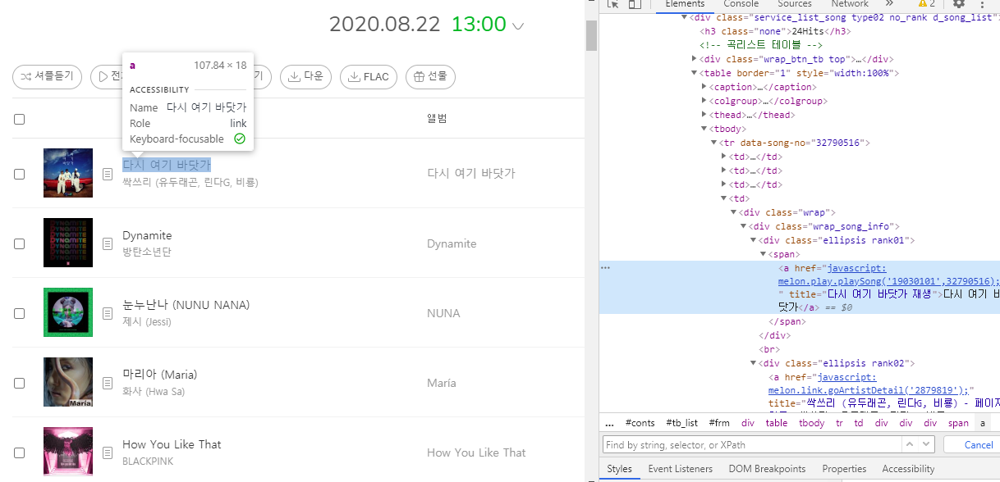
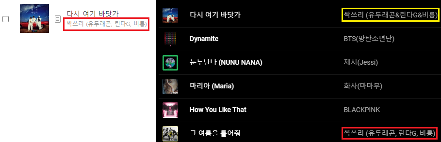
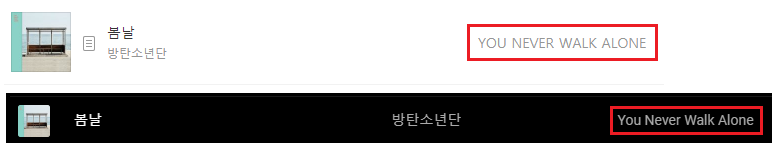

필자는 음악 스트리밍 서비스로 [Youtube Music](https://music.youtube.com/)을 이용하고 있다. [Youtube Premium](https://www.youtube.com/premium)에 포함되어 있길래 그냥 같이 쓰고있다. 플레이 리스트 생성이나 자동재생 기능은 만족하면서 쓰고있지만, 차트 기능이 좀 부족한 것 같았다. 물론 한국 인기곡 Top100 차트가 있긴 한데 유행하는 신곡이 나와도 업데이트가 빠르게 되는 것 같지 않다.

한국 노래 차트하면 대표적으로 [멜론 차트](https://www.melon.com/chart/index.htm)가 있다. 그래서 이 멜론 차트를 주기적으로 크롤링해서 내 플레이리스트에 넣으면 되겠다! 라는 생각이 들었다. 하지만, [Youtube API](https://developers.google.com/youtube/v3/getting-started)는 있는데 아무리 찾아봐도 Youtube Music API는 찾을 수가 없었다.

그렇게 구현을 포기하고 있다가 어느날, 이 API를 어떤 사람이 [직접 구현](https://github.com/sigma67/ytmusicapi)한 것을 발견했다! 그것을 보고 바로 개발을 시작했다.

-----

# API 파악

이 API는 [python](https://www.python.org/)으로 만들어져 있다. python은 오랜만에 해보는 언어라서 어떻게 개발 환경을 만들어야 할지 좀 찾아봤다. (자세한 구축 방법은 다음 문단에)

다행히 [문서](https://ytmusicapi.readthedocs.io/en/latest/usage.html)가 잘 정리되어있어서  API를 쓰는데 어려움 점은 없었다.

이 API는 크게 **인증된 요청(Authenticated requests)** 과 **인증되지 않은 요청(Unauthenticated requests)** 두 가지로 나눌 수 있다.

**인증된 요청**은 말 그래도 **사용자 인증**이 된 상태에서 하는 요청이다. 보통 유저와 관련된 요청(플레이 리스트 추가, 추천...)들이 여기에 속한다. 인증된 요청을 쓰기 위해서는 로그인된 유저의 [**쿠키**](https://developer.mozilla.org/ko/docs/Web/HTTP/Cookies)가 필요하다. 아마 이 API는 Youtube Music에게 HTTP 요청을 보내 받은 값을 처리하는 구조인 것 같은데, 그때 사용하는 것 같다.

**인증되지 않은 요청**은 이와 반대로 사용자 인증이 필요 없는 요청이다. 검색이나 곡 정보 보기 같은 것들이 해당한다.

# 개발 환경 구축

API가 python으로 만들어져 있기 때문에 python 개발 환경 구축방법들을 찾아보았다.

일단 python은 그냥 쓰기에 좋지 않다.  모든 환경이 각 프로젝트에 맞춰져 있지 않고 **글로벌**하게 맞춰져 있기 때문이다. Python 프로그램 자체가 그런것은 그럴 수 있는데, 문제는 **라이브러리 패키지**도 그렇다는 점이다.

예를 들어 **AProject**에서 **B-1.0.2** 라이브러리를 쓴다고 하자. 이때 새로운 **BProject**를 만들고 이 프로젝트는 **B-4.5.1** 라이브러리를 쓰도록 설정했다. 이러면 python(정확히는 [pip](https://pypi.org/project/pip/))은 기존에 설치되어있던 B-1.0.2를 B-4.5.1로 **업데이트** 하게 된다. 그러면 이제 **AProject**는 **B-4.5.1** 라이브러리를 쓰게 되고, 버전이 의도치 않게 올라갔기 때문에 문제가 발생할 가능성이 생기게 된다.

이 문제를 해결하기 위해서는 각 프로젝트마다 **독립된 환경**을 구축할 필요가 있다. 이러한 것들을 도와주는 여러 프로그램들이 있는데, 필자는 [**Virtualenv**](https://virtualenv.pypa.io/en/latest/)를 사용했다. Virtualenv는 쉽게 말해 라이브러리랑 python 그 자체를 **한 폴더**에다가 넣어두고, 실제로 사용할 땐 그 폴더 안에서 동작하도록 **가상화**해준다.

사용법은 아주 간단하다. 먼저 Virtualenv를 설치해 준다. (이미 설치가 되어있다면 할 필요 없음)

```
$ sudo pip install virtualenv
```

> Windows의 경우 `sudo`를 빼주면 된다.

설치가 되었으면 가상환경을 구축할 프로젝트 폴더로 가서

```
$ virtualenv env
```

를 입력하면, `env`라는 폴더가 생기게 된다.

폴더가 생겼다고 바로 쓸 수 있는 것은 아니다. 작업을 시작하기 전에 수동으로 **활성화**해야 한다.

```
$ source env/bin/activate
```

> Windows의 경우 `./env/Scripts/activate` 라고 입력하면 된다.

를 입력하면 가상환경이 활성화가 된다. 이제 `pip`나 `python` 명령어를 실행하면 `env`폴더 내부에서 처리하게 된다.

작업을 다 끝내고 가상환경을 **비활성화** 하고 싶으면 간단하게

```
$ deactivate
```

를 입력하면 된다.

이외에 여러가지 찾아보니까 부실한 pip를 대신해 [**Poetry**](https://python-poetry.org/)라는 패키지 매니저도 있었다. 하지만 프로젝트 규모도 크지 않고, 무엇보다 귀찮아서 그냥 pip를 쓰기로 했다.

이외에 편집기로는 기존에 쓰던 [**VSCode**](https://code.visualstudio.com/)를 이용했다.

# 멜론 차트 크롤링

웹 크롤링을 구글에 검색하면 대다수가 python을 이용한 크롤링이라서 정보를 아주 쉽게 얻을수가 있다. 방법을 간단히 요약하자면,

1. [**request**](https://requests.readthedocs.io/en/master/)를 이용해 웹 페이지를 가져온다.
2. [**BeautifulSoup**](https://www.crummy.com/software/BeautifulSoup/)를 이용해 가져온 웹 페이지에서 원하는 정보를 뽑아낸다.

자세한 방법은 검색하면 많이 나오니 여기서는 생략하겠다.

멜론 차트에서 정보를 뽑아오기 위해서는 먼저 [차트 페이지](https://www.melon.com/chart/index.htm)가 어떤 구조로 되어있는가를 알아야 한다.



차트 페이지에서 얻어야 할 정보는 **곡 이름**, **앨범**, 그리고 **작곡가**이다. 얻고자 하는 정보에 마우스 우클릭->검사(혹은 Ctrl-Shift-I)를 누르면 해당 element로 이동하기 때문에 좀 더 편리하게 구조를 분석할 수 있다.

```html
<table>
    ...
    <tbody>
        <tr>
            <td>...</td>
            <td>...</td>
            <td>...</td>
            
            <td>
                <div class="wrap">
                    <div class="wrap_song_info">
                        <div class="ellipsis rank01">
                            <span>
                                <a ...> 곡 이름 </a>
                            </span>
                        </div>
                        <div class="ellipsis rank02">
                            <a ...> 작곡가 <a/>
                        </div>
                    </div>
                </div>
            </td>
                
            <td>
                <div class="wrap">
                    <div class="wrap_song_info">
                        <div class="ellipsis rank03">
                            <a ...> 앨범 </a>
                        </div>
                    </div>
                </div>
            </td>
            
            ...
        </tr>
        <tr>...</tr>
        ...
    </tbody>
</table>
```

구조를 간략하게 분석한 내용이다. 차트 자체는 table로 이루어져 있고, 각 곡들은 table에 한 줄씩 차례대로 들어가있다. 각 줄의 4번째 `<td>`랑 5번째 `<td>`가 각각 **곡 이름+작곡가**, **앨범**의 정보를 가지고 있다.

이 정보만 가지고도 충분히 뽑아올 수 있지만, 좀 더 살펴보니 더 편한 방법이 있었다. 곡 이름, 작곡가, 앨범 정보들이 모두 `<div class="wrap_song_info">` 안에 있어서 저 클래스만 가지고 뽑을 수도 있겠다 라는 생각이 들었다. 실제로 [CSS Selector](https://www.w3schools.com/cssref/css_selectors.asp)로 `.wrap_song_info` 를 검색하니까 **[1등 곡 이름+작곡가, 1등 곡 앨범, 2등 곡 이름+작곡가, 2등 곡 앨범, ...]** 이렇게 손쉽게 정보를 뽑아올 수 있었다.

```python
melon_page_req = requests.get("https://www.melon.com/chart/index.htm")
soup = BeautifulSoup(melon_page_req.content, "html.parser")
song_infos = soup.select(".wrap_song_info")

for i in range(0, len(song_infos), 2):
    tmp = song_infos[i].find_all("div")

    title = tmp[0].span.a.text
    artist = tmp[1].span.a.text
    album = song_infos[i + 1].div.a.text
    
    self.melon_song_infos.append((title, artist, album))
```

먼저 BeautifulSoup를 이용해 `.wrap_song_info`인 요소들을 다 가져온다. 그리고 반복문을 돌면서 요소들 안에 있는 곡 이름, 작곡가, 앨범 정보들을 빼서 배열에 튜플로 넣어준다.

완벽해! 하고 프로그램을 돌리니까 오류가 발생했다... 응답 내용을 보니 **406 Not Acceptable** 이 찍혀 있었다. 그래서 검색해보니까 requests의 **User-Agent**가 몇몇 사이트에서는 **막는** 경우가 있다고 한다.

```python
melon_page_req = requests.get(
    "https://www.melon.com/chart/index.htm",
    headers={
        "User-Agent": "Mozilla/5.0 (Windows NT 10.0; Win64; x64) AppleWebKit/537.36 (KHTML, like Gecko) Chrome/84.0.4147.105 Safari/537.36"
    },
)
```

그래서 그냥 헤더에 [Chrome의 User-Agent](https://developer.mozilla.org/en-US/docs/Web/HTTP/Headers/User-Agent#Chrome_UA_string) 값을 넣었다. 다행히 잘 작동했다.

# Youtube Music에 넣기

## ID 찾기

Youtube Music에 음악을 넣기 위해서는, 각 곡의 **ID**를 알아야 한다. 가지고 있는 정보는 곡 이름, 작곡가, 앨범인데 다음과 같은 방식으로 찾았다.

1. **곡 이름**을 Youtube Music에 검색한다.
2. 검색 결과중에 **앨범명**이 일치하는 곡이 있으면 그 곡을 선택한다.
3. 없을 경우, **작곡가**와 일치하는지 확인 후 있으면 그 곡을 선택한다.
4. 그래도 없을 경우, 그냥 **첫 번째** 곡을 선택한다.

일치하는지 여부 확인은 두 문자열이 정확히 일치하는지를 확인하지 않고, 문자열 중 하나가 다른 문자열에 **포함**될 경우를 일치한다고 정했다. 멜론에서 쓰는 작곡가/앨범 이름이 Youtube Music하고 다른 경우가 종종 있어서 이런 방식을 사용했다. 특히 영어 이름인 경우에 이런 예외가 많았는데, 예를 들어 멜론에서 **아이유** 라는 이름이 Youtube Music에서는 **IU(아이유)** 라고 표기되어 있다.

```python
if album_name.find(song_album) != -1 or song_album.find(album_name) != -1:
```

포함 여부는 `find()`함수를 쓰면 쉽게 알 수 있다.

## 플레이리스트에 넣기

플레이리스트에 넣는 방법은 간단하다.

1. 이전에 플레이리스트를 만들어서 해당하는 플레이리스트 ID를 가지고 있다면, 4번으로 넘어간다.
2. 해당 계정이 가지고 있는 플레이리스트를 전부 가져온 뒤, 해당하는 플레이리스트가 있으면 그 플레이리스트 ID를 가져온다.
3. 없을 경우 플레이리스트를 만들고 해당 ID를 가져온다.
4. 플레이리스트에 있는 모든 곡들을 제거한다.
5. 플레이리스트에 미리 찾아둔 곡 ID들을 이용해 곡들을 전부 넣는다.

플레이리스트에 곡들을 넣을 때 주의할 점이 있는데, 곡 ID들이 **중복**되어서는 **안 된다**. 중복으로 넣으려 하면 이미 있는 곡이라고 중간에 곡 넣는 작업이 중단되기 때문이다.

# 검색 정확도 높이기

이렇게 코딩을 하고 실제로 돌려보니 잘 돌아갔다. 하지만 의도한 것과는 다른 곡들이 들어가는 경우가 종종 있었다. 그래서 이런 오류들을 고치기 위해 여러 추가 작업들을 했다.

### 작곡가보다 앨범을 우선해서 확인

초기 버전에서는 곡 검색 후 작곡가가 먼지 일치하는지를 확인했었다. 하지만 이 방식으로 하니까 종종 엉뚱한 곡이 들어가는 경우가 생겼다. Youtube Music에서 작곡가 명이 조금씩 다르기 때문이다.



왼쪽이 멜론에서의 곡 정보, 오른쪽이 Youtube Music에서의 곡 정보이다. *다시 여기 바닷가* 라는 곡의 작곡가가 멜론에서는 **싹쓰리 (유두래곤, 린다G, 비룡)** 으로 되어있고 Youtube Music에서는 **싹스리 (유두래곤&린다G&비룡)** 으로 되어있다. `,` 가 `&` 로 바뀌어서 서로 일치하지 않는다고 판단하고, 오히려 전혀 다른 곡이지만 작곡가 명이 일치하는 *그 여름을 틀어줘*가 대신 들어가게 된다.

또한 어떤 작곡가는 **한글명**만 쓰여있고, 어떤 작곡가는 **한글명(영어명)** 으로 쓰여있고, 어떤 작곡가는 **영어명**만 쓰여있는 등 일관성이 없기도 하다.

이처럼 작곡가 이름은 서로 다르거나 일관성이 없는 경우가 많은 반면에, 앨범 이름은 대체로 멜론과 Youtube Music 둘 다 같은 이름을 가지는 경우가 많았다. 그래서 앨범이 작곡가보다 더 신뢰할만하다고 판단해, **앨범**이 먼저 일치하는지 확인하도록 바꾸었다.

### 일치 여부 확인 전에 전부 소문자로 바꾸기

앨범을 먼저 확인하도록 바꾸었어도 종종 오류가 발생해서 확인해봤더니 이런 경우도 있었다.



위쪽의 멜론에서는 **YOU NEVER WALK ALONE** 으로 전부 대문자로 되어 있는 반면에, 아래쪽의 Youtube Music에서는 **You Never Walk Alone** 으로 단어의 첫 글자만 대문자로 되어있다. 그래서 서로 일치하는지 확인하기 전에 모든 영문자들을 **소문자**로 바꾸는 전처리과정을 추가했다. Python에서는 이 과정을 문자열 뒤에 `.lower()`만 붙이면 된다.

### 검색 결과를 한국어로 바꾸기

이런저런 작업들을 해도, 근본적으로 검색 결과가 **영어**로 나오기 때문에 오류가 이따금씩 발생하고 있었다. API가 아직 한국어를 지원하지 않아서 그렇다. 그래서 **한국어**를 지원하도록 API를 수정하기로 했다.

다행히 이 [문서](https://github.com/sigma67/ytmusicapi/tree/master/ytmusicapi/locales)를 보고 추가 언어 지원을 할 수 있다고 한다. 여기서 ytmusicapi는 [**gettext**](https://ko.wikipedia.org/wiki/Gettext)를 사용하고 있다는 것을 알 수 있었다.

`.po` 파일을 수정하고 ([Poedit](https://poedit.net/)을 사용했다), 파일들을 라이브러리 폴더에 넣고, 언어 설정을 `ko`로 바꾸었다. 검색 요청을 날려보니 다행히 한국어로 잘 나왔다.

그런데 몇몇 검색에서는 결과값이 전혀 안 나오고 `[]`만 나오는 현상이 발생했다. 실제로 웹에서 검색을 하면 잘 나와서 검색 결과가 없는게 아닌데 라는 생각으로 라이브러리를 뜯어보았다. 그리고 문제점을 발견했다.

```python
def to_int(string):
    number = string.split(' ')[0]
    return locale.atoi(number)
```

유틸 관련 파일에 있는 `to_int()`함수이다. 구현이 그냥 문자열을 띄어쓰기를 기준으로 나누고 나눈 것의 첫번째를 숫자로 바꾼다. 이 함수가 문제였다.

위 함수는 숫자가 있는 데이터(조회수, 좋아요 수...)에서 숫자 정보만 빼기 위해 만든 함수이다. 영미권 언어들은 저런 구현이 가능한게, '**153** songs', '**156k** follwers' 처럼 왠만하면 무조건 숫자가 앞에 나오게 된다. 하지만 한국어의 경우, '노래 **153**곡', '팔로우 **15.6만**명' 처럼 앞에 숫자의 정보가 있고, 숫자 뒤에 접미사까지 붙게 된다. 이 때문에 한국어에서 저 함수를 호출하면 '**노래**'를 숫자로 변환하려고 하게 되고, 예외가 발생해서 올바른 값이 나오지 않게 된다.

```python
def to_int(string):
    start_decimal_idx = -1
    end_decimal_idx = -1
    for i in range(0, len(string)):
        if string[i].isdecimal() == True:
            end_decimal_idx = i
            if start_decimal_idx == -1:
                start_decimal_idx = i

    number = string[start_decimal_idx : end_decimal_idx + 1]
    return locale.atoi(number)
```

그래서 문자열에서 **숫자만** 추출해서 변환하도록 코드를 수정했다. 문자열을 돌면서 가장 처음에 나온 숫자의 위치와 가장 나중에 나온 숫자의 위치를 알아내고, 그 위치를 기준으로 문자열을 자른 후 그 문자열을 변환하게 만들었다.

이 코드 말고도 다른 곳에서도 비슷하게 숫자를 처리하는 로직이 있는데, 일단 저 함수만 수정해도 잘 돌아갔다. 그래서 저런 로직들을 싹다 수정해서 PR을 올리려고 했는데, 골치아픈 문제가 있었다.

숫자가 적을 경우는 문제가 안 되는데, 숫자가 많아져서 줄어들게 될 경우 문제가 발생한다. 숫자 뒤에 k, m이나 천, 만 같은 접미사가 붙게 되어서 숫자만 추출하면 저 접미사가 빠져서 원래 숫자보다 더 적게 나오게 된다. 그렇다고 뒤에 한 글자만 더 포함하자니 접미사가 안 붙는 경우도 있고, 언어마다 다른 경우도 있는 등 고려할 게 많았다. 그리고 이 모든 것들을 수정하기에는 귀찮기도 해서... 그래서 그냥 오류가 안 날 정도로만 수정해서 쓰고있다. 어차피 숫자 데이터는 안 쓰기 때문에...

# 배포

배포는 [이전에 했던 프로젝트](https://blog.cube219.me/posts/2019/making-a-alerter-for-new-posts/#%EB%B0%B1%EC%97%94%EB%93%9C-%EC%84%9C%EB%B2%84)랑 비슷하게 [**Docker**](https://www.docker.com/)를 이용했다.

```dockerfile
FROM python:3.8-alpine

WORKDIR /app/MelonCrawler4YTMusic
COPY main.py ./
COPY requirements.txt ./

RUN pip install -r requirements.txt

COPY ytmusicapi_modified /usr/local/lib/python3.8/site-packages/ytmusicapi

CMD [ "python3", "main.py" ]
```

파일을 복사하고, pip로 패키지 설치하고, 실행하는 간단한 구조이다. 실행하기 전에 ytmusicapi 수정한 부분을 덮어씌우는 과정이 있다. 이 Dockerfile을 이용해 docker image를 만들면 된다.

```yaml
version: '3'

services:
  mainserver:
    image: "cube219/melon-crawler:latest"
    container_name: melon-crawler-server
    volumes:
      - ./logs:/app/MelonCrawler4YTMusic/log
    environment:
      COOKIE: [MY_COOKIE]
      PLAYLIST_NAME: 멜론 차트 100
      UPDATE_INTERVAL: 172800 # 2 days
```

그리고 만든 docker image를 띄우면 된다.  필자는 [**docker-compose**](https://docs.docker.com/compose/)를 사용했다. 환경 변수 설정이나 volume 마운트 설정이 편하기 때문이다.

# 느낀 점

오랜만에 쓰는 python이라 그런지 생각보다 재미있었다.

완성하긴 했는데 막상 별로 사용하지는 않을 것 같다. 노래를 자주 듣지 않기도 하고, 요즘은 그냥 Youtube 추천 노래들만 듣고있다. 그래도 한 번 만들어보고 싶었던 것이여서 만족한다.

