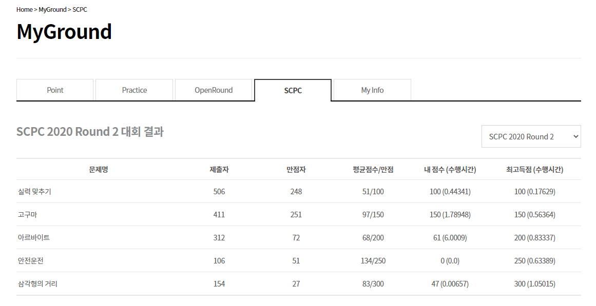
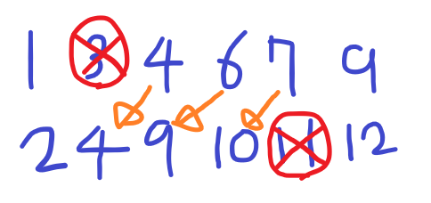
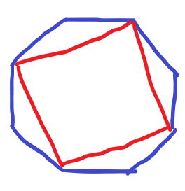

오늘(2020-09-05) 오후 9시에 [SCPC](https://research.samsung.com/scpc) 2020 Round 2가 끝났다.



보다시피 망했다... 1, 2번은 어찌저찌 풀었는데, 3번이 Test case 2까지만 맞고 계속 TLE가 나서 별 짓을 다해보다가 포기.

4번은 세로선을 범위 정해서 어찌저찌하면 되지 않을까...? 생각하다가 너무 복잡해져서 포기.

5번은 문제가 괴랄한데 Test case 1 조건만 보니까 쉬워서 그것만 맞췄다.

# 1. 실력 맞추기

서로 짝을 지어서 실력의 차이의 합을 최소로 만드는 것은 두 배열을 정렬하고 각각 맞추면 최소가 된다.

그런데 문제는 A그룹의 사람을 바꿀 수 있다는 점이다. 이때 바꾸는 경우로는 A그룹의 누군가(A[i])를 B그룹의 누군가(B[i])와 같게 만들어서 서로 소멸하는 방법을 생각할 수가 있다.



그러면 둘 사이에 있는 연속한 숫자들은 한 칸씩 앞으로 당겨지게 된다. 이 경우에는 앞에 숫자가 지워지면서 해당 숫자의 차이는 사라지게 되고, 뒤의 숫자들이 당겨지면서 서로간의 차이들이 변하게 된다. 이렇게 변하는 실력의 차이를 최대로 하는 경우가 정답이 된다.

|      | 0    | 1    | 2    | 3    | 4    | 5    |
| ---- | ---- | ---- | ---- | ---- | ---- | ---- |
| aGap | x    | 0    | 5    | 1    | 1    | 1    |
| bGap | x    | -2   | -1   | -2   | -1   | -2   |

aGap과 bGap은 해당하는 위치가 앞으로 한 칸 당겨졌을 때 실력의 차이가 얼마나 변경되는지 기록하는 배열이다. 더 좋아질수록(실력의 차이가 줄어들수록) 양수의 값을 가진다.

이제 (이 배열의 구간합 + 구간 앞 요소의 실력 차이)의 최대값을 DP를 이용해 풀면 된다.

dp[i] = i번째로 끝나는 구간 중 최대값 일 때

dp[i] = max(aGap[i] + abs(a[i-1] - b[i-1]), aGap[i] + dp[i-1])

-> i위치에서 앞에 구간에서 이어가는 것과 새로운 구간으로 시작하는 것 중 더 큰 것을 선택하면 된다.

```c++
#define _CRT_SECURE_NO_WARNINGS 1

#include <iostream>
#include <cstdio>
#include <utility>
#include <cstdlib>
#include <algorithm>
#include <vector>
using namespace std;

using lli = long long int;

int tNum;
int n;
int a[200001], b[200001];
lli aGap[200001], bGap[200001];
lli dp[200001];

lli gap;

int main(void)
{
    // freopen("input.txt", "r", stdin);
    ios_base::sync_with_stdio(false);
    cin.tie(NULL);

    cin >> tNum;
    for(int tt = 1; tt <= tNum; tt++) {
        gap = 0;

        cin >> n;
        for(int i = 0; i < n; i++) {
            cin >> a[i];
        }
        for(int i = 0; i < n; i++) {
            cin >> b[i];
        }

        sort(a, a + n);
        sort(b, b + n);

        for(int i = 1; i < n; i++) {
            lli re = (lli)abs(a[i] - b[i - 1]);
            aGap[i] = (lli)abs(a[i] - b[i]) - re;

            re = (lli)abs(b[i] - a[i - 1]);
            bGap[i] = (lli)abs(b[i] - a[i]) - re;
        }

        for(int i = 1; i < n; i++) {
            dp[i] = aGap[i] + (lli)abs(a[i - 1] - b[i - 1]);
            if(dp[i] < dp[i - 1] + aGap[i]) dp[i] = dp[i - 1] + aGap[i];

            if(gap < dp[i]) gap = dp[i];
        }
        for(int i = 1; i < n; i++) {
            dp[i] = bGap[i] + (lli)abs(a[i - 1] - b[i - 1]);
            if(dp[i] < dp[i - 1] + bGap[i]) dp[i] = dp[i - 1] + bGap[i];

            if(gap < dp[i]) gap = dp[i];
        }

        lli res = 0;

        for(int i = 0; i < n; i++) {
            res += (lli)abs(a[i] - b[i]);
        }

        cout << "Case #" << tt << "\n";
        cout << res - gap;
        cout << endl;
    }

    return 0;
}
```

# 2. 고구마

문제가 조금 이상한 것 같다... 풀이대로라면 썩은 고구마면 오히려 판매자가 돈을 더 주는 경우가 되는데... 아무튼 문제는 구간합인데 k를 넘지 않는 최대 구간합을 구하면 된다.

단순하게 접근한다면 위 문제와 비슷하게 i번째가 마지막인 구간일 때 k를 넘지 않는 최대 구간합을 구하는 방법을 생각할 수 있다. 문제는 k를 넘지 않는 이라는 조건 때문에 위 문제처럼 단순 비교로는 안 되고, 구간의 앞을 잘라가면서 확인을 해야 하는데 이러면 O(n^2)라서 무조건 시간초과다. (n <= 300000)

그렇기 때문에 구간의 앞을 자르는 과정을 더 빠르게 해야 한다. 구간의 합을 k 이하로 만들기 위해서는 자를 구간의 합이 **현재 구간의 합 - k**보다 크거나 같은 값이어야 한다. 이 값을 req라고 하자.  그리고 앞을 자르지 않은 구간의 합들을 현재 지점까지 저장해둔다. 이제 저장된 구간합 중에 req보다 크거나 같으면서 가장 근접한 구간합으로 자르면 최적의 구간합이 됨을 알 수 있다. 이것을 BST를 이용하면 구간합을 넣는데 O(logn), 값을 찾는데 O(logn)이 걸리기 때문에 최종 시간복잡도는 O(nlogn)이 된다.

BST는 std::set과 lower_bound를 이용하면 쉽게 구현할 수 있다.                                                                                                                                                                                                                                                                                                                                                                                                                                                                                                                                                                                                                                                                                                            

```c++
#define _CRT_SECURE_NO_WARNINGS 1

#include <iostream>
#include <cstdio>
#include <utility>
#include <set>
using namespace std;

using lli = long long int;

int tNum;
int n;
lli m;
lli d[300001];
lli res;
set<lli> pre;

int main(void)
{
    // freopen("input.txt", "r", stdin);
    ios_base::sync_with_stdio(false);
    cin.tie(NULL);

    cin >> tNum;
    for(int tt = 1; tt <= tNum; tt++) {
        res = 0;
        pre.clear();

        cin >> n >> m;
        for(int i = 0; i < n; i++) {
            cin >> d[i];
        }

        pre.insert(0);
        lli sum = 0;
        for(int i = 0; i < n; i++) {
            sum += d[i];
            auto findIter = pre.lower_bound(sum - m);
            if(findIter != pre.end()) {
                if(res < sum - *findIter) {
                    res = sum - *findIter;
                }
            }
            pre.insert(sum);
        }

        cout << "Case #" << tt << "\n";
        cout << res;
        cout << endl;
    }

    return 0;
}
```

# 3. 아르바이트 (Test Case 2까지)

배열에 들어가있는 숫자들이 계속 바뀌게 된다. 그래서 중간값을 기준으로 나눈 down, up BST를 만들고, 값이 변할때마다 이 down, up에 서 값들을 넣다 뺐다 하면서 균형을 맞춰준다. 이러면 O(nlogn + qklogn) (초기값 정렬 + 모든 값 갱신)이 된다.

하지만 이래도 TLE가 난다... 끝나고 찾아보니까 set / multiset이 삽입/제거가 O(logn)이지만 상수가 좀 있어서 그러는 것 같다. priority_queue를 쓰면 된다고 하는데 나중에 다시 풀어봐겠다.

```c++
#define _CRT_SECURE_NO_WARNINGS 1

#include <iostream>
#include <cstdio>
#include <utility>
#include <set>
#include <algorithm>
#include <vector>
using namespace std;

using lli = long long int;

int tNum;
int n, k, q;
int d[200001];
multiset<int> down, up;
int downNum, upNum;
vector<int> tmp;
int tSize;
vector<pair<int, int>> changedNums;
int res[200001];

void getChangedNum(int idx, int v)
{
    changedNums.clear();

    int st = idx - k + 1;
    st = max(st, 0);

    int sum = 0;
    for(int i = 0; i < k; i++) {
        sum += d[st + i];
    }
    changedNums.push_back({ sum, 0 });

    for(int i = st; i < idx; i++) {
        int ed = i + k;
        if(ed > n - 1) break;

        sum -= d[i];
        sum += d[ed];
        changedNums.push_back({ sum, 0 });
    }

    d[idx] = v;

    int cNum = 0;
    st = idx - k + 1;
    st = max(st, 0);

    sum = 0;
    for(int i = 0; i < k; i++) {
        sum += d[st + i];
    }
    changedNums[cNum++].second = sum;

    for(int i = st; i < idx; i++) {
        int ed = i + k;
        if(ed > n - 1) break;

        sum -= d[i];
        sum += d[ed];
        changedNums[cNum++].second = sum;
    }
}

void update()
{
    for(auto ch : changedNums) {
        if(ch.first == ch.second) continue;

        auto it = down.find(ch.first);
        if(it != down.end()) {
            down.erase(it);
            downNum--;
        } else {
            auto it2 = up.find(ch.first);
            if(it2 != up.end()) {
                up.erase(it2);
                upNum--;
            }
        }

        if(up.empty() == true || *up.begin() < ch.second) {
            up.insert(ch.second);
            upNum++;
        } else {
            down.insert(ch.second);
            downNum++;
        }

        if(downNum > tSize / 2) {
            auto t = down.end();
            t--;
            up.insert(*t);
            down.erase(t);

            upNum++;
            downNum--;
        } else if(downNum < tSize / 2) {
            auto t = up.begin();
            down.insert(*t);
            up.erase(t);

            downNum++;
            upNum--;
        }
    }

    changedNums.clear();
}

int main(void)
{
    // freopen("input.txt", "r", stdin);
    ios_base::sync_with_stdio(false);
    cin.tie(NULL);

    cin >> tNum;
    for(int tt = 1; tt <= tNum; tt++) {
        down.clear();
        up.clear();
        downNum = 0;
        upNum = 0;
        tmp.clear();

        cin >> n >> k >> q;
        for(int i = 0; i < n; i++) {
            cin >> d[i];
        }

        int sum = 0;
        for(int i = 0; i < k; i++) {
            sum += d[i];
        }
        tmp.push_back(sum);

        for(int i = k; i < n; i++) {
            sum -= d[i - k];
            sum += d[i];
            tmp.push_back(sum);
        }
        
        sort(tmp.begin(), tmp.end());

        tSize = tmp.size();
        for(int i = 0; i < tSize / 2; i++) {
            down.insert(tmp[i]);
            downNum++;
        }
        for(int i = tSize / 2; i < tSize; i++) {
            up.insert(tmp[i]);
            upNum++;
        }

        res[0] = *up.begin();

        for(int i = 1; i <= q; i++) {
            int a, b;
            cin >> a >> b;
            a--;

            getChangedNum(a, b);
            update();

            res[i] = *up.begin();
        }

        cout << "Case #" << tt << "\n";
        for(int i = 0; i <= q; i++) {
            cout << res[i] << " ";
        }
        cout << "\n";
    }

    return 0;
}
```

# 5. 삼각형의 거리 (Test Case 1까지)

5번 답게 엄청난 기하 문제이다. 그런데 Test Case 1이 '모든 다각형은 볼록다각형이다.' 라는 문구가 있다.

볼록다각형인 경우 안쪽에 삼각형들을 그려놓으면 볼록다각형을 유지하는 상태라면 어떻게든 변형해도 삼각형들의 배치는 변하지 않는다. 그러므로 좌표를 신경쓰지 말고, 몇각형인지만 신경쓰면 된다.



곰곰히 생각해보면 위 그림처럼 가장자리를 먼저 삼각형으로 만드는 것이 좋다는 것을 알 수 있다. 이러면 가운데가 각의 수가 줄어든 다각형을 발견할 수 있고, 해당 다각형에서의 최소값만 알면 그 값 +2가 정답임을 알 수가 있다. 간단한 dp문제이다.

dp[i] = dp[i / 2] + 2  // i가 짝수

​          = dp[i / 2 + 1] + 2 // i가 홀수

```c++
#define _CRT_SECURE_NO_WARNINGS 1

#include <iostream>
#include <cstdio>
#include <utility>
using namespace std;

using lli = long long int;

int tNum;
int n;
int dp[301];

int main(void)
{
    dp[4] = 1;
    dp[5] = 2;
    for(int i = 6; i <= 300; i++) {
        if(i%2 == 0)
            dp[i] = dp[i / 2] + 2;
        else
            dp[i] = dp[i / 2 + 1] + 2;
    }

    // freopen("input.txt", "r", stdin);
    ios_base::sync_with_stdio(false);
    cin.tie(NULL);

    cin >> tNum;
    for(int tt = 1; tt <= tNum; tt++) {
        cin >> n;
        for(int i = 0; i < n; i++) {
            int a, b;
            cin >> a >> b;
        }
        
        cout << "Case #" << tt << "\n";

        cout << dp[n] << endl;
    }

    return 0;
}
```

물론 다각형이 볼록다각형이 아닌 경우에는 위의 방법이 적용되지 않는다.

---

이번 Round2에서는 아마 떨어질 것 같다. 아마 나랑 같은 점수대에서 갈릴 것 같은데 이러면 제출 횟수가 중요해진다. 총 제출을 13번이나 했기 때문에 힘들 것 같다. 아쉽지만 내년을 노려봐야 겠다.