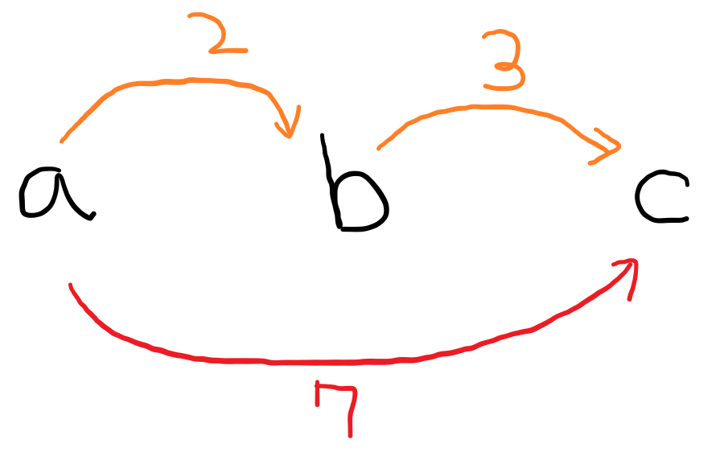

[ABC216G - 01Sequence](https://atcoder.jp/contests/abc216/tasks/abc216_g)의 [에디토리얼](https://atcoder.jp/contests/abc216/editorial/2474)을 보는데, 문제를 **소 게임(牛ゲー)** 형태로 변형해서 풀면 된다고 나와있다. 처음 보는 유형이라서 검색해보니까 특이한 유형이라서 정리해본다.

-----

# BOJ 7040 - 밥 먹기

[BOJ 링크](https://www.acmicpc.net/problem/7040)

소 게임은 위 문제에서 나온 풀이를 일본에서 부르는 말인 것 같다. [개미책(蟻本)](https://www.amazon.co.jp//dp/4839941068/)으로 알려진 풀이같다. (번역본이 있는데, 속칭 [노란책](http://www.yes24.com/Product/goods/5814363)이라 부른다.)

어떤 주어진 **수열**이 있고, 이 수열에 **제약 조건** \\(x_j - x_i ≤ c\_{i,j}\\)들이 있을 때, \\(x_q - x_p\\)의 **최댓값**을 구하고 싶다. 결론부터 말하자면, 각 수열을 **그래프의 노드**라고 생각하고 제약 조건들을 \\(i → j\\)로 가는 \\(c\_{i,j}\\) 비용의 **단방향 간선**을 넣고, \\(p\\)에서 \\(q\\)의 **최단경로**를 구하면 된다.

이 개념은 간선이 두 노드 사이 거리를 **묶어**둔다고 생각하면 된다. 위의 그림처럼 a와 c가 7인 줄로 묶여있는데, a와 b, b와 c가 각각 2, 3인 줄로 묶여있으면, a와 c를 최대한 잡아당겨도 주황색 줄에 의해 최대 5까지만 늘어나게 된다. 이 최대값은 a와 c의 최단경로로 구할 수 있다.

부등호가 **반대**인 경우에는 식들을 적절히 넘겨서 방향을 바꿔주면 된다. 그러면 간선의 방향은 **반대**가 되고, 비용은 **음수**가 된다. 이는 두 노드 사이 거리가 최소한 간선 비용 이상이어야 한다는 것을 말한다. 만약 두 노드의 최대 거리가 이 비용보다 작으면, **음수 사이클**이 생기게 돼서 불가능한 경우가 된다.

좀 더 자세한 증명은 밑에 참고 자료에서 볼 수 있다(일본어).

-----

위 문제에서 제약 조건들을 살펴보면,

1. 일단 **번호 순**으로 줄을 서기 때문에 \\(x_{i+1} - x_i ≥ 0\\)
2. 서로를 **좋아하는** 소는 \\(x_b - x_a ≤ c_{a, b}\\)
3. 서로를 **싫어하는** 소는 \\(x_b - x_a ≥ c_{a, b}\\)

3가지로 나눌 수 있다. 이 제약 조건들로 간선을 그어보면,

1. \\(i+1 → i\\)로 비용 \\(0\\)인 간선 \\( (x_i - x_{i+1} ≤ 0) \\)

2. \\(a → b\\)로 비용 \\(c_{a, b}\\)인 간선 \\( (x_b - x_a ≤ c_{a, b}) \\)
3. \\(b → a\\)로 비용 \\(-c_{a, b}\\)인 간선 \\( (x_a - x_b ≤ -c_{a, b}) \\)

긋고 \\(1\\)에서 \\(n\\)의 최단경로를 구하면 된다. 음수인 간선이 있기 때문에 **벨만-포드**를 사용해야 한다. 만약 도달하지 못해서 INF값이라면 \\(-2\\), 음수 사이클이 생기면 \\(-1\\)을 출력하면 된다.

[소스코드](https://github.com/Cube219/PS/commit/215f99c0ec2d786e12e5baf1446741cc8898b83b)

-----

# ABC216G - 01Sequence

[문제 링크](https://atcoder.jp/contests/abc216/tasks/abc216_g)

\\([L, R]\\)에서 \\(1\\)의 개수가 \\(x\\)개 이상이라는 말은, \\(0\\)의 개수가 \\(R-L+1-x\\)개 이하라는 말과 동치이다. 이제 \\(B_n\\)을 \\(A1,A2,...,An\\)까지 \\(0\\)의 개수라고 정의하자. 그러면 \\(B_R - B_{L-1} ≤ R-L + 1 - X\\) 라는 부등식을 얻을 수 있다 (Prefix sum을 생각하면 된다).

여기에 추가로

* \\(B_i - B_{i+1} ≤ 0\\)
* \\(B_{i+1} - B_i ≤ 1\\)
* \\(B_0 = 0\\)

가 성립한다. 이러면 \\(B_n\\)의 최댓값을 구할 수 있고 전체에서 최소 1의 개수를 알 수 있다(\\(0\\)의 최댓값 → \\(1\\)의 최솟값). 이제 \\(1\\) ~ \\(n\\)범위에서 최소 1의 개수를 알았으니, 뒤에서부터 보면서 \\(B\_{i}\\)와 \\(B\_{i - 1}\\) 값이 같으면 1, 다르면 0을 넣으면 된다. 간선의 비용들이 전부 **양수**이므로, **다익스트라** 알고리즘을 사용해도 된다.

[소스코드](https://atcoder.jp/contests/abc216/submissions/25499344)

> 실은 이 문제는 **그리디 + 세그먼트 트리**로 푸는 것이 더 쉽다. 쿼리를 \\(R\\)이 **작은 순**으로 정렬하고, 현재 해당 구간에서 \\(1\\)의 개수를 세고 부족한 1의 개수만큼 현재 구간의 **오른쪽부터** 채워주면 된다. 넣어줄 \\(1\\)의 위치는 **스택**을 이용해 저장하면 된다. [소스코드](https://github.com/Cube219/PS/commit/0e883bcddad8903f7c4c9585c6234015d43a9847)

-----

# 참고 자료

 https://qiita.com/tanabe13f/items/6c723c29a121de760790
