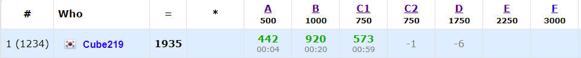

PS + 그래픽스 공부를 하려고 한 학기 휴학을 했는데, 집에서만 하다보니까 생각보다 공부할 의욕이 나질 않았다. 그래서 앞으로 공부한 것을 블로그에 꾸준히 기록하면서 동기부여와 성취감을 주기로 했다. 그 중 하나로 CodeForeces Contest 나간 것을 정리하려고 한다.

-----

어제 [Codeforces Round #703 (Div. 2)](https://codeforces.com/contest/1486)에 참가했다. C번에 interactive 문제가 있었는데, 아직 interactive에 익숙하기 않아서 푸는데 시간이 조금 걸렸다. 그리고 B번도 접근을 잘못해서 조금 시간이 걸렸다.

D번에 남은 모든 시간을 쏟고 결국 못 풀었는데, 그냥 C1 문제 조금 수정해서 C2나 풀걸 그랬다...

[Code](https://github.com/Cube219/PS/tree/main/CodeForces/1486%20-%20Codeforces%20Round%20%23703%20(Div.%202))

# A. Shifting Stacks

돌을 오른쪽으로 옮길 수 있기 때문에 최소한의 돌을 써서 조건을 만족하려면 `0, 1, 2, 3, ...` 이런 순서로 돌을 배치하면 된다. 남은 돌들은 마지막에 몰아넣으면 된다.

그러면 앞에서부터 돌의 개수를 누적해 더하면서 이게 `0, 1, 2, 3, ...`의 누적합보다 작아지는 경우는 이 순서로 배치할 수 없으므로 NO, 다 가능하면 YES를 출력하면 된다.

# B. Eastern Exhibition

거리를 x좌표의 차이 + y좌표의 차이로 계산하기 때문에, x와 y를 분리해서 접근해보자.

그러면 x좌표들의 중간 지점을 잡으면 x좌표 거리의 합이 최소가 된다. 만약 개수가 홀수인 경우 딱 중심에 있는 집에 둬야하고, 짝수인 경우 그 사이에 두면 된다. 이렇게 x좌표 기준으로 가능한 경우의 수를 구할 수 있다.

이걸 똑같이 y좌표에도 적용하고 `x좌표 기준 경우의 수 * y좌표 기준 경우의 수`를 하면 된다.

-----

처음에는 중복되는 좌표를 빼고 생각을 했는데, 중복되어도 상관이 없다는 것을 나중에 깨달았다...

# C1. Guessing the Greatest (easy version)

최근에도 컨셉이 비슷한 interactive문제가 있어서 이분탐색으로 접근했다.

-----

일단 전체를 쿼리를 날려서 2번째로 큰 수 위치(2idx)를 구한다. 그리고 이분탐색을 돌린다.

왼쪽 절반 / 오른쪽 절반 각각 쿼리를 날려서 각각 범위의 2idx를 구하고, 이게 전체 범위의 2idx하고 같으면 해당 구간에 가장 큰 수가 있으므로 해당 구간으로 줄여서 위 과정을 반복하면 된다. 

그러다가 크기가 2나 3으로 줄어들게 되는데,

* 2인 경우: 2idx가 아닌 위치가 답

* 3인 경우
  * 2idx가 마지막에 위치해 있으면 가장 큰 수가 앞에 1~2구간에 있으므로 해당 구간을 쿼리를 날리고 2인 경우를 적용하면 된다.
  * 2idx가 1~2구간에 위치해 있으면 가장 큰 수가 3구간이 있을 수도 있는데, 이는 1~2구간에 쿼리를 날려서 2idx값이 바뀌면 가장 큰 수가 3구간에 있는거고, 아니면 1~2구간이 있으므로 2인 경우 적용.

이러면 이분탐색 한 번에 2번의 쿼리를 날리기 때문에  `2*log2(100000) = 33.21...`로 C1을 풀 수 가 있다. 하지만 C2는 쿼리 제한이 20으로 위 방식으로는 풀 수 가 없다.

# C2. Guessing the Greatest (hard version)

C1을 풀고나서 C2는 그냥 넣어봤는데 당연히 쿼리 개수를 넘어가니까 틀렸다. 전략을 수정해야 할 것 같아서 그냥 바로 D로 넘어갔다.

-----

Upsolving을 해보니, 핵심적인 부분은 처음 구한 2idx를 계속 이용하는 것이다. 2idx를 구하고 [1, 2idx] 범위로 쿼리를 날린 결과가 2idx랑 같으면 해당 범위에 가장 큰 수가 있고, 없으면 [2idx, n] 범위에 있게 된다.

이제 이 범위에서 가장 큰 수를 찾으면 되는데, 왼쪽 범위와 오른쪽 범위 처리 방식이 약간 다르다.

오른쪽 범위인 경우, 해당 범위의 중간값 위치를 midx라 할 때, [2idx, midx]를 해서 2idx랑 midx랑 같으면 범위의 왼쪽 절반에 가장 큰 수가 있는 것이고, 오른쪽 절반에 있게 된다.

왼쪽 범위인 경우 이 개념을 뒤집어서 ( [midx, 2idx] ) 생각하면 된다. 이렇게 하면 쿼리를 절반으로 줄일 수 있게 된다.

-----

이분탐색이 생각보다 까다로운게 설계를 잘못하면 개수가 1~3개 남은 마지막 케이스에서 꼭 틀리는 경우가 나온다. Upsolving 할 때도 마지막 케이스때문에 조금 시간이 걸렸다. 이분탐색 문제를 몇 개 더 따로 풀어봐야겠다.

# D. Max Median

Contest때는 투포인터 + running median으로 양쪽 끝중에 더 작은 값을 빼는 방식으로 접근했는데 계속 WA가 나왔다. 아마 풀이가 틀렸다고 생각하고 다른 방법을 생각하다가 결국 못 풀었는데 나중에 Editorial을 보니까 문제를 결정문제로 바꿔서 풀어버리더라... parametric serach는 심심하면 나오는데 알아차리기가 힘든 것 같다.

-----

일단 이 문제는 parametric search로 생각을 해야 한다. 어떤 값 x를 잡고 어떤 subarray의 중앙값이 이 x보다 크거나 같으면 x값을 늘리고, 아니면 줄이는 방식으로 접근해야 한다.

이러면 위의 조건을 판별하는 방법은, 먼저 새로운 배열을 하나 만들어서 x보다 크거나 같으면 1, 작으면 -1로 바꿔서 넣는다. 이러면 위의 조건은 subarray의 합이 0보다 크면 조건을 만족한다는 것을 알 수가 있다. (0보다 커지는 경우면 1의 개수가 더 많은 경우인데, 이러면 당연히 1이 중앙값에 위치하게 되고, 이는 중앙값이 x보다 크거나 같다는 것을 의미한다.) 이것을 prefix sum을 이용해 subarray의 최대값을 구하고 이게 0보다 큰지 검사하면 된다.

prefix sum을 이용해 구하는 방법은 반복문을 돌면서 sum[i-k] 이 최소값인지 확인 후 갱신하고(이러면 [0, i-k] 구간의 최소값이 됨), 이 값이 sum[i] - 최소값이 i에서 끝나는 subarray의 최대값이 된다.

-----

parametric search는 개념은 쉬운데 문제로 나오면 꽁꽁 숨겨져서 나와서 알아차리기가 어렵다. 결정 문제로 바꾸면 확인하는 조건이 쉬워진다는 점을 빨리 알아내야 하는데... 쉽지 않다.

# E. Paired Payment

E가 더 쉬웠다는 말이 좀 있던데, Upsolving해보니 둘 다 비슷한 난이도인 것 같다. 역시 이것도 특정한 방법을 알지 못하면 풀기 힘든 문제였다.

-----

일단 먼저 생각할 수 있는 것은, 2번 가는 경로로 그래프를 다시 만들어서 다익스트라를 돌리는 것인데 이러면 시간과 메모리가 초과하게 된다.(최악의 경우 각 정점에 모든 간선이 생겨서 간선 개수가 n^2이 된다.) 그래서 문제를 자세히 읽어보면 길의 비용이 50으로 아주 작은 것을 알 수가 있는데, 그러면 [BOJ 1533 - 길의 개수](https://www.acmicpc.net/problem/1533)이 문제와 비슷한 테크닉을 이용할 수 있다.

먼저 각 정점마다 추가로 50개의 새로운 정점을 만든다. 편의를 위해 각 정점의 번호 * 51을 해서 확보하자. 이 정점들은 A라는 곳으로 가는 경로가 있을 때 A + cost 로 중간에 거쳐가는 정점이라고 생각하면 된다. a, b, cost인 간선을 읽으면, 먼저 a->[b의 중간지점]으로 가는 간선은 (a * 51 -> b * 51 + cost)이고 비용이 0인 간선을 추가한다. 비용이 0인데, 이는 나중에 중간지점 -> 다른정점으로 갈 때 함께 계산한다. 그리고 [b의 중간지점들] -> a로 가는 간선인 (b * 51 + i -> a * 51)를 추가한다. 비용은 (cost + i)^2으로 계산하면 된다.

간선의 비용을 추가 정점으로 계산한다고 생각하면 된다. 이제 이 그래프를 다익스트라를 돌려서 풀면 된다. 이러면 간선의 개수가 e * 51로 확 줄면서 시간 내에 나올 수 있게 된다.

