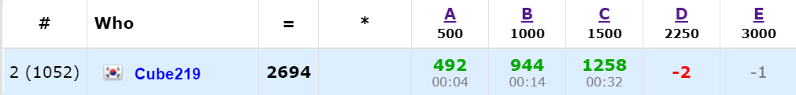

오늘 [Codeforces Round #704 (Div. 2)](https://codeforces.com/contest/1492)에 참가했다. 난이도는 평소보다 쉽게 나온 것 같다. 이번에는 그래도 괜찮게 푼 것 같다. D번까지 푸니까 힘이 다 빠져서 E번은 대충 생각하고 넘어갔는데, 지금 생각해보면 후반에도 집중했으면 풀었을 것 같다는 생각이 든다.

+ 글쓰는 도중에 D번에서 System test fail이 떳다. 망할

[전체 Code](https://github.com/Cube219/PS/tree/main/CodeForces/1492%20-%20Codeforces%20Round%20%23704%20(Div.%202))

# A. Three swimmers

p초일 때 세 선수가 왼쪽 끝까지 얼마나 남았는가만 계산해서 풀면 된다. 왕복하는데 시간을 `x`초라고 하면, `p % x`를 하면 가장 마지막으로 왼쪽 끝을 찍고 몇 초가 흘렀는지 알 수 가 있다. 이것을 `x - (p % a)`처럼 x에 대해 빼주면 남은 시간을 알 수 있다. 다만 `p % x`가 0인경우는 현재 왼쪽 끝에 있는 경우인데, 이 경우에만 0으로 바꿔주면 된다.

# B. Card Deck

문제 설명과 test case들을 봤을 때, 덱에 남아있는 카드 중 가장 큰 카드를 기준으로 뽑아내면 무조건 최대가 된다는 점을 파악할 수 있다. 왜냐하면 맨 처음에 뽑은 카드는 `n^n-1`를 곱하는데, 이 값이 다른 값을을 압도?하기 때문이다. 자세한 증명은 Editorial에서...

가장 큰 카드의 위치를 기준으로 뽑을 때, 무식하게 그냥 덱을 순환해서 최대값 찾고 이러면 시간초과가 날 수도 있다. 방법은 여러가지가 있을 것 같은데 필자가 푼 방식은, 먼저 `x`번 카드가 덱에 있으면 `1`인 `idx[x]` 배열을 만들고, 덱에서 빠져나가면 `idx[x]`를 `0`으로 만들어준다. 그리고 현제 최대값에서 가장 가까운 최대값을 `idx`배열을 이용해서 찾으면 된다.

# C. Maximum width

문자열을 `s1`, `s2`라고 하면, `s2`를 왼쪽으로 최대한 몰아넣은 뒤, 맨 뒤 글자부터 하나씩 오른쪽으로 붙이면서 최대값을 구하면 된다.

최대한 오른쪽으로 붙일 때 어느 위치에 붙여야 하는지 알아야 하는데, 이는 prefix sum이랑 비슷한? 개념을 가진 전처리 배열을 만들면 된다. `last[x][y]`를 `x`길이만큼 있을 때 `y`번째 알파벳이 가장 마지막에 있는 위치로 정의하고, 미리 값들을 채워넣는다. 그리고 오른쪽으로 붙일 때는, 직전에 붙인 자리를 `i`라 했을 때 `last[i-1][y]`에다가 붙이면 된다.

# D. Genius's Gambit

쓰는 도중 System test fail이 나긴 했는데... 일단 내 풀이를 적어본다. (다행히 풀이는 맞았다)

일단 1들을 전부 왼쪽으로 밀고, 나머지는 0을 오른쪽에 넣어둔다. 이제 가장 오른쪽에 있는 1을 한 칸씩 옮기면 1의 개수가 늘어나게 된다. 이렇게 끝까지 밀어보고, 부족하면 그다음 오른쪽에 있는 1을 한 칸 옮기면 역시 1의 개수가 1개 늘어난다. 여기서 한 칸 더 옮기면 오히려 줄어들게 되니까 그다음 오른쪽에 있는 1을 한 칸 옮긴다. 그러다가 맨 왼쪽 1도 옮기는 경우가 생기면 No를 출력한다.

여기서 1이 1개인 경우만 예외처리를 해서 pretest는 통과를 했는데... 좀 더 생각해봐야 겠다.

-----

다시보니까 풀이는 맞는데, 코드에서 0이 없고 1만 있는 경우(111111)인 경우 오류가 있었다. 1이 한 개만 있는 경우는 체크했는데 저 경우는 체크를 못 했다. 이런 코너케이스들을 꼼꼼히 체크했어야 했는데...

# E. Almost Fault-Tolerant Database

풀이를 보니 그냥 백트래킹이다. 생각은 해보긴 했는데 시간초과 날 것 같아서 넘겼던 건데...

-----

먼저 첫 번째 배열을 기준으로 다른 배열들을 전부 검사한다. 만약 다른 모든 배열의 차이가 2 이하라면 바로 첫 번째 배열로 출력하면 되고, 한 개라도 5 이상이라면 No를 출력한다. 그러면 이제 첫 번째 배열하고 3~4개 차이가 나는 배열만 남게 된다. 이 배열들이 만족하도록 첫 번째 배열을 바꾸면 되는데, 3개 차이는 1개, 4개 차이는 2개를 바꾸면 되니 각각 경우의 수가 3개, 6개가 생긴다. 이 경우의 수를 모든 3~4개 차이가 나는 배열에 대해서 백트래킹을 해 모든 경우를 구하고, 모든 배열을 만족하는 경우가 있으면 출력, 없으면 No를 출력하면 된다.

여기서 그냥 하니까 시간초과가 나서 백트래킹 함수에 remain 파라미터를 넣어서 첫 번째 배열이 최대 2개까지만 바뀌도록 하니까 통과했다.

