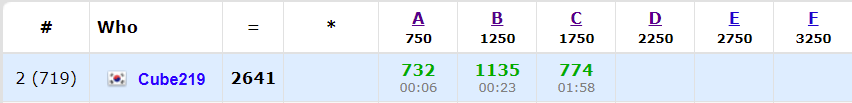

[Codeforces Round #705 (Div. 2)](https://codeforces.com/contest/1493)에 참가했다. C에서 좀 삽질을 해서 만족스럽진 않다. C 고민 -> D 고민 -> C 고민 이렇게 왔다갔다 하니까 오히려 더 망하는 것 같다. 그래도 전에 레이팅을 많이 떨어뜨려놔서 조금은 오를 것 같다.

[전체 Code](https://github.com/Cube219/PS/tree/main/CodeForces/1493%20-%20Codeforces%20Round%20%23705%20(Div.%202))

# A. Anti-knapsack

처음에 문제가 무슨 소리인지 이해가 가지 않아서 조금 시간이 걸린 문제이다.

-----

일단은 `k`보다 큰 수들은 어떤 것을 더해도 `k`보다 크기때문에 답으로 넣어준다. 그리고 남은 것들이 중요한데, 그냠 남은 것들의 뒤에 절반만 넣어주면 된다. 그래야 반대편이랑 매칭이 안 되기 때문이다. 예를 들어 `k`가 `7`인 경우 `1, 2, 3`은 빼고 `4, 5, 6`은 넣고 이런식으로.

# B. Planet Lapituletti

일단 뒤집었을 때도 유효한 숫자는 `0, 1, 2, 5, 8`밖에 없다는 것을 알 수 있다. 여기서 `2 <-> 5`이고 나머지는 그대로 유지된다.

자리수가 모두 2자리이기 때문에, 분에 1씩 더해가면서 뒤집었을 때 유효한지 체크하면 된다. 뒤집을 떄 분/초가 서로 바뀌고 2는 5로, 5는 2로 바뀌고, 한 자리수는 두 자리수(8이면 80)가 된다는 점에 주의해야 한다.

# C. K-beautiful Strings

기존의 string보다 커야하기 때문에, 뒤에서부터 바꿔보자. 현재 위치를 `i`라 할 때, `str[i]`에 있는 알파벳보다 큰 알파벳을 넣으면, `i + 1`부터 맨 뒤까지 자리에는 아무 알파벳이나 들어가도 된다. 이제 이 남은 자리에 a부터 `k`로 나눠지지 않아 부족한 알파벳을 채우고, 남은 자리는 전부 a로 채우면 된다. 이것을 뒤에서부터 하면 된다. 알파벳의 숫자는 `num[x]`로 관리하면 된다.

-----

여기서 주의할 점은 알파벳을 채우는 과정을 바로 하는 것이 아니라 가능한 지 확인 후 가능한 경우에만 최종적으로 채워야 한다. 이것 때문에 TLE를 한 번 받았다...

# D. GCD of and Array

아이디어는 간단하다. 각 자리의 수마다 소인수분해를 하고, 소수들이 모든 자리에 1이상 있는 경우 결과에 `해당 소수 * 해당 소수에서 가장 적은 수`를 곱해준다. 그리고 쿼리가 들어올 때, 쿼리 값을 소인수분해하고 쿼리 자리에 소수들을 곱해서 해당 소수의 최소 개수가 갱신되는 경우 그만큼 곱해주면 된다.

하지만 문제는 `n`이 20만이기 때문에 어떻게 소수의 최소 개수를 관리할지가 문제다. 구간의 최소값이기 때문에 세그트리도 생각해봤는데 메모리가 부족할 것 같고, map도 시간이나 메모리가 부족할 것 같았다. 하지만 업솔빙을 해보니 map으로도 풀리더라...

map을 `map[소수] = { 인덱스, 개수 }`로 정의하고, `map[소수].size()`가 `n`이 되면 해당 소수의 최소 개수가 갱신된 것이기 때문에 `map[소수]`를 돌면서 최소 개수만큼 개수를 빼주고, 개수가 0인 것은 제거해준다. 그리고 결과값에 `최소 개수 * 소수`를 곱해주면 된다.

