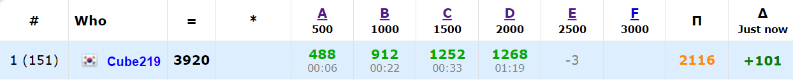
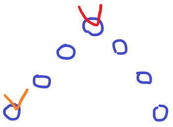
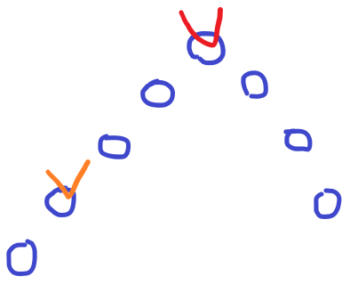
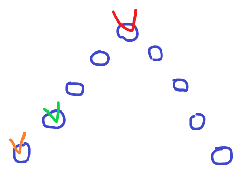

[Codeforces Round #706 (Div. 2)](https://codeforces.com/contest/1496)에 참가했다. 다행히 D까지 풀어서 괜찮은 결과가 나온 것 같다. E는 뭐 어떻게 해야할지 몰랐는데, 나중에 다른 사람의 풀이를 보니까 생각보다 쉬운 문제였다.

[전체 Code](https://github.com/Cube219/PS/tree/main/CodeForces/1496%20-%20Codeforces%20Round%20%23706%20(Div.%202))

# A. Split it!

앞뒤로 펠린드롬이어야 하는데, 각 조각의 크기를 1개로 해야 앞/뒤 길이가 최소가 되고, 그래야 맞을 가능성이 높아진다. 그래서 앞/뒤로 펠린드롬 길이를 구하고, 이 길이가 `k`보다 크면 YES, 작으면 NO이다. 여기서 같을 경우가 문제가 되는데, `a_k + 1`이 있기 때문에 `k`로 가득 차는 경우`(k*2 == n)`에는 NO, 아니면 YES를 하면 된다.

# B. Max and Mex

몇몇 케이스들을 만들어서 손으로 풀어보면, 경우의 수가 몇 가지 없다는 것을 알 수 가 있다.

1. 모든 수가 있는 경우 (0, 1, 2, ...)

   이 경우에는 **mex**는 max+1이 되는데, 추가되는 값은 max+1이 된다. 즉, 셋에 최대값이 하나 늘어나고, 다시 1번 경우처럼 된다.

2. **mex**와 max의 차이가 1인 경우 (0, 1, 2, 4)

   이 경우 추가되는 값은 4로, 즉 max값이다. 즉 그대로(2번 경우) 된다.

3. **mex**와 max의 차이가 2이상인 경우 (0, 1, 2, 7)

   이 경우 추가되는 값은 5 ((3+7)/2 = 5)로, **mex**값보다 크고, max값보다 작다. 즉, 3번 경우처럼 된다.

1번 경우는 연산을 할 때마다 하나씩 늘어나므로 `n+k`, 2번 경우는 안 바뀌므로 `n`, 3번 경우는 추가되는 값이 원래 배열에 있으면 `n`, 없으면 `n+1`로 하면 된다(`k > 0`인 경우에만).

# C. Diamond Miner

일단 miner와 mine의 위치를 따로 저장하고, 각각 가장 큰 값 끼리 연결하면 합산한 값은 가장 작은 값이 된다. 왜냐하면, 결국 miner거리^2 + mine거리^2의 제곱근인데, 제곱근은 값이 증가할수록 증가폭이 적어지기 때문에 한 번 제곱근으로 묶을 때 가장 큰 값을 묶어야 효율이 좋기 때문이다.

뭔가 애매하게 넘어갔는데 아마 Editorial에 내용 증명이 있지 않을까...

# D. Let's Go Hiking

상당히 흥미롭고, 어려운 문제였다. 게임이론이라 처음에는 DP인 줄 알았다.

-----

일단 산봉우리(극댓값)에 있어야 가능성이 있다는 것을 알 수 있다. 경사진 곳에 있으면 바로 근처 아래에 둬서 못 움직이게 할 것이고, 극솟값은 어차피 움직일 수가 없기 때문이다.

이제 산봉우리에서 양옆으로 경사의 길이가 어느정도인지 알아봐야 하는데, 여러 경우들을 살펴보면 결국 양옆 경사 길이가 같고 산봉우리포함 경사의 길이가 홀수인 경우만 가능하다는 점을 알 수 있다.

1. 만약 짝수 길이인 경우

   

   상대방이 맨 끝에 자리잡으면 무조건 지게 된다. 왼쪽으로 가면 만나게 되고, 오른쪽으로 가면 내가 먼저 끝에 도달하기 때문이다.

2. 양옆 길이가 다른 경우

   

   상대방이 긴 쪽으로 짝수 길이가 되게 자리잡으면 위의 경우가 되서 무조건 지게 된다.

3. 홀수 길이인 경우

   

   상대방이 맨 끝에 자리잡으면 그쪽 방향으로 가서 이기면 되고, 초록색처럼 짝수 길이에 자리잡으면 반대편으로 가면 이길 수 있다.

여기에 추가로 만족하는 경사 길이보다 크거나 같은 경사가 다른 곳에 있으면 안 된다. 상대방이 다른 경사를 타고 올라가는 경우가 있기 때문이다.

-----

위의 경우를 찾는 방법은 여러가지가 있을 것 같은데, 본인은

1. `d[i - 1] < d[i] && d[i] > d[i + 1]`인 위치를 찾고, 양 옆 경사의 길이를 구한다.
2. 양 옆 경사의 길이가 같고 홀수인 경우,
   1. 최대 경사 길이가 갱신이 된다면 `res = 1`하고 경사 길이 갱신
   2. 최대 경사 길이가 같으면 `res = 0`
3. 위의 조건이 아닌데 최대 경사 길이가 갱신되거나 같으면 `res = 0`
4. 마지막에 맨 왼쪽->오른쪽 내려가는 경사, 맨 오른쪽->왼쪽 내려가는 경사도 체크해 최대 경사 길이보다 크거나 같으면 `res = 0`

이렇게 구현했다.

# E. Garden of the Sun

Contest 도중에는 풀지 못했다. 일단 맨 윗줄을 다 칠하고, 꽃이 있는 열만 세로로 칠하는데 연속해서 나오는 경우 한 칸 건너뛰고 칠하고 이런 방식으로 접근했다. 이러니까 사이클이 생기는 경우가 생겨서 적절히 지워줘야 하는데 풀지 못했다. 나중에 다른 사람들이 푼 것을 보니 너무 쉽게 풀어서 놀랐다.

-----

문제 특성상 여러 풀이가 있을 수 있지만, 공통적으로 3의 배수를 기준으로 문제를 푸는 것 같다.

일단 3의 배수 기준으로  세로로 쭉 칠한다. 0, 2, 5, 8열... 이렇게 칠한다. 이러면 기존에 있는 꽃들은 모두 세로줄에 포함되게 된다. 이제 이 세로줄들을 연결하면 되는데, 각 세로줄 사이에 꽃이 1개 있으면 그 꽃을 기준으로 연결하고, 없으면 그냥 맨 위에 연결하면 된다.

이렇게 풀면 한가지 예외 케이스가 있는데, 세로줄을 칠하기 직전에 정원 너비가 끝나는 경우, 가장 오른쪽에 있는 꽃들은 세로줄에 연결이 안 되게 된다 (오른쪽 세로줄에 연결해야 하는데, 만들기 전에 정원 너비가 끝나기 때문). 이 경우만 해당 꽃들을 왼쪽 세로줄에 연결하면 된다.

-----

적절히 칠하고 사이클이 생기는 경우를 제거하는 방향으로 생각하니까 너무 복잡해서 풀 수가 없었다. 생각한 풀이가 너무 어려운 경우 완전히 새로 생각하는 법도 고려해야 겠다.

