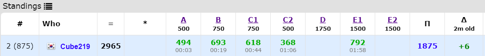

[Codeforces Round #708 (Div. 2)](https://codeforces.com/contest/1497)에 참가했다. 도중에 사이트가 마비되는 이슈가 있었다. m1버전으로 풀고있었는데 결국 unrated되었다. 중간에 조금 헤매서 잘 못봤는데 다행이다. (망할 정수론)

[전체 Code](https://github.com/Cube219/PS/tree/main/CodeForces/1497%20-%20Codeforces%20Round%20%23708%20(Div.%202))

# A. Meximization

일단 정렬을 해서 바로 순서대로 출력하면 틀리게 된다. 왜냐하면 중복되는 숫자가 있는 경우 해당 부분에 mex값이 변하지 않기 때문이다.

* ex) 0 1 2 2 3 보다 0 1 2 3 2가 더 높은 값을 가진다.

그래서 정렬을 한 다음에 앞에서부터 중복되지 않게 결과값을 넣고, 중복되는 남은 것들을 맨 뒤로 넣으면 된다.

# B. M-arrays

임의의 두 개의 수를 더해서 m으로 나누어지는 경우는 두 수의 m으로 나눈 나머지의 합이 0이거나 m이면 된다.

그래서 먼저 배열에 넣을 때 modulo m으로 하고 해당 값들의 개수들을 저장한다. 그리고 `<1, m-1>`, `<2, m-2>`, ...이렇게 앞뒤로 묶어서 개수를 검사한다. 만약 둘 중 하나가 `0`이라면, 남아있는 수로는 다른 수랑 묶을 수 없기 때문에 전부 별개의 배열로 나눠야 한다. 이경우 개수들을 전부 더해준다.

둘 다 있는 경우라면, abab나 babab 등 서로 엇갈려서 한 개의 배열로 묶을 수 있다. 묶고 남은 수는 위의 경우처럼 전부 별개의 배열로 나눈다. 이경우 `많은 개수 - 적은 개수`를 더하면 된다 (정확한 식은, 많은 개수에서 1개를 더 써야 하기 때문에 묶고 남은 개수는 `많은 개수 - 적은 개수 - 1`, 여기에 아까 묶은 배열 개수 `+1`). 만약 두 개의 개수가 같은 경우, 남은 개수가 없기 때문에 추가로 `+1`을 해준다. 

0인 경우 0끼리 다 묶으면 되므로, 0인 경우가 있으면 추가로 `+1`하면 된다.

# C1. k-LCM (easy version)

생각보다 많이 헤맨 문제였다. 풀이를 떠오르기가 어려운 문제지만, 예제 데이터가 힌트가 되었다.

-----

일단 최대공배수가 `n/2`를 넘지 않아야 하기 때문에, 모든 항은 무조건 `n/2`보다는 작아야 한다. 이 `n/2`를 가지고 생각을 해보면, 홀수의 경우 `(1, n/2, n/2)`를 하면 간단히 해결이 가능하다.

이제 짝수의 경우가 문제인데, 일단 홀수처럼 `n/2`를 넣어보자, 그러면 `(0, n/2, n/2)`가 되는데, 여기서 예제 데이터를 보면 2가지 경우가 나온다.

1. `n/2`가 홀수인 경우
   * `n/2`에서 1씩 빼서 첫 번째 자리에 넣는다. 그러면 `(2, n/2-1, n/2-1)`이 되고, 최대공배수는 `n/2-1`이 된다.
2. `n/2`가 짝수인 경우
   * `n/2`중 하나를 절반으로 나눠서 첫 번째 자리에 넣는다. 그러면 `(n/4, n/4, n/2)`가 되고, 최대공배수는 `n/2`가 된다.

# C2. k-LCM (hard version)

이런 easy/hard문제들은 점수는 비슷한데 완전 다른 알고리즘을 쓰는 경우가 있고, E1이 많이 풀려있길래 E1을 먼저 생각하다가 C2로 돌아왔는데 생각보다 쉽게 풀리는 문제였다... 어쩐지 점수가 작다 했어

-----

위의 문제에서 3개로 나누는 것을 k개로 나누어야 하는데, 조금만 생각해보면 위의 문제에서 3자리를 제외하고 남은 자리를 1로 채우고, 남은 3자리는 C1처럼 하면 된다.

-----

C2 문제 하나만 있으면 위 방법을 떠올리기가 쉽지 않았을 것이다. C1 -> C2로 넘어가면서 자연스럽게 풀이를 유도한 것 같다. 이런 컨셉은 괜찮은 것 같다.

# E1. Square-free division (easy version)

Perfect square(완전 제곱수)인지 확인하는 방법은, 해당 수를 소인수분해해서 각 소수들의 지수가 모두 짝수이면 된다. 그러면 어떤 수와 곱해서 perfect square가 되려면, 지수가 홀수인 소수들이 같으면 된다는 것을 알수가 있다. 그 소수들이 곱해지면서 지수들은 더해져서 짝수가 되기 때문이다.

이제 앞에서부터 순회하면서, 이전의 수들과 비교해 perfect square가 되면 현재 수 이전까지로 배열을 자르고, 다시 현재 수를 기준으로 이어서 순회하면 된다. 문제는 이전의 수들을 비교할 때 그냥 비교하면 O(n^2)이기 때문에 시간초과가 나게 된다. 그래서 (2의 지수가 홀수), (2와 3의 지수가 홀수), ... 이런 것을 빠르게 찾을 수 있는 방법을 떠올려야 하는데, 비트마스킹을 쓰기에는 소수의 개수가 많기때문에 사용할 수 없다.

그러다가 어차피 다 소수이기 때문에, 그냥 해당하는 소수들을 곱하면 그 값들은 전부 다 다르기 때문에 비트마스킹과 같은 효과가 나는 것을 알 수가 있다. 이것을 set에 넣고 있는지 확인하면 된다.

n의 개수가 200000이라 상당히 많기 때문에, 그냥 d의 제곱수만큼 돌아서 소인수분해를 하면 시간초과가 날 수도 있다 (2*10^5 * sqrt(10^7) = 약 6억). 그래서 이 문제에서는 [오일러의 체](https://booknu.github.io/2019/01/17/%EC%98%A4%EC%9D%BC%EB%9F%AC%EC%9D%98%EC%B2%B4/)를 쓰는 것을 추천한다. 수의 범위가 10^7이기 때문에 정적배열로 충분히 선언 가능하다. 그래도 나중에 다른 사람들의 풀이를 보니까 제곱수로 풀어도 시간 안에 나오는 것 같다.