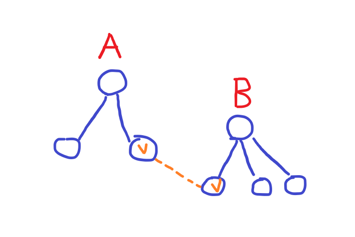
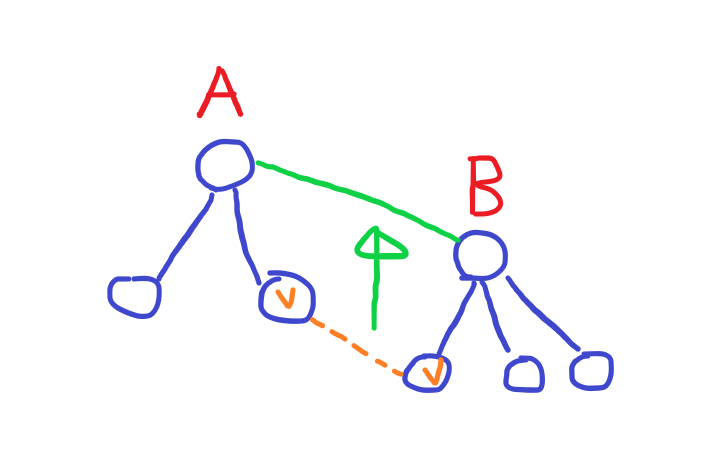
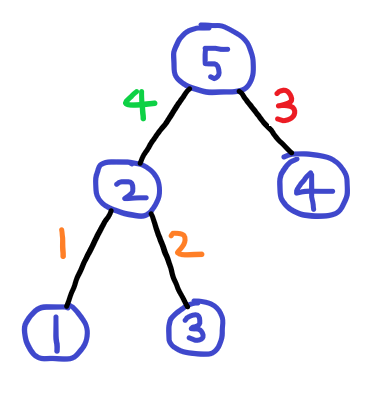

최근에 경로에서 최소/최대 간선을 최대/최소화 하는 알고리즘을 배웠는데, 개념이 재미있어서 정리해본다.

-----

# 최소 간선을 최대화

[BOJ 1939 - 중량제한](https://www.acmicpc.net/problem/1939)

위 문제를 요약하면 경로에서 **최소 간선**을 **최대화**하는 문제이다. 

기본적인 개념은 MST를 [크루스칼 알고리즘](https://ko.wikipedia.org/wiki/%ED%81%AC%EB%9F%AC%EC%8A%A4%EC%BB%AC_%EC%95%8C%EA%B3%A0%EB%A6%AC%EC%A6%98)을 이용해서 구할 때 만들어지는 **유니온 파인드 트리**를 이용하는 것이다. 최소 간선을 최대화 할때는 **Maximum** Spanning Tree를 이용한다. MST를 만드는 도중을 생각해보자.



현재 정점들이 연결된 A 컴포넌트와 B 컴포넌트가 있다. 이제 다음 점선 간선을 추가하는데, 이때 A 컴포넌트의 정점 중 하나랑 B 컴포넌트의 정점 중 하나라고 하자. 이때, 선택된 두 정점간의 경로의 최소 간선의 최대값은 무조건 **해당 간선**이 된다. 왜냐하면 해당 간선을 추가하면서 경로가 생기게 되고, 남은 간선들은 전부 현재 간선보다 작거나 같기 때문에 **남은 간선을 탈 필요가 없기** 때문이다. 같은 이유로 A 컴포넌트의 **아무 정점**과 B 컴포넌트의 **아무 정점**간의 경로도 고정이 된다.



결국 A 컴포넌트와 B 컴포넌트를 연결하는 다른 간선들은 전부 무시해도 되기 때문에, 그냥 해당 간선을 각 컴포넌트의 **루트 노드**로 옮겨서 연결하면 된다. 즉, 유니온 파인드를 하는 과정이랑 똑같다. 보통 유니온 파인드를 구현할 때는 노드의 부모값만 저장하는데, 여기에 추가로 간선의 비용도 저장한다.

이렇게 해서 유니온 파인드 트리를 만들고 해당 트리에서 경로를 이용하면 최소 간선의 최대값을 구할 수 있다.

```c++
int par[10001], r[10001], dis[10001];

int find(int v)
{
    while(par[v] != v) {
        v = par[v];
    }
    return v;
}
void uni(int u, int v, int w)
{
    int ur = find(u);
    int vr = find(v);
    if(ur == vr) return;
    if(r[ur] > r[vr]) swap(ur, vr);
    par[ur] = vr;
    if(r[ur] == r[vr]) r[vr]++;
    dis[ur] = w;
}
int query(int u, int v)
{
    int res = 0;
    while(u != v) {
        if(dis[u] < dis[v]) swap(u, v);
        res = dis[u];
        u = par[u];
    }

    return res;
}
```

유니온 파인드는 그냥 쓰면 느려질 수 있기 때문에 **Union by rank**를 이용한다. Path decomposition은 트리의 구조가 **깨지기** 때문에 사용하지 않는다. 간선의 비용은 `dis[]` 배열에서 부모로 올라갈 때 비용으로 저장한다.

이렇게 트리를 만들고 난 뒤, 경로를 찾을 때는 [**LCA**](https://en.wikipedia.org/wiki/Lowest_common_ancestor)를 찾으면 되는데, 간선의 비용이 **큰 것**부터 차례대로 올라가면 된다. 이것이 되는 이유는, 트리를 만들 때 간선의 비용이 큰 쪽에서 작은 쪽으로 연결하고, Union by rank를 할 때 서로 합쳐지면서 루트가 갱신되기 때문에 무조건 **위의 간선 비용**이 **아래 간선 비용**보다 **작을** 수 밖에 없기 때문이다. 큰 비용이 무조건 작은 비용보다 아래에 있거나 같은 높이에 있기 때문에, 큰 비용인 정점만 옮기면 자연스럽게 LCA로 다가가게 된다. 설명하기가 좀 어려운데... 직접 손으로 그려보면 감이 잡힐 것이다.

> 물론 평소 LCA를 구할 때 처럼 Sparse table을 만들어서 구해도 된다. 하지만 어차피 Union by rank를 이용했기 때문에, 트리의 높이는 logN이라서 LCA를 그냥 찾아도 logN에 찾을 수 있다.

[소스코드](https://github.com/Cube219/PS/blob/21de5422c65016eb07f8017ddf94042eeca261d5/BOJ/1000~2000/1939%20-%20%EC%A4%91%EB%9F%89%EC%A0%9C%ED%95%9C.cpp)

-----

# 최대 간선을 최소화

[BOJ 1396 - 크루스칼의 공](https://www.acmicpc.net/problem/1396)

이 문제는 앞의 문제와는 반대로 **최대 간선**의 **최소값**을 구해야 한다. 이는 간단하게 Maximum Spanning Tree를 **Minimum** Spanning Tree로 바꾸면 된다. 물론 이러면 트리에서 올라갈수록 간선 비용이 커지므로, 간선의 비용이 **작은 것**부터 차례대로 올라가야 한다.

이 문제는 추가로 해당 온도일 때 움직일 수 있는 **정점의 개수**도 구해야 한다. 여기서 그냥 단순하게 LCA에서 트리의 크기로 출력하면 틀리게 된다.



예제 입력 1의 데이터를 처리한 후 트리의 모습이다. 여기서 `(4, 5)`를 쿼리로 날리면 결과값은 3이고, LCA는 5번 노드가 된다. 5번 노드의 크기는 5지만, 3의 값으로는 2번 노드로 갈 수 없기 때문에 실제 정답은 2가 나와야 한다. 그래서 LCA의 자식들로 갈 수 있는지 확인 후 갈 수 있는 자식의 크기들만 더하면 되는데, 역시 그냥 순차탐색을 하게 되면 시간 초과가 나게 된다. 더 빠르게 찾을 수 있는 방법을 생각해야 한다.

여기서 트리를 만들 때 간선의 비용이 작은 것에서 큰 것으로 이용한다는 점을 이용한다. 유니온을 하면서 자식이 달라붙을 때는 무조건 간선의 비용이 **점점 커지는** 방향으로 추가가 된다. 이 점을 이용해서, 자식이 붙을 때 마다 **간선의 비용**과 **현재 자식들의 크기 + 해당 자식의 크기** *(Prefix sum)* 를 저장하고, 찾을 때 그냥 이분탐색(`lower_bound()`를 쓰면 된다)으로 찾으면 된다.

[소스코드](https://github.com/Cube219/PS/blob/b8dc273c3bb2cf232af1e616f0525d436bd0d4f1/BOJ/1000~2000/1396%20-%20%ED%81%AC%EB%A3%A8%EC%8A%A4%EC%B9%BC%EC%9D%98%20%EA%B3%B5.cpp)

-----

# 관련 문제

[BOJ 5542 - JOI 국가의 행사](https://www.acmicpc.net/problem/5542)

[BOJ 10264 - Particle Swapping](https://www.acmicpc.net/problem/10264)