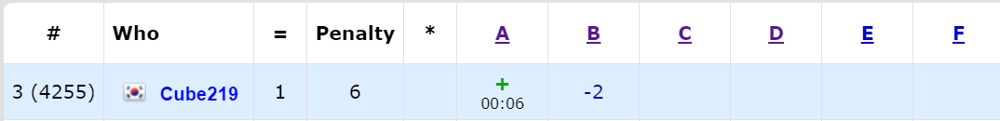

어제 [Educational Codeforces Round 105 (Rated for Div. 2)](https://codeforces.com/contest/1494)에 참가했다. 근데 풀다가 머리가 너무 아파서 도중에 포기한 라운드다... 이미 제출은 해서 점수가 폭풍같이 떨어질 예정이다.

[전체 Code](https://github.com/Cube219/PS/tree/main/CodeForces/1494%20-%20Educational%20Codeforces%20Round%20105%20(Rated%20for%20Div.%202))

# A. ABC String

알파벳이 3개밖에 없기 때문에, 각 알파벳에 `(` 또는 `)`를 넣는 모든 경우를 구하고, 각 경우의 수마다 괄호의 짝이 맞는지 확인하면 된다.

그냥 심플하게 4중 for문 돌렸다.

# B. Berland Crossword

모서리 부분만 잘 처리하면 된다. 왜냐하면 모서리 부분을 제외하고는 각 면들이 서로 영향을 안 주기 때문이다.

처음에는 모서리를 먼저 지우고, 남은 숫자들을 가지고 판단했는데, 이러면 여러 예외들이 생긴다. 그래서 나중에 업솔빙때 모서리를 칠하는 모든 경우를 구하고 그 상태에서 남은 숫자들을 가지고 판단하니 맞았다. 판단 방법은, 먼저 모서리를 칠한 부분에 해당하는 면 숫자를 빼주고, 남은 숫자가 `0`보다 작거나, `n - 2`보다 큰 면이 있으면 `false`, 없으면 `true`로 판단하면 된다.

# C. 1D Sokoban

생각보다 구현이 까다로운 문제였다.

일단 0에서 시작하기 때문에 양수 부분과 음수 부분으로 나누고, 음수 부분은 뒤집에서 계산할 수 있다. 이제 박스들을 움직여서 special position들에 둘 수 있는지 확인해야 한다. 여러 방법이 있겠지만, 여기서는 투 포인터를 이용했다. special position들을 담은 배열을 `b[]`라고 할 때, 투 포인터 영역을 해당 영역 special position들에 박스들을 전부 둘 수 있는 경우로 한다. 이 경우가 가능한지 판단하면 되는데, `b[r]`보다 작거나 같은 박스 위치를 구하고, 해당 박스부터 그 이전 박스들까지의 개수가 오른쪽 special position과 왼쪽 special position의 길이(`r - l + 1`)보다 크거나 같으면, 해당 영역에 있는 모든 special position들을 채울 수 있다. special position 개수 + `b[r]`이후로 채워진 special position 개수를 더해주면 된다. 후자는 미리 prefix sum으로 구해두면 된다.

-----

D번은 아직 못 풀었는데, 나중에 시간나면 풀어볼까 생각중이다.

