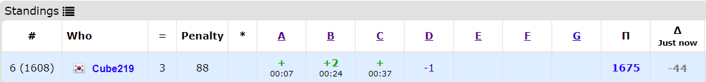
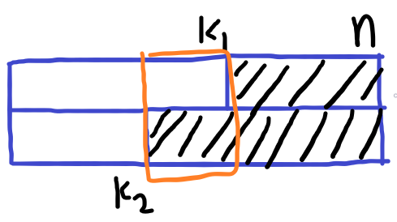

[Educational Codeforces Round 106 (Rated for Div. 2)](https://codeforces.com/contest/1499)에 참가했다. 2일 연속으로 하는거라서 할까말까 고민하다가 했는데 결과가 좋지 않다. 걍 쉴껄...

[전체 Code](https://github.com/Cube219/PS/tree/main/CodeForces/1499%20-%20Educational%20Codeforces%20Round%20106%20(Rated%20for%20Div.%202))

# A. Domino on Windowsill

그림으로 표현하면 이런 모양이 된다. 이러면 주황색 영역 왼쪽에는 하얀 도미노를 `min(k1, k2)`개 놓을 수 있고, 오른쪽에는 검은 도미노를 `n - max(k1, k2)`를 놓을 수 있다. 그리고 주황색 영역에서는 하얀/검은 도미노를 각각 `abs(k1 - k2) / 2`만큼 놓을 수 있다. 이 값을 `w`, `b`하고 비교하면 된다.

# B. Binary Removals

지울때 무조건 한 칸 이상 띄우고 지워야 하기 때문에, 붙어있는 경우를 체크해야 한다는 점을 알 수가 있다. 왜냐하면 00, 11이 무조건 0, 1로 남기 때문이다. 이것을 알고나면 11다음에 00이 나오는지 확인만 하면 된다는 것을 알 수가 있다(둘 다 하나는 남기 때문에 무조건 1....0 구조가 나오기 때문).

# C. Minimum Grid Path

일단 방향이 왔다갔다 하기 때문에 배열의 홀수 번/짝수 번째끼리 묶어서 생각할 수 있다. 그리고 목록이 있으면 가장 작은 값에 거리를 다 몰아주고 나머지는 1만 주는 경우가 가장 작다는 것을 발견해야 한다. 본인은 예제 데이터 설명을 보고 유추했다.

* 그리디를 증명하는 방법은 보통 최적의 해인 경우를 가정하고 반례가 있는지 찾아보면 된다. 위 경우는, 가장 작은 값에 있는 거리를 다른 값에게 줬을 때 무조건 커지거나 같아지기 때문에 반례가 없어서 증명된다.

이제 이것을 dp처럼 구현하면 된다. i번째까지 사용할 때, 짝수/홀수번째 수의 합(`sum1, sum2`)과 가장 작은 것(`min1, min2`)과 개수(`cnt1, cnt2`)를 구하고, `min1*(n-cnt1) + min2*(n-cnt2) + (sum1-min1) + (sum2-min2)`를 구하고 이 값들 중 최소값을 출력하면 된다.

# D. The Number of Pairs

미친듯이 삽질하다가 마지막에 아이디어가 떠올랐는데 못 푼 문제다...

----

일단 `LCM`이 `GCD`에서 자연수 `k`를 곱한 형태라는 것을 알아야 한다. 그러면 `LCM = kGCD`로 바꿀 수 있고, `GCD`에 대한 식으로 바꾸면 `GCD = x/(ck - d)`가 되고, 이 값이 자연수로 나오면 가능한 경우가 된다. 결국 `ck - d`가 `x`의 약수여야만 가능한 것이고, 약수는 `sqrt(x)`번 돌려서 찾을 수 있다.

위의 방식으로 `k`의 값을 구하면 이 `k`를 두 수에 적절히 분배하는 경우의 수를 구하면 되는데, `k`를 소인수분해해서 `2^소수 종류 개수`(각 소수를 왼쪽/오른쪽으로 분배하는 경우)로 구할 수 있다. 이때 `2^3`처럼 같은 소수가 여러개 있는 경우 두 개로 쪼개지 말아야 하는데, 쪼개는 경우 `GCD`가 증가하기 때문이다.

이때 [어제 E1문제](https://blog.cube219.me/posts/2021/codeforces-round-708-div2/#e1-square-free-division-easy-version)처럼 소인수분해를 할 때 `sqrt(k)`로 하면 시간초과가 나게 된다. 그래서 [오일러의 체](https://booknu.github.io/2019/01/17/%EC%98%A4%EC%9D%BC%EB%9F%AC%EC%9D%98%EC%B2%B4/)(에라토스테네스의 체 변형)을 이용해야 한다. 이걸 써도 시간이 아슬하긴 하다.

PS: System test에서 fail이 뜨길래 `long long`을 `int`로 바꾸니 통과했다. 시간이 매우 빡빡해서 그런 것 같다. `long long`은 꼭 필요할 때만 쓰는게 좋을 것 같다.