최근 [언리얼 엔진](https://www.unrealengine.com/)을 이용한 프로젝트를 한 적이 있었다. 언리얼 엔진은 프로그래밍을 할 때 블루프린트를 이용할 수 있지만, 구조가 복잡해지면 가독성이 떨어지기도 하고, 결정적으로 [Gameplay Ability System](https://docs.unrealengine.com/en-US/InteractiveExperiences/GameplayAbilitySystem/index.html)이 블루프린트를 지원하지 않기 때문에 핵심 파트는 C++로 개발하고 있었다.

본인은 Windows 환경에서 C++을 개발할 때 거의 [Visual Studio](https://visualstudio.microsoft.com/ko/)를 사용한다. 가장 큰 이유는 디버깅하기 편해서지만, Intellisense 기능도 상당 부분 차지한다. 이 기능이 있어야 Syntax highlighting이나 Code completion, Navigation등 여러 편리한 기능들을 쓸 수 있다. 소규모 프로젝트에서는 이 기능들이 잘 작동하지만, 언리얼 엔진 프로젝트는 엔진 소스코드도 참조해서 그런지 매우 느리게 작동한다.

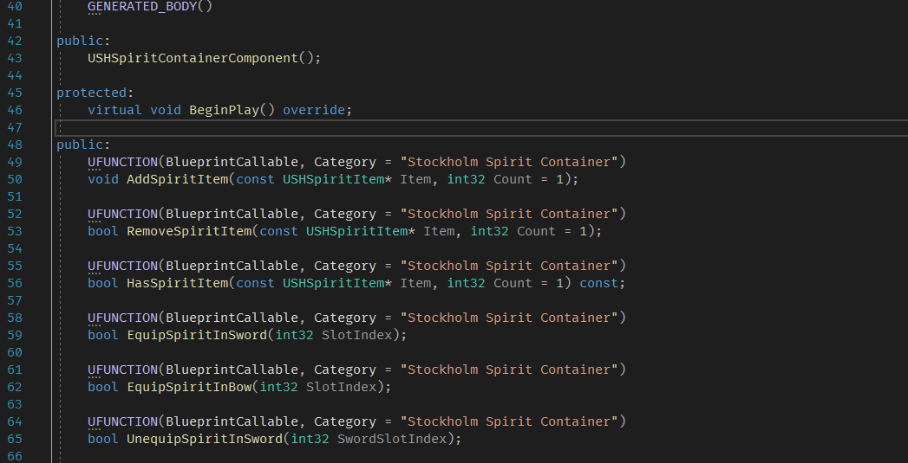

위 영상처럼 다른 파일을 열 때마다 Intellisense가 코드를 분석하는데 오랜 시간이 걸려서 개발하는데 많이 불편했다.

그래서 찾아보니까 [Visual Assist](https://www.wholetomato.com/) 또는 [ReSharperC++](https://www.jetbrains.com/ko-kr/resharper-cpp/)같은 추가 Extension을 많이 사용하는 것 같다. Visual Assist는 지인도 쓰고있고 많이 쓰는 것 같은데... 유료다. 물론 ReSharperC++도 유료지만 [JetBrains](https://www.jetbrains.com/ko-kr/)사 제품들은 [학생인증](https://www.jetbrains.com/ko-kr/community/education/#students)을 하면 무료로 쓸 수 있어서 후자를 선택했다.

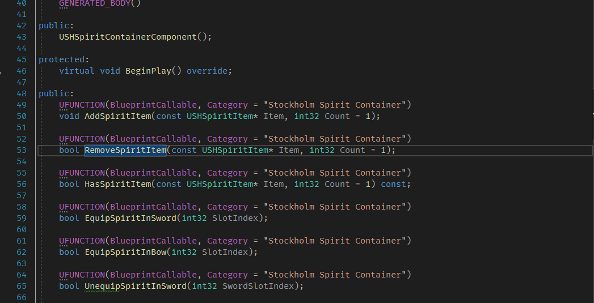

적용하니 12초에서 1초로 매우 빠르게 완료가 된다. 다만 프로젝트를 열 때 플러그인 초기화 + 인덱싱을 하는지 조금 기다려야 한다 (한 1~2분?).

-----

이외에도 여러 유용한 기능들이 많은데 그중에 본인이 자주 쓰는 것들을 정리해봤다. 단축키 설정은 Visual Studio scheme을 이용한다.

## Code / File template

템플릿 기능은 자주 쓰는 코드 조각들을 미리 정의해서 쉽게 가져다 쓸 수 있는 기능이다. 그중에 본인이 많이 쓰는 것은

* beg..end - STL container에서 시작과 끝을 지정하는 일이 많은데, 그때 사용한다.

  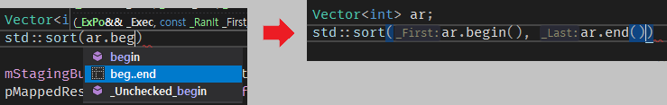
* fori, forr - 각각 순차/역순으로 탐색하는 for문을 만든다.

  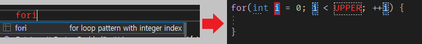

  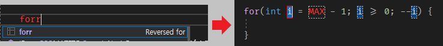

이외에도 사용자가 직접 템플릿을 정의해서 만들 수 있다.

## Inlay hints

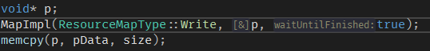

JetBrains사 제품에서 많이 볼 수 있는데, 함수를 호출 할 때 매개변수의 이름을 보여주는 기능이다. Python이나 Swift같은 언어처럼 매개변수를 명시적으로 지정할 수는 없지만, hint로 보여주니까 괜찮은 것 같다. 레퍼런스로 넘겨지는 경우에는 `[&]`를 표시한다.

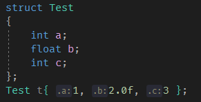

개인적으로 이 기능의 최대 강점은 `struct`를 초기화 할 때 변수들 이름을 보여주는 것이다. `{}`를 이용해 초기화를 할 때 변수 이름들을 보여줘 값들이 어떤 변수에 들어가는지 바로 알 수 있다.

## Search everywhere

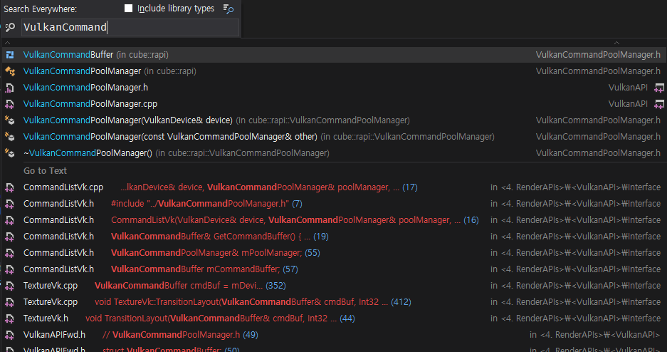

Mac의 [Spotlight](https://support.apple.com/ko-kr/HT204014)랑 비슷한 기능이다. `Ctrl + T`를 누르면 검색창이 뜨는데, 여기에 찾고싶은 것을 입력하면 해당하는 이름의 클래스/함수/변수명을 찾거나, 텍스트를 찾는 기능이다. 솔루션 탐색기를 뒤질 필요 없이 검색해서 바로 찾을 수 있어서 편리하다. 만약에 타입들로만 찾고 싶다면 `Ctrl + T`를 두 번, 파일명으로만 찾고 싶다면 `Ctrl + Shift + T` 등 선택적으로도 탐색할 수 있다.

## Navigation

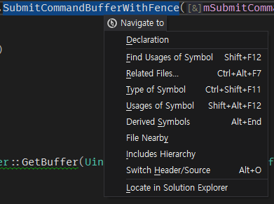

특정한 위치로 이동하는 기능들이다. **Alt + `** 를 누르면 위 사진처럼 사용할 수 있는 기능들이 나온다. 자주 사용하는 기능들로는,

* Find usage

  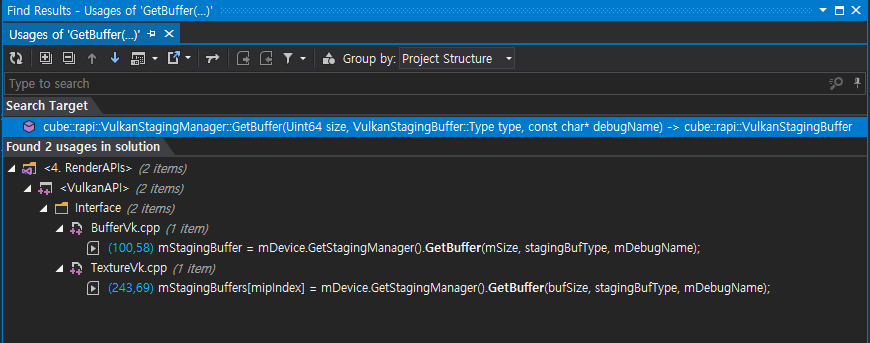

  * `Shift + F12`를 누르면 해당 함수나 변수가 쓰이고 있는 곳들을 보여준다. Visual Studio에도 있는 기능이지만, 속도는 비교할 수 없을 정도로 빠르다.

    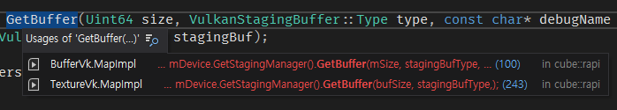

  * `Shift + Alt + F12`를 누르면 별도의 창이 아닌 바로 볼 수 있다.

* Base / Derived Symbol

  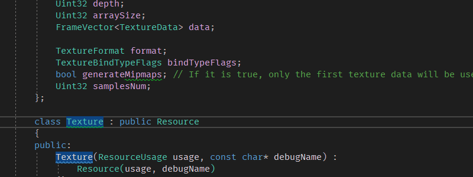

  * 함수나 클래스의 부모 / 자식으로 바로 이동할 수 있다. `Alt + Home` / `Alt + End`로 이동 가능하다.

## Insertion

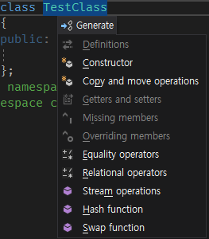

특정 코드들을 넣을 수 있는 기능이다. `Alt + Insert`를 누르면 사용할 수 있는 기능들이 나온다. 자주 사용하는 기능들로는,

* Copy and move operations
  * 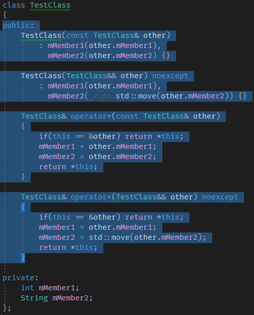
  * 복사/이동 관련 함수들을 추가해준다. 맴버 변수들도 반영해서 함수가 만들어진다.
* Overriding / Missing memebers
  * 오버라이딩 할 함수나 추가해야 할 함수들을 추가한다. 하지만 보통 밑에 있는 빠른 수정 기능으로 이용한다.

## 빠른 수정

코드에 문제가 있거나 수정사항이 있을만한 곳에 물결 표시가 뜨는데, 이를 해결해주는 기능이다. `Alt + Enter`로 사용할 수 있다. 자주 사용하는 기능들로는,

* Switch - generate missing case statements

  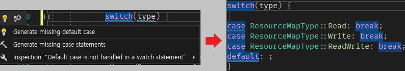

  * switch 값이 enum class같이 정해져 있는 경우, 빠져있는 case들을 자동으로 추가하는 기능이다.

* Class 수정

  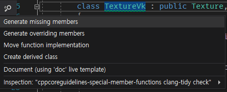

  * 만들어야 할 함수(pure virtual function, ...)들을 추가할 수 있다.

* Function 수정

  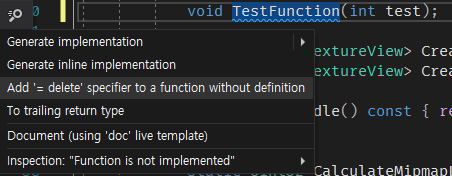

  * 구현이 없는 함수에 구현을 추가할 수 있다.

* including

  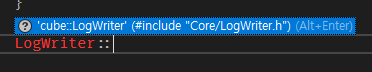

  * 코드를 작성하는데 만약 include되지 않은 것을 쓰려하면 자동으로 해당 헤더파일을 include해준다.

## Refactoring

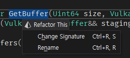

말 그대로 리펙토링 기능이다. `Ctrl + Shift + R`로 사용할 수 있다. 자주 사용하는 기능으로는,

* Rename

  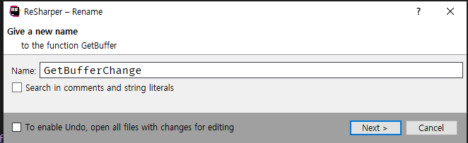

  * 함수나 변수의 이름을 바꿔주는 기능이다. `Ctrl + R, R`로 실행할 수 있다.  사용중인 곳에도 자동으로 바뀐다.

* Change signature

  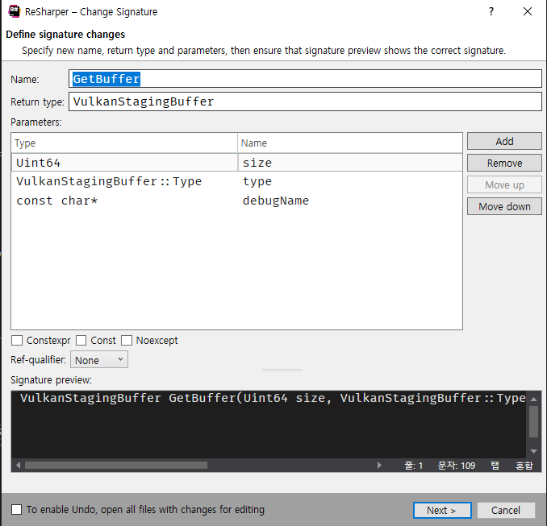

  * 함수의 이름 뿐만 아니라 선언까지 바꿔주는 기능이다. `Ctrl + R, S`로 실행할 수 있다. return type, 매개변수 추가 / 수정 / 제거 등 여러가지를 바꿀 수 있다. 이상하게 이 창에서는 입력하는 속도가 상당히 느려진다.

    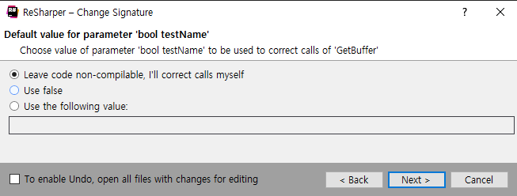

  * 추가되는 매개변수가 있을 경우, 이 함수를 사용하는 곳에서 어떤 값으로 넣을지 정할 수 있다.

## Unreal Engine support

당연히 언리얼 엔진 기능도 지원한다. 이러한 플러그인을 쓰게 된 계기가 언리얼 엔진 지원 때문이니...

* Reflection code completion

  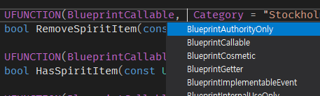

  * 언리얼 엔진에서는 C++에서는 지원하지 않는 리플렉션 기능을 위해 `UCLASS`, `UFUNCTION`과 같은 여러 매크로들을 사용한다. 하지만 실제로는 아무 내용도 없는 매크로이기 때문에, Visual Studio에서는 리플렉션 관련 코드들 자동 완성이 되지 않는데, 이러한 매크로들을 자동 완성이 되도록 해준다.

* UE4 전용 코드 검사

  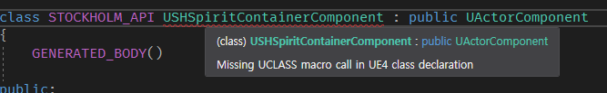

  * 역시 리플렉션 기능을 위해 매크로를 필수적으로 넣어야 하는 곳들이 있는데, 빠진 곳에 오류를 표시해서 알 수 있게 해준다.

    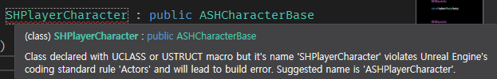

  * 언리얼 엔진에는 자체적인 [코딩 컨벤션](https://docs.unrealengine.com/en-US/ProductionPipelines/DevelopmentSetup/CodingStandard/index.html)이 있는데, 이를 지키지 않을 경우 오류를 표시해준다.

## Etc

* To-do items

  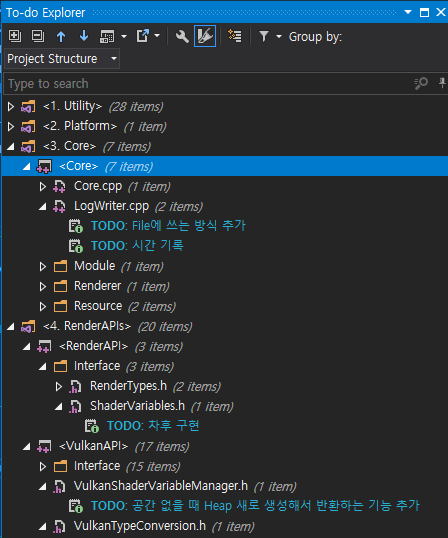

  * 코드에 있는 TODO들을 모아서 보여주는 기능이다. `Ctrl + Alt + D`를 눌러 띄울 수 있다.

* std::make_shared 매개변수

  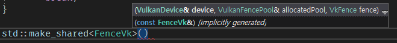

  * 스마트 포인터를 생성하기 위해서는 보통 `std::make_shared`나 `std::make_unique`함수를 많이 사용한다. 근데 이 함수들을 이용하면 생성자의 매개변수들을 에디터에서 볼 수가 없고, 만약에 잘못 넣은 경우 에디터에 바로 나오지 않고 컴파일해야 나오기 때문에 오류를 알아보기가 힘들다. 이러한 단점을 보완해 에디터에서 생성자의 매개변수들을 볼 수 있고, 잘못 넣은 경우 오류를 바로 표시해준다.

* Extend selection

  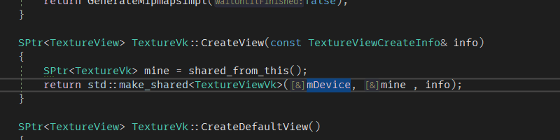

  * 선택 범위를 점점 늘려가거나 줄이는 기능이다. 보통 유용하게 쓰는 경우는 함수 파라미터나 인자들을 복사하는 경우이다.

* Highlight usage in file

  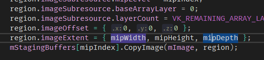

  * 강조하고 싶은 곳에 `Shift + Alt + F11`을 누르면, 해당 파일 안에서 강조한 것들이 보라색으로 표시가 되는 기능이다. 물론 커서를 가져다대면 파란색으로 강조되긴 한다.

* break / continue 대상 표시

  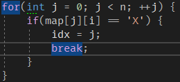

  * `break`나 `continue`를 쓸 때 해당되는 반복문을 강조해준다. 이게 `if`나 여러가지가 섞이면 알아보기가 힘든 경우가 많은데, 강조를 해줘서 쉽게 알아볼 수 있다.

    

이외에도 naming convention, uint test 등 여러 기능들이 있다. 하지만 소소한 단점들도 있는데,

* 처음에 프로젝트를 열었을 때 플러그인 로드 + 분석때문에 조금 기다려야 한다. 특히 언리얼 프로젝트인 경우, 맨 처음에 인덱싱하는데 2~5분정도 걸리고, 이후에 다시 열 때는 20초 정도 걸린다.
* `}`나 `;`를 넣을 때, 자동으로 formatting이 되지 않는다. 설정을 다 찾아서 수정해도 안 된다... 그래서 자동 fomatting은 Visual Studio 기능을 사용하고 있다.
* 최근에 업데이트 하고나서 팅기는 경우가 가끔 발생한다. Visual Studio 문제일 수도 있으나, 보통 code completion 리스트가 뜰 때 팅기는 것으로 봐서 ReSharper 문제같다.

-----

사람들이 왜 이런 플러그인들을 쓰는지 처음에는 잘 몰랐다. Visual Studio 기능만 해도 충분한 것 같은데 굳이 유로 플러그인들을 써야 하나...? 하는 생각이었다. 하지만 실제로 써보니까 그 이유를 알 것 같다. 무엇보다 네비게이션이나 코드 분석이 빨라서 좋았다. 아주 만족스럽게 사용하고 있다.