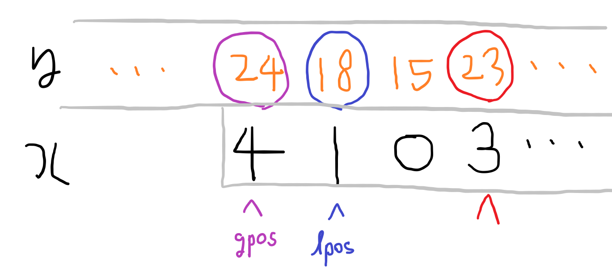
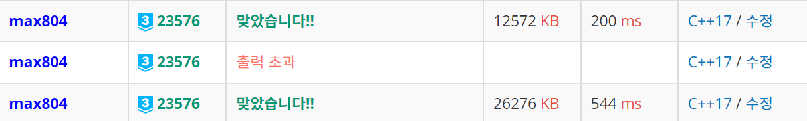
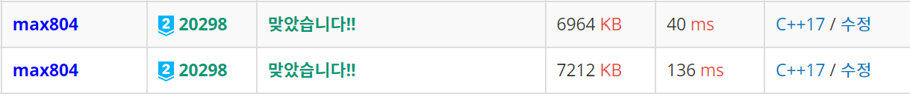
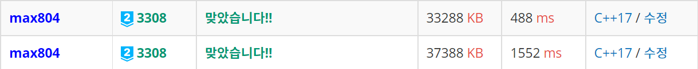

2021 ICPC Seoul Regional에서 K번으로 **Stock Price Prediction**이라는 문제가 나왔다. 실제 대회에서는 못 풀었는데, 알고보니 최근에 비슷한 문제 (BOJ 20298 - 파인애플 피자, BOJ 3308 - Matching, SCPC 2021 예선 2차 4번 - 패턴 매칭)가 있는, **Well-known**이라고 한다. 어쩐지 많이 풀더라...

-----

# BOJ 23576 - Stock Price Prediction

[BOJ 링크](https://www.acmicpc.net/problem/23576)

문제 내용이 긴데, 간단히 요약하자면

`x` 배열의 **rank**(가장 작은 값부터 0, 1, ..로 바꾸는 것)가 있을 때, `y` 배열의 **sub-배열**들 중에 rank 값이 `x` 배열의 rank 값과 **같은** sub-배열의 위치들을 전부 출력하면 된다.

 

문자열 매칭 알고리즘을 쓰면 될 것 같긴 한데, 문제는 `y`배열의 sub-배열이 바뀌면서 같은 값이라도 **rank가 달라질 수가 있다**는 점이다. 하지만 **KMP를 변형**하면 해결이 가능하다! KMP에서 **문자가 같은지 비교하는 부분**만 수정하면 되는데, 이 문제에서는

**두 문자열**에서 문자가 각자 하나 추가될 때, 추가된 문자보다 **작은 문자의 수**와 **큰 문자의 수**가 두 문자열이 **서로 같은지** 확인하면 된다.

> proof)
> :   문자열에 문자 `c`가 추가된다 했을 때, `c`보다 **작은 문자의 수**를 `lcnt`, **큰 문자의 수**를 `gcnt`라 하자. 이제 rank가 어떻게 변하는지 보면
> :   1.  `c`보다 **작은 문자**들: `c`가 추가되어도 rank에 변화가 없음
> :   2. `c`: 작은 문자들 다음이므로 `lcnt`
> :   3. `c`보다 **큰 문자**들: `c`에 의해 한 칸씩 밀리므로 +1
> :   이제 두 문자열의 `lcnt`와 `gcnt`가 서로 같다면 바뀌는 rank도 전부 같게 되므로 두 문자열은 그대로 서로 같아진다.

문자의 수는 **Segment Tree**를 이용해 \\( O(logN) \\)에 셀 수 있고, 전체 시간복잡도는 \\( O((N + M) logN) \\)이다. 주의할 점은 일치하지 않아서 fail함수를 실행하고 문자열을 **옮길 때** 앞에 있는 문자들을 Segment Tree에서 **제거**해줘야 한다.

[소스코드](https://github.com/Cube219/PS/blob/main/BOJ/23000~24000/23576%20-%20Stock%20Price%20Prediction.cpp)

위 방식으로 앞에서 언급한 [BOJ 20298 - 파인애플 피자](https://www.acmicpc.net/problem/20298), [BOJ 3308 - Matching](https://www.acmicpc.net/problem/3308) 문제도 풀 수 있다. 전자는 `y` 배열이 원형인 것만 고려하면 같은 문제고, 후자는 `x` 배열 입력 방식만 조금 다른 것을 빼면 같은 문제다.

-----

# Segment Tree 없이 풀기 - 배열에 중복이 없는 경우

위 방식처럼 Segment Tree를 이용해 풀면 시간제한이 빡빡하다. Fenwick Tree나 바텀업 Segment Tree로는 통과하지만, 탑다운 Segment Tree로는 어려울 수도 있다. 하지만 저 3문제 중에서 가장 먼저 나온 Matching 문제의 해설을 찾아봤는데, Segment Tree **없이** \\( O(N + M) \\)으로 푸는 방법이 존재하고, 그것이 정해라고 한다!

## BOJ 3308 - Matching

[BOJ 링크](https://www.acmicpc.net/problem/3308)

이 문제는 위 문제랑 거의 같지만 입력 형식이 조금 다르고, 배열에 **중복이 없고**, **N의 범위**가 1,000,000으로 커졌다.

`x`배열은 읽어오면서 `x[v - 1] = i;`로 넣어주면 된다. 이제 KMP에서 문자가 같은지 비교하는 부분을 다음과 같이 수정하면 된다.

`x`배열 기준으로 문자 `c`가 추가되고, 문자 `c`보다 **앞에 있는 문자들 중**에 `c` **다음으로 작은 문자의 위치**를 `lpos`, `c` **다음으로 큰 문자의 위치**를 `gpos`라 할 때, 대응되는 `y`배열의 `lpos`, `gpos`의 문자(`lc`, `gc`)와 추가되는 문자 `c2`의 **대소관계**가 `lc < c2 && c2 < gc` 인지 확인한다.

말로는 설명하기 까다로워서 그림으로 예시를 들어 설명한다. 현재 **빨간색 위치**를 검사하는 단계이다. 이때 `x`배열의 문자는 **3**이고, 3 다음으로 작은 **1의 위치**를 `lpos`, 3 다음으로 큰 **4의 위치**를 `gpos`로 정한다. 이제 `y`배열에서 대응되는 값들의 대소관계를 비교해, 만족하면 다음으로 넘어가고, 아니면 `x`배열을 이동시킨다.

> 대략적인 proof)
>
> : 바로 다음으로 작은/큰 문자들의 대소관계를 비교하기 때문에, 만약 저 대소관계를 만족한다면 **남은 다른 문자**들은 전부 `x[lpos]`보다 작거나 `x[gpos]`보다 크게 된다. 이러면 결국 위에서 언급한 `lcnt`와 `gcnt`도 두 문자열이 서로 같게 되고, 위의 증명을 사용할 수 있다.

이제 범위로 쿼리를 날릴 필요 없이 `lpos`, `gpos`에 대응되는 값만 가져오면 돼서 \\( logN \\)을 없앨 수 있다. 하지만 각 위치에 대응되는 `lpos`, `gpos`를 그냥 \\( O(N^2) \\)에 구하게 되면 오히려 더 느려지므로 빠르게 구하는 방법을 생각해야 한다. 이는 **Doubly Linked List**를 이용해 \\( O(N) \\)에 구할 수 있다.

일단 Linked List에 `0`부터 `N-1`까지 순서대로 넣어준다. 그리고 `x`배열을 **뒤에서**부터 돌면서 Linked List를 이용해 **해당 값**보다 **한 단계 작은/큰 값**을 찾고, 해당 값의 **위치**(`lpos`, `gpos`)를 구한다. 그리고 다음 루프로 넘어가기 전에 **해당 값**을 Linked List에서 **지워**준다.

[소스코드](https://github.com/Cube219/PS/blob/main/BOJ/3000~4000/3308%20-%20Matching(WithoutSegTree).cpp)

-----

# Segment Tree 없이 풀기 - 배열에 중복이 있는 경우

만약 배열에 **중복이 있는 경우**라면 위의 방법을 그대로 사용하거나, 크거나 같음/작거나 같음으로 하면 **안 맞는** 경우가 생긴다. 대신에 만약 추가되는 문자가 **이미 존재**하는 경우에는, **이미 존재하는 문자의 위치**를 찾고(`spos`), `y` 배열에서도 **같은지 확인**하면 된다. 생각해보면 이미 있는 문자가 또 추가되는 경우에는, 다른 문자들의 rank가 **변하지 않으므로** 그냥 실제 매칭되는 문자도 같은지만 확인하면 된다.

이것을 처리하기 위해서 Linked List에 추가로 해당 **값의 개수**인 `cnt`정보도 넣어둔다. `x`배열을 뒤에서부터 돌면서 만약 해당 값의 `cnt`가 **2 이상**이라면 해당 위치 앞에 **같은 값이 있다**는 의미이므로, 해당 위치에 `spos`를 기록한다. `spos`는 미리 **해당 값의 가장 왼쪽 위치**로 찾아두면 된다. 기록 후 해당 값의 `cnt`를 **감소**시키고 **0**이 된다면 Linked List에서 **지워**준다.

확인하는 함수에서는 먼저 `spos`가 **기록되어 있는지 확인** 한 후, 되어 있으면 해당 위치와 `spos` 위치의 문자가 **같은지 비교**하면 되고, 기록이 안 되어 있으면 **기존 방식**을 쓰면 된다.

[소스코드 (BOJ 23576 - Stock Price Prediction)](https://github.com/Cube219/PS/blob/main/BOJ/23000~24000/23576%20-%20Stock%20Price%20Prediction(WithoutSegTree).cpp)

[소스코드 (BOJ 0298 - 파인애플 피자)](https://github.com/Cube219/PS/blob/main/BOJ/20000~21000/20298%20-%20%ED%8C%8C%EC%9D%B8%EC%95%A0%ED%94%8C%20%ED%94%BC%EC%9E%90(WithoutSegTree).cpp)

-----

# 얼마나 빨라질까?

**Stock Price Prediction** 문제는 약 2.72배 빨라졌다.

**파인애플 피자** 문제는 약 3.4배 빨라졌다.

**Matching** 문제는 약 3.1배 빨라졌다.

전체적으로 **약 3배** 정도 빨라졌음을 볼 수 있다.
