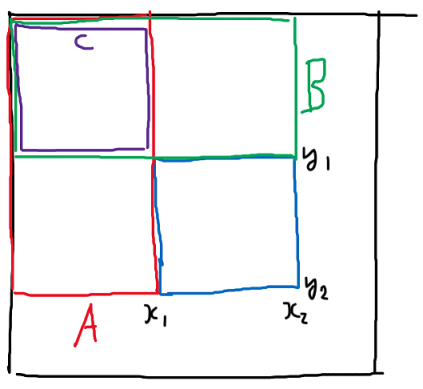
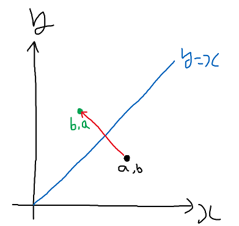
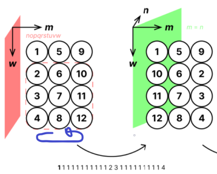
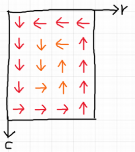

백준에 **하이퍼**~ 라는 이름의 특이한 문제들이 있다. 모두 [**구데기컵**](https://www.acmicpc.net/category/420) 대회에 나온 문제들인데, 특징은 데이터가 **11차원** 이라서 **11차원 배열**을 써야 한다는 점이다. 듣기만 해도 끔찍해 보이는데, 천천히 생각을 하면 생각보단 쉽게 풀 수 있다.

-----

# 데이터 입력과 처리

3차원 데이터 입력받는것도 힘든데, 11차원의 데이터를 받아야 하니 벌써부터 막막하다. 11중 for문과 11개의 []로 처리는 가능하나, 좀 더 깔끔하게 풀기 위해서 **재귀 함수**와 **template**을 이용했다.

```cpp
using hv = vector<vector<vector<vector<vector<vector<vector<vector<vector<vector<vector<ll>>>>>>>>>>>;
hv arr;

template <typename T>
void init(T& d, int dim)
{
    d.resize(dimsz[dim]);
    for(int i = 0; i < dimsz[dim]; ++i) {
        init(d[i], dim + 1);
    }
}
template <>
void init(ll& d, int dim)
{
    cin >> d;
}

init(arr, 0);
```

중첩 `for`문을 하나씩 함수에 넣어뒀다고 생각하면 된다. 맨 처음에 `init` 함수를 호출하면 `T`가 **`vector`가 11개**인 `init`이 호출된다. 이제 안에서 `d[i]`인 값으로 `init` 함수를 호출하면 **맨 바깥**에 있는 `vector`가 벗겨진 **10개**의 `vector` 타입으로 호출된다. 이것이 계속 반복되면 `vector`들이 다 사라지고 안에 있는 **`ll(long long)`** 타입만 남게 된다. 그러면 [**Explicit template specialization**](https://en.cppreference.com/w/cpp/language/template_specialization)에 의해 아래에 있는 함수가 호출되고, 이때 입력을 받거나 연산을 처리하면 된다.

위 코드는 배열을 초기화하고 입력을 받는 코드이고, 다른 연산은 밑에서 보거나 소스코드를 참조하자.

-----

# BOJ 17114 - 하이퍼 토마토

[BOJ 링크](https://www.acmicpc.net/problem/17114)

11차원 배열에 **안 익은 토마토**와 **익은 토마토**가 있는데, 익은 토마토는 **주변**의 **안 익은 토마토**를 1일 후 **익은 토마토**로 바꾼다. 이떄 모든 토마토가 익은 토마토가 되는 **시간**을 출력하면 된다.

이런 4차원 이상의 배열은 머리로 떠올릴 수 없기 때문에, 떠올릴 수 있는 **2/3차원**으로 **줄여서** 생각해보자. 문제를 2차원으로 낮춰서 생각해보면 처음에 익은 토마토들을 queue에 넣고, queue에서 뽑으면서 인접한 안 익은 토마토를을 익게 하고 queue에 넣는, 전형적인 **BFS**로 풀 수 있다.

이것을 똑같이 11차원에서 하면 된다. 다만 2차원에서는 인접한 구간이 상하좌우 4개라면, 11차원에서는 **11개의 축 * 2 = 22개**라는 점이다. **배열의 index**를 `vector`로 저장하고, 인접한 곳에 접근할 때는 for를 돌려서 **i번째 index**를 **+1, -1** 하면 된다.

```cpp
template <typename T>
bool ck(T& d, int dim, vector<int>& idx)
{
    return ck(d[idx[dim]], dim + 1, idx);
}
template <>
bool ck(ll& d, int dim, vector<int>& idx)
{
    if(d == 0) {
        d = 1;
        return true;
    }
    return false;
}

ck(arr, 0, nxt);
```

배열 접근은 index를 담은 `vector`를 가지고 매 차원마다 해당하는 index에 접근하면 된다.

참고로 이 문제는 밑에 두 문제와는 입력 방법이 조금 다른데, 이 문제는 **첫 번째 축부터** 입력은 받고 밑에 두 문제는 **마지막 축부터** 입력을 받는다. 본인은 뒤에서부터 문제를 풀어서 그냥 축들을 전부 **뒤집고** 입력을 받았다. (어차피 배열을 출력할 필요가 없으니까)

[소스 코드](https://github.com/Cube219/PS/blob/main/BOJ/17000~18000/17114%20-%20%ED%95%98%EC%9D%B4%ED%8D%BC%20%ED%86%A0%EB%A7%88%ED%86%A0.cpp)

-----

# BOJ 18830 - 하이퍼 수열과 하이퍼 쿼리

[BOJ 링크](https://www.acmicpc.net/problem/18830)

수열인데 배열이라 생각해도 된다. 문제가 조금 난해한데, 자세히 보면 그냥 쿼리마다 **부분배열의 합**을 구하는 문제이다.

역시 **2차원**으로 낮춰서 생각해보자.



2차원에서 부분배열의 합을 구하는 방법은 **prefix sum** 이용해 **(0, 0) ~ (x2, y2) 구간**에서 **┌자 영역**을 **빼면** 된다는 것이 잘 알려져 있다. 이것을 **각 축**마다 A영역, B영역으로 나눠서 본다면 ┌자 영역이 \\( A + B - A \cap B \\) 인 [**포함-배제**](https://ko.wikipedia.org/wiki/%ED%8F%AC%ED%95%A8%EB%B0%B0%EC%A0%9C%EC%9D%98_%EC%9B%90%EB%A6%AC)의 꼴이라는 것을 관찰할 수 있다. 3차원에서도 생각해보면 포함-배제의 꼴로 성립한다. 그러므로 이를 11차원으로 확장해도 똑같다고 생각할 수 있다.

```cpp
template <typename T>
ll bt(int dim, T& d, vector<int>& a1, vector<int>& a2, int cnt)
{
    ll res = 0;
    res += bt(dim + 1, d[a2[dim]], a1, a2, cnt);

    if(a1[dim] > 0) {
        res += bt(dim + 1, d[a1[dim] - 1], a1, a2, cnt + 1);
    }
    return res;
}
template <>
ll bt(int dim, ll& d, vector<int>& a1, vector<int>& a2, int cnt)
{
    if(cnt & 1) return -d;
    else return d;
}

ll query(vector<int>& a1, vector<int>& a2)
{
    return bt(0, sum, a1, a2, 0);
}
```

각 축을 돌면서 **해당 축**을 **포함 안 시키는** 경우는 `0 ~ a2[dim]`, **포함 시키는** 경우는 `0 ~ a1[dim]-1` 영역이 된다. 포함되는 **개수**가 **홀수**면 +, **짝수**면 -인데, 어차피 구한 **┌영역의 값**을 **전체 영역**에서 **빼는** 것이므로 부호를 **반대**로 뒤집었다.

[소스 코드](https://github.com/Cube219/PS/blob/main/BOJ/18000~19000/18830%20-%20%ED%95%98%EC%9D%B4%ED%8D%BC%20%EC%88%98%EC%97%B4%EA%B3%BC%20%ED%95%98%EC%9D%B4%ED%8D%BC%20%EC%BF%BC%EB%A6%AC.cpp)

-----

# BOJ 21298 - 하이퍼 배열 돌리기

[BOJ 링크](https://www.acmicpc.net/problem/21298)

안그래도 괴랄한데, 쿼리 종류만 **121가지**가 있어서 더 괴랄하다. 하지만 잘 보면 쿼리의 종류는 **3가지**만 있다는 것을 알 수 있다.

1. 1~11 쿼리 - **부분 배열**을 **한 개의 축을 제외**한 **초공간**에 **대칭**
2. 12~66 쿼리 - **부분 배열**을 **두 축의 평면**을 기준으로 **반시계방향**으로 **한 번 회전**
3. 67~121 쿼리 - **두 축 a, b**를 고르고, **전체 배열**을 **a = b에 대해 대칭**

입력 조건에 **첫 번째**와 **두 번째** 쿼리는 **최대 1,111개**만 등장한다는데, **세 번째** 쿼리는 그런 말이 없다(총 쿼리 수 111,111). 이 말은 첫 번째와 두 번째 쿼리는 **배열 전체를 순회**해도 되는데, 세 번째 쿼리는 **그럴 수 없다**는 것을 의미한다. 일단은 세 번째 쿼리부터 보자.

### 3. 67~121 쿼리

방정식이 나오는데, 일단 **2차원**으로 낮춰서 생각해보자.



점 (a, b)가 **직선 y=x에 대칭**되는 점은 **(b, a)** 인것은 쉽게 알 수 있다. 즉, **두 개의 축**에 대응되는 **값**이 서로 **바뀐다**는 말이다. 그리고 3차원으로 확장해 생각해 보면 **나머지 축**들은 **변화가 없음**을 알 수 있다.

그러면 배열 전체를 순회하면서 대응되는 값만 바꿔주면 될 것 같지만, 위에서 말했듯이 그럴 순 없다. 대신에 **축 자체를 바꿔버리는** 방법이 있다. 즉, x축을 y축으로, y축을 x축으로 바꾸는 것이다. 그리고 나중에 연산에 x축이 필요할 때는 y축을 쓰고, y축이 필요할 때는 x축을 쓰는 방식이다.

이것을 구현하기 위해 변환 테이블을 만들자. **현재 축 → 배열의 축** 으로 바꾸는 `cvtDim[]`과 **배열의 축 → 현재 축** 으로 바꾸는 `invCvt[]`배열을 만든다. 만약 **축이 바뀌면** 해당 현재 축에 **대응**되는 배열의 축이 바뀌는 것이므로 `cvtDim[a]`와 `cvtDim[b]`를 바꾸고, 바뀐 것에 맞게 `invCvt[]`도 수정해주면 된다.

### 1. 1~11 쿼리

배열을 초공간에 대칭한다는 말이 무슨 의미인지 모르겠다. 다행히 예제 1번이 그림으로 설명이 되어 있으므로 이것을 참고해보자.



1번 쿼리이기 때문에 **m축을 제외**한 초공간에 대칭이고, 범위는 \\( 1 \le m \le 3, 2 \le w \le 4 \\) 다. 나머지 축들은 크기가 1이기 때문에 무시하고, **m축**과 **w축**을 평면에 수직으로 배치하면 그림처럼 **2차원 배열**로 표현된다. **점선 영역**이 쿼리에 대응되는 영역인데, 연산 결과 **m축 index만 뒤집히는 것**을 볼 수가 있다. 이것을 보고,

> 다른 축들의 index는 변하지 않고, **제외된 축의 index만** 뒤집히는 것이 아닐까?

라고 유추할 수 있다. 3차원에서 생각을 해보면, xy평면에 대칭을 하면 x랑 y값은 바뀌지 않고 z값만 뒤집히게 되므로 위 추측은 유효하다고 생각할 수 있다. (증명은 못하겠지만, 맞았으니까 맞지 않을까?)

```cpp
template<typename T>
void swap1(T& d1, T& d2, int dim, vector<int>& a1, vector<int>& a2, int swapDim, int x1, int x2)
{
    int cdim = invCvt[dim];
    if(cdim == swapDim) swap1(d1[x1], d2[x2], dim + 1, a1, a2, swapDim, x1, x2);
    else {
        for(int i = a1[cdim]; i <= a2[cdim]; ++i) {
            swap1(d1[i], d2[i], dim + 1, a1, a2, swapDim, x1, x2);
        }
    }
}
template <>
void swap1(ll& d1, ll& d2, int dim, vector<int>& a1, vector<int>& a2, int swapDim, int x1, int x2)
{
    swap(d1, d2);
}

void q1(vector<int>& a1, vector<int>& a2, int dim)
{
    int gap = a2[dim] - a1[dim] + 1;
    for(int i = 0; i < gap / 2; ++i) {
        swap1(arr, arr, 0, a1, a2, dim, a1[dim] + i, a2[dim] - i);
    }
}
```

뒤집는 것은 범위의 **양쪽 끝**부터 서로 바꿔주면 된다. 뒤집는 축(`swapDim`)이면 처음에 정한 2개의 index에 접근하고, 아니면 해당 영역을 전부 순회하면 된다. 주의할 점은 순회할 때 축(`dim`)은 **배열의 축**이므로 **배열의 축 → 현재 축**으로 변환하고, 이 축을 기준으로 데이터를 가져오거나 연산을 해야 한다 (데이터가 현재 축 기준이니까).

### 2. 12~66 쿼리

두 축의 평면을 기준으로 반시계방향으로 회전하는 것이기 때문에, 두 축을 **제외한 다른 축**들은 **바뀌지 않는다**는 것을 생각할 수 있다. (잘 모르겠다면 3차원에서 배열이 xy평면에 회전한다고 생각해보자. x, y값만 바뀌고 z값은 바뀌지 않는다.)



반시계 방향으로 회전하는 것은 위 그림처럼 생각하면 된다. 먼저 **맨 바깥쪽 경계**를 회전시키고, 그다음 **안쪽**으로 들어가면서 회전시키면 된다.

```cpp
template <typename T>
void mv(T& src, T& dst, int dim, vector<int>& a1, vector<int>& a2, int rdim, int ddim, int r, int d, int dr, int dd)
{
    int cdim = invCvt[dim];
    if(cdim == rdim) {
        mv(src[r], dst[r + dr], dim + 1, a1, a2, rdim, ddim, r, d, dr, dd);
    } else if(cdim == ddim) {
        mv(src[d], dst[d + dd], dim + 1, a1, a2, rdim, ddim, r, d, dr, dd);
    } else {
        for(int i = a1[cdim]; i <= a2[cdim]; ++i) {
            mv(src[i], dst[i], dim + 1, a1, a2, rdim, ddim, r, d, dr, dd);
        }
    }
}
template <>
void mv(ll& src, ll& dst, int dim, vector<int>& a1, vector<int>& a2, int rdim, int ddim, int r, int d, int dr, int dd)
{
    dst = src;
}
```

인접한 원소끼리 swap을 해도 되지만, 그냥 새로운 배열에 복사했다. `swap` 함수와 비슷한 느낌으로 작성하면 된다. **두 개의 축**에서만 **이동**하기 때문에 **이동할 축**(`rdim`, `ddim`)과 **이동할 위치**(`r`, `d`), **얼마만큼 이동**할지(`dr`, `dd`)를 정하고 해당 축인 경우 이동시키면 된다.

```cpp
void q2(vector<int>& a1, vector<int>& a2, int rdim, int ddim)
{
    int rst = a1[rdim], red = a2[rdim];
    int dst = a1[ddim], ded = a2[ddim];

    cp(arr, tmp, 0);

    while((rst < red && dst < ded)) {
        // down
        for(int i = dst; i < ded; ++i) {
            mv(arr, tmp, 0, a1, a2, rdim, ddim, rst, i, 0, 1);
        }
        // right
        for(int i = rst; i < red; ++i) {
            mv(arr, tmp, 0, a1, a2, rdim, ddim, i, ded, 1, 0);
        }
        // up
        for(int i = ded; i > dst; --i) {
            mv(arr, tmp, 0, a1, a2, rdim, ddim, red, i, 0, -1);
        }
        // left
        for(int i = red; i > rst; --i) {
            mv(arr, tmp, 0, a1, a2, rdim, ddim, i, dst, -1, 0);
        }

        rst++; red--;
        dst++; ded--;
    }

    swap(arr, tmp);
}
```

위에서 작성한 `mv`함수를 이용해 `tmp`배열에 이동한 값을 넣어준다. 영역의 바깥쪽 테두리를 회전시키고, 영역의 양쪽 끝을 한 칸씩 줄여 다음 테두리를 회전시키는 방식을 쓰면 된다.

### 출력하기

출력을 **현재 축**을 기준으로 출력을 해야 하기 때문에 배열을 그대로 출력할 수는 없다. 매번 대응되는 배열 원소에 접근해서 출력해도 되지만, **현재 축을 기준으로 하는 배열**을 새로 만들어서 그곳에 값을 넣고 새로운 배열을 출력했다.

```cpp
template <typename T>
void init2(T& d1, int dim)
{
    d1.resize(dimsz[cvtDim[dim]]);
    for(int i = 0; i < dimsz[cvtDim[dim]]; ++i) {
        init2(d1[i], dim + 1);
    }
}
template <>
void init2(ll& d1, int dim)
{}

init2(arr2, 0);
```

`dim`은 **현재 축**인데, `dimsz[]`는 **배열 축 기준**이기 때문에 **현재 축 → 배열의 축**으로 변환해서 크기를 가져와야 한다.

```cpp
template <typename T>
void insert(T& d1, int dim, vector<int>& curi, ll v)
{
    int i = cvtDim[dim];
    insert(d1[curi[i]], dim + 1, curi, v);
}
template <>
void insert(ll& d1, int dim, vector<int>& curi, ll v)
{
    d1 = v;
}

template <typename T>
void get(T& d1, int dim, vector<int>& curi)
{
    for(int i = 0; i < dimsz[dim]; ++i) {
        curi.push_back(i);
        get(d1[i], dim + 1, curi);
        curi.pop_back();
    }
}
template <>
void get(ll& d1, int dim, vector<int>& curi)
{
    insert(arr2, 0, curi, d1);
}

vector<int> curi;
get(arr, 0, curi);
```

이제 `get`함수를 통해 원래 배열을 순회하면서 **각 축의 index**를 저장한다. 그리고 `insert`함수에서는 **현재 축 → 배열의 축**으로 변환하고 **해당 축의 index**를 가져와서 해당 위치에 접근해 값을 저장한다.

> 축 변환이 상당히 헷갈리는데, `insert` 함수에서의 `dim`은 **현재 축**이고, `curi` 배열은 **배열의 축 기준**이기 때문에 `dim`을 **배열의 축**으로 **변환**해야 현재 축에 **대응되는** 배열의 축 index를 가져올 수 있다.

```cpp
template <typename T>
void print(T& d1, int dim)
{
    for(int i = 0; i < dimsz[cvtDim[dim]]; ++i) {
        print(d1[i], dim + 1);
    }
    if(dim == 10) cout << "\n";
}
template <>
void print(ll& d1, int dim)
{
    cout << d1 << " ";
}

print(arr2, 0);
```

새로 만든 배열로 출력을 한다. 가장 마지막 축만 일자로 출력하기 때문에 이전 축에서 줄바꿈을 해준다.

[소스 코드](https://github.com/Cube219/PS/blob/main/BOJ/21000~22000/21298%20-%20%ED%95%98%EC%9D%B4%ED%8D%BC%20%EB%B0%B0%EC%97%B4%20%EB%8F%8C%EB%A6%AC%EA%B8%B0.cpp)
