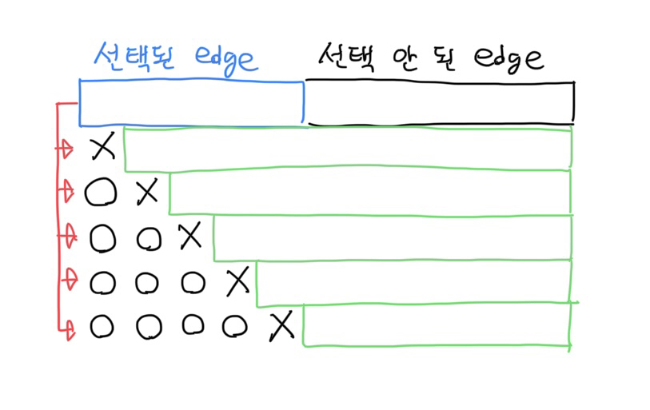
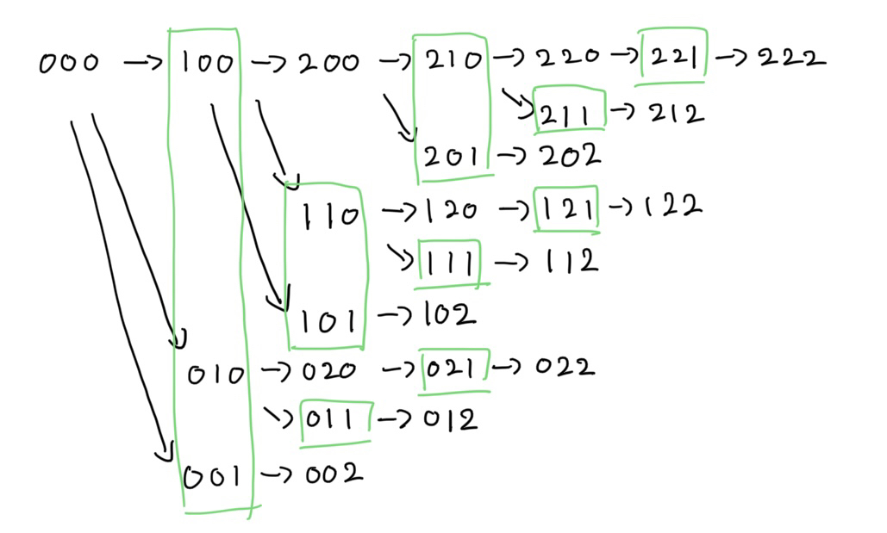
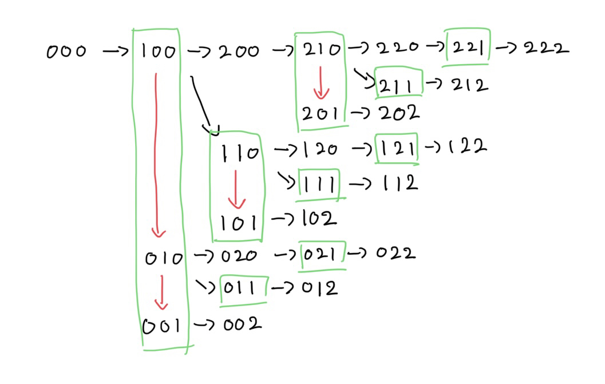
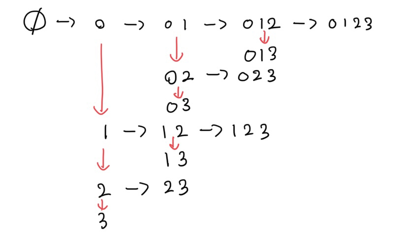

문제들 중에 **k번째**로 **작은/큰 값**을 구하는 경우가 있다. 이때 **Fracturing Search**를 쓰면 효율적으로 구할 수 있다.

-----

# Fracutring Search

문제에서 만들 수 있는 여러 **상태**들이 있고, 각 상태들은 **값**을 가지고 있다. 이때 다음 조건을 만족하는 **상태 트리**를 만들 수 있다.

1. 트리에서 **노드**에 대응되는 **모든 상태**들은 서로 **겹치지 않는다**.
2. **자식 노드**는 부모 노드보다 값이 **크거나 같다**.

이때 k번째 값은 **priority queue**를 이용하면 다음과 같이 빠르게 구할 수 있다.

1. 처음에 **가장 작은 값** 노드(상태)를 priority queue에 넣는다.
2. priority queue에서 노드를 꺼낸다.
3. 해당 노드의 **자식 노드**들을 priority queue에 넣는다.
4. k번째 값을 찾을때까지 2-4를 **반복**한다.

이러면 가장 작은 값부터 **차례대로** 구할 수 있다. 해당 노드의 자식 노드들을 넣으면 **남은 노드**들은 현재 priority queue에 있는 노드들보다 무조건 **크거나 같기** 때문이다.

결국 위의 **두 조건**을 만족하는 상태 트리를 잘 설계하는 것이 이 알고리즘의 핵심이다.

# K-th Smallest Spanning Tree

이름 그대로 **k번째 MST**를 구하면 된다.

일단 MST를 구하자. 그러면 n-1개의 간선들이 선택되었을 것이고, 이것은 **첫 번째 상태**가 된다.
이제 이 상태에서 다음 MST를 어떻게 구해야 할까? 선택된 간선들 중 **하나를 제외**하고 MST를 구하는 게 다음 MST라는 것을 생각할 수 있다.

> 트리에서 간선을 추가하면 무조건 **cycle**이 생기게 되는데, cycle 안에서 **현재 MST의 간선**을 **제거**해야만 현재 MST와는 **다른 MST**가 나오기 때문이다.

위의 그림처럼 파란색 영역이 선택된 간선일 때, 다음 상태는 **선택된 간선**들 중 **하나를 제외**하는 것이고, 이것을 priority queue에 넣으면 된다.
여기서 주의할 점은, 간선을 제외할 때 **앞에 있는 간선**을 무조건 MST에 **포함**되도록 **강제**해야 한다는 점이다. 이래야 상태 트리에서 노드들이 **중복되지 않기** 때문이다. 이러한 기법은 Fracturing Search를 할 때 자주 이용된다.
이렇게 강제/제외된 간선을 반영한 MST의 값을 구하고 priority queue에 넣으면 된다.

각 상태마다 MST를 구해야 하고, 자식의 개수는 선택된 간선의 개수\\( (N) \\)이므로, 시간복잡도는 \\( O(KN(logKN + M\alpha(N))) \\)이다. (상태 개수 * (priority queue 연산 + MST 연산))

# BOI 2019 - Olympiads (BOJ 17188)

[BOJ 링크](https://www.acmicpc.net/problem/17188)

위의 문제와 **거의 똑같이** 접근하면 된다. 가장 큰 점수를 가지는 참가자 그룹은 **각 event**마다 아직 안 고른 참가자들 중 **가장 큰 점수**를 가지는 참가자를 고르면 된다. 이렇게 고른 상태에서, **선택한 참가자**를 **하나씩 제외**한 상태를 넣으면 된다. 시간복잡도는 \\( O(CK(logCK + NK)) \\)이다.

[소스 코드](https://github.com/Cube219/PS/blob/main/BOJ/17000%7E18000/17188%20-%20Olympiads.cpp)

# USACO 2016 December - Robotic Cow Herd (BOJ 14166)

[BOJ 링크](https://www.acmicpc.net/problem/14166)

**가장 작은 상태**는 각 location에서 **가장 작은 model**을 선택하면 된다. 다음 상태는 **각 location별**로 **다음 model**을 선택한다. 이때 역시 중복을 막기 위해 현재 **i번째 location**의 model을 선택했다면 다음 선택은 **i번째 ~ n번째 location**을 선택한다. 하지만 이러면 시간복잡도는 \\( O(KNlog(KN)) \\)라서 \\( KN \\)때문에 시간 안에 나올수가 없다.

model의 개수가 각각 3, 3, 3개 있는 데이터의 상태 트리이다. 결국 문제는 **자식 노드의 개수**가 **최대 n개**가 된다는 점이다. 이때 **초록색 영역**을 살펴보면, 자식들이 나누어지는 경우는

1. 현재 **자기 location**의 **다음 model**을 선택
2. 자기 location을 고정하고 **다음 location ~ 마지막 location**의 다음 model **(0번째->1번째)** 을 선택 (초록색 영역)

이다. 여기서 **0번째->1번째 증가 비용**을 기준으로 location을 **정렬**하면, 2번 경우에서 **i+1번째 location만** 하고 나머지 상태는 나중으로 **미뤄도** 된다. 왜냐하면 정렬을 하면서 **i+1번째 location**을 선택한 상태가 그 **이후 location**을 선택한 상태 보다 비용이 **작거나 같기** 때문이다.

**빨간색**이 나중으로 미루는 경우이다. 이러면 자식으로 나누어지는 경우는

1. 현재 자기 location의 다음 model 선택
2. 자기 location을 고정하고 **다음 location의** 다음 model **(0번째->1번째)** 을 선택
3. 만약 자기 location의 **model**이 **1번째**라면 **0번째**로 바꾸고 **다음 location**의 다음 model **(0번째->1번째)** 을 선택 (빨간색)

자식의 개수는 **최대 3개**가 되고, 시간복잡도는 \\( O(NlogN + KlogK) \\)가 되어서 시간 내에 충분히 나온다.

[소스 코드](https://github.com/Cube219/PS/blob/main/BOJ/14000~15000/14166%20-%20Robotic%20Cow%20Herd(priority_queue).cpp)

# CCO 2020 - Shopping Plans (BOJ 19616)

[BOJ 링크](https://www.acmicpc.net/problem/19616)

위의 문제에 **여러 개**를 선택할 수 있고, **상/하한**까지 있는 상위호환 문제다. 일단 문제를 작은 것 부터 차례대로 풀어보자.

## 타입 1개에 상/하한 X

상/하한이 없다면 처음 상태는 당연히 **아무 것도 안 고른 상태**이다. 그다음 MST와는 반대로 무조건 **한 개의 값**을 **고르는** 방식으로 하면 된다. 물론 이전 값들은 고르지 않도록 고정해야 한다. 이러면 시간복잡도는 \\( O(NKlogNK) \\)고, 위에서 사용한 최적화를 적용하면 \\( O(NlogN + KlogK) \\)가 된다.

## 타입 1개에 상/하한 O

**상한**은 상태에 **고른 개수**를 **저장**하고 상한보다 크면 컷하는 방식으로 하면 된다.
문제는 **하한**인데, 하한이 있을 때 경우를 생각해보자. 하한이 3일 때, 가장 작은 상태는 (0, 1, 2)다. 그다음 상태는 (0, 1, **3**)이고, 그다음 상태는 (0, 1, **4**), (0, **2, 3**)... 이렇게 이어진다. 이것은 **base**로 (0, 1, 2)인 상태에서 **뒤에서부터 대체**하는 방식을 사용하면 된다. 시작을 3부터 시작하고, 만약 앞에 넣을 수 있으면 **앞에 넣는 상태**를 **추가**하면 된다.

> 앞에 넣는다는 의미는 넣는 값이 x일 때 **x-1**을 **x로 대체**하는 것이다. 예를 들어 base가 (0, 1, 2)이고 현재 대체 상태가 (3)이라고 하면, 다음 대체 상태로 (2, 3)이 될 수 있다. 이것은 적용하면 (0, **2, 3**)이 되고, 이는 1이 2로 대체된 것이다.

![5개 있고 상/하한이 [2, 4]일때 상태 트리](images/has-bound.png)

**파란색**이 앞에 넣는 상태이다. 잘 보면 현재 **크기**에 따라 **앞에 넣는 값**이 **같은 것**을 볼 수 있다. 구현할 때 주의할 점은 현재 상태가 **앞에 넣은 상태**라면 **빨간색**으로 넘어가지 **않아야** 한다.

## 타입 M개

이제 **각 타입별**로 **k번째로 작은 값**을 구할 수 있다. 이러면 위의 문제와 **동일**해지므로, 같은 방법으로 풀면 된다. 다만 각 타입별로 미리 c번째까지 구할 수 없기 때문에, 필요할 때마다 **동적**으로 구해야 한다. 로직상 타입별로 k번째는 **순서대로 접근**(0번째 -> 1번째 -> 2번째 -> ...)하게 된다.

총 시간복잡도는 \\( O(NlogN + KlogK) \\)이다.

[소스 코드](https://github.com/Cube219/PS/blob/main/BOJ/19000~20000/19616%20-%20Shopping%20Plans.cpp)

-----

# 참고 자료

<https://usaco.guide/adv/fracturing-search>

<https://koosaga.com/275>
