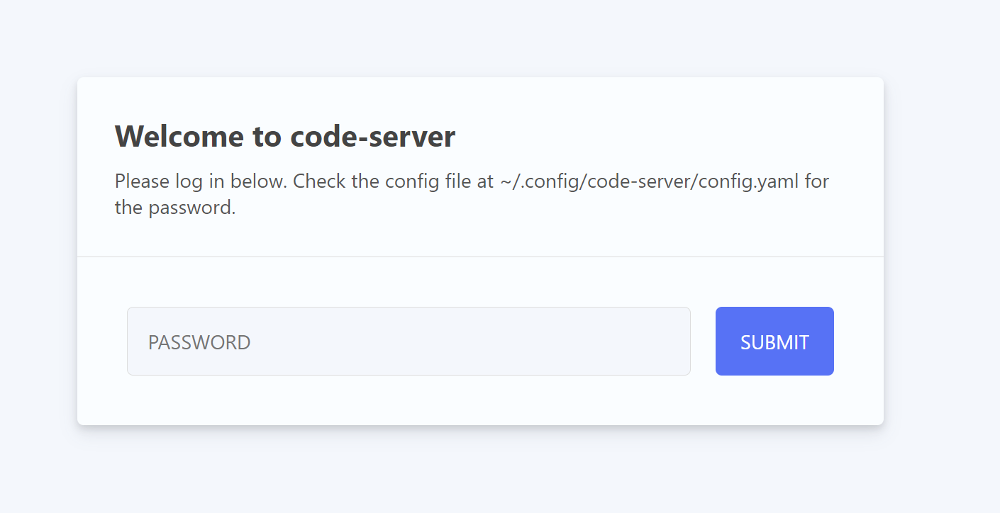
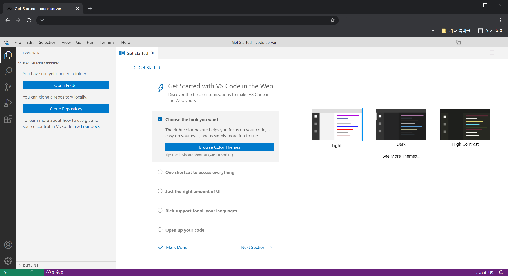
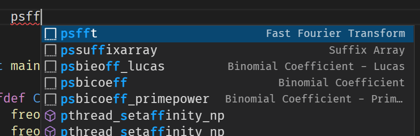
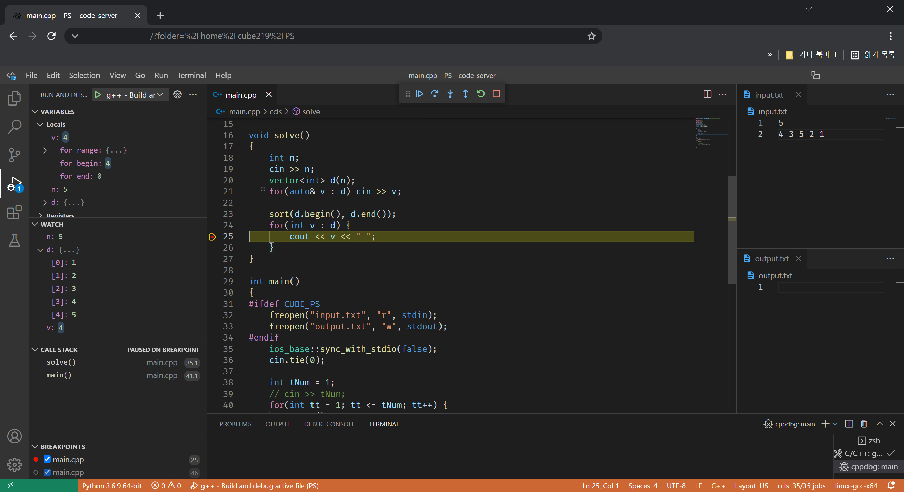
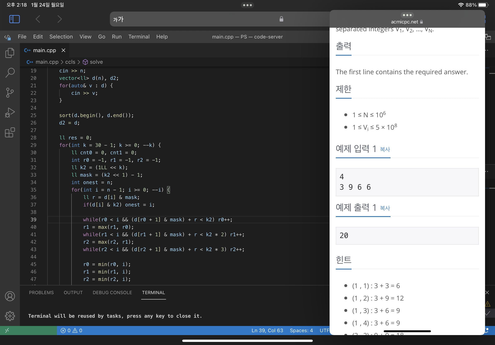
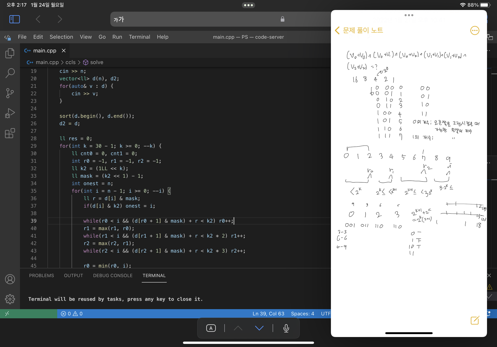

최근에 아이패드를 샀다. 여러가지 이유가 있지만, 그 중 하나는 **밖**에서도 **PS문제**들을 편하게 풀기 위해서다. 기존에는 카페나 기차같이 밖에서 코딩할 일이 있으면 노트북을 들고 갔는데, 지금 쓰는 노트북이 **게이밍 노트북**이라 어댑터까지 포함하면 **3kg**가 넘어서 가지고 다니기 힘들었다. 그래서 가볍게 들고다니면서 코딩할 수 있는 패드를 사기로 결심했다.

현재 노트북이 윈도우 환경이기 때문에, 가장 쉬운 방법은 **Microsoft Surface Pro**를 사는 것이다. 같은 윈도우 환경이라 그대로 똑같이 세팅하면 되기 때문이다. 하지만 Surface Pro 8은 아직 한국에 출시가 안 되었고, 그렇다고 이전 모델을 사기에는 8에서 너무 많이 바뀌어서 애매했다. 그리고 e-book, 동영상, 필기 등 다방면으로 활용하기에는 서피스는 조금 부족하다고 생각했다. 아이패드를 한 번 써보고 싶기도 했고...

아무튼 그래서 아이패드로 결정하고 구입했는데, 문제는 아이패드에는 코딩할 수 있는 앱이 **거의 없다**는 점이다. [Code App](https://apps.apple.com/kr/app/code-app/id1512938504#?platform=ipad)이라는 앱이 그나마 가장 나아보이는데, 유료고 확장성이 떨어진다고 생각해서 제외했다.
결국 **서버**를 올리고 **원격으로 코딩**하는 방안으로 결정했다. 여러 방법이 있지만, 그 중에서 [**code-server**](https://github.com/coder/code-server)라는 것을 이용했다.

-----

# code-server

[code-server](https://github.com/coder/code-server)는 쉽게 말해서 [Visual Studio Code](https://github.com/Microsoft/vscode)를 **서버**에 올리고 이것을 **웹에서 사용**하는 프로그램이다. 이 프로그램은 원래 [**Coder**](https://coder.com/)라는 플랫폼에서 VSCode만 오픈소스로 따로 공개한 것이다. **서버**에 **모든 에디터 설정**들이 있어서 언제 어디서나 **같은 환경**에서 개발할 수 있고, 부하가 심한 곳에 **리소스**를 **임시로 더 할당**할 수도 있다.
어차피 PS하는데 큰 리소스도 필요 없고, 기기가 바뀔때 마다 다시 설정할 필요도 없어져서 이것을 이용했다.

## 설치

[github repo](https://github.com/coder/code-server)에 가면 설치방법이 나와있다. 가장 간단한 방법은

```bash
curl -fsSL https://code-server.dev/install.sh | sh
```

하면 자동으로 설치가 된다.

## 설정과 실행

설치를 완료하면 `~/.local/share/code-server`에 code-server 관련 파일이, `~/.config/code-server/config.yaml`에 **설정 파일**이 있다. 설정 파일을 열어보면

```yaml
bind-addr: 127.0.0.1:8080
auth: password
password: $PASSWORD$
cert: false
```

이렇게 있을 것이다. 여기서 접속할 **주소/포트**와 **비밀번호**를 설정 가능하다.

### nginx로 안전하게 연결하기
설정을 저장하고 `code-server`나 `sudo systemctl start code-server@user_name`를 입력하면 실행이 가능하나, 이렇게 바로 서버를 여는 것은 위험하다. 특히나 code-server는 접속하면 바로 터미널에 접근 가능하기 때문에 더 위험하다. 따라서 ssh나 https 같은 **안전한 프로토콜**을 거쳐서 열어야 한다. 자세한 내용은 [code-server usage](https://coder.com/docs/code-server/latest/guide)에서 확인 가능하다. 여기서는 **nginx**를 이용한다.

```nginx
server {
        listen 80;
        server_name your.domain.name;
        return 301 https://your.domain.name$request_uri;
}

server {
        listen 443 ssl http2;
        server_name your.domain.name;
        autoindex off;

        ssl_certificate /etc/letsencrypt/live/your.domain.name/fullchain.pem;
        ssl_certificate_key /etc/letsencrypt/live/your.domain.name/privkey.pem;


        location / {
                proxy_pass http://127.0.0.1:8080;
                proxy_set_header Host $host;
                proxy_set_header Upgrade $http_upgrade;
                proxy_set_header Connection upgrade;
                proxy_set_header Accept-Encoding gzip;
        }
}
```

nginx설정은 간단히 말하면 **127.0.0.1:8080**으로 **reverse-proxy**를 연결하는 것이다. 여기에 추가로 4개의 header를 넘겨주면 된다.



접속해보면 로그인 화면이 뜨는데, 아까 설정한 비밀번호를 넣어서 접속하면 된다.



비밀번호를 입력하면 웹 페이지에 VSCode 화면이 나오게 된다.

# Problem Solving을 위한 셋팅

이제 기존에 쓰던 환경대로 셋팅을 하면 된다. 다만 확장 프로그램을 설치하려고 검색을 해보면 확장 프로그램 수가 많이 적은 것을 알 수 있다. 이것은 code-server가 [Visual Studio MarketPlace](https://marketplace.visualstudio.com/vscode)를 쓰는 것이 아니라 [**Open VSX**](https://open-vsx.org/)를 쓰기 때문이다.
> VSCode는 **소스 코드**는 [MIT Licence](https://github.com/microsoft/vscode/blob/main/LICENSE.txt)지만, Microsoft에서 받을 수 있는 **VSCode 설치 파일**은 [MS 자체 라이센스](https://code.visualstudio.com/License/)다. 그리고 Visual Studio MarketPlace는 이렇게 **MS에서 직접 빌드**한 VSCode**만 사용할 수 있도록** [약관](https://cdn.vsassets.io/v/M146_20190123.39/_content/Microsoft-Visual-Studio-Marketplace-Terms-of-Use.pdf)에 명시되어 있다. 그래서 VSCode로부터 파생된 다른 소프트웨어들은 다른 마켓 플레이스를 이용할 수 밖에 없다.

> 참고 링크
> - [Why can't code-server use Microsoft's extension marketplace?](https://github.com/coder/code-server/blob/main/docs/FAQ.md#why-cant-code-server-use-microsofts-extension-marketplace)
> - [Differences between the repository and Visual Studio Code](https://github.com/microsoft/vscode/wiki/Differences-between-the-repository-and-Visual-Studio-Code)

## ccls

자동완성, 네비게이션, 구문 하이라이팅 등 에디터를 좀 더 편하게 사용하기 위해서는 [**language server**](https://langserver.org/)가 필요하다. C++ language server로는 [**ccls**](https://github.com/MaskRay/ccls)를 이용했다. ccls는 Open VSX에 있기 때문에 바로 설치하면 된다. 다만 확장 프로그램은 ccls하고 VSCode하고 연결하는 프로그램이라 ccls는 **따로 설치**해야 한다. 빌드와 설치 방법은 [ccls repo](https://github.com/MaskRay/ccls/wiki)를 참조.

PS를 하면서 매크로를 따로 선언하는 경우가 있는데 (Debug용, freopen...), 이때 ccls에도 반영하게 하려면 설정에서

```json
"ccls.clang.extraArgs": ["-DDEBUG", "-DCUBE_PS"]
```

를 추가하면 된다.

## Code Snippet

PS를 하면서 미리 작성해둔 코드를 사용하는 경우가 많은데, VSCode 자체 기능인 [**Snippet**](https://code.visualstudio.com/docs/editor/userdefinedsnippets)기능을 이용하면 편리하다.

`File -> Preferences -> User Snippets`를 누르면 새로운 snippet을 생성 가능하다.

```json
"Fast Fourier Transform" : {
    "scope": "cpp",
    "prefix": "psfft",
    "body" : [
        "struct FFT",
        "{",
        "   ...",
        "};"
    ]
},
```

이런 식으로 snippet을 추가하면 된다. 특이한 점은 body부분이 **각 줄**마다 **문자열**로 넣어야 한다는 점이다. 이게 귀찮아서 본인은 각 줄마다 ""를 넣는 python 프로그램을 만들어서 변환해 넣었다.



prefix로 지정한 문자를 입력하면 잘 나오는 것을 볼 수 있다.

## 실행/디버깅

가장 간단한 방법은 vscode-cpptools를 이용하는 것 이지만, runtime licencse가 오픈 소스가 아니라서 VSX Open에 있지 않다. 아마 Windows에서 쓰는 빌드 툴이 오픈 소스가 아니라서 그런 것 같다. 그래서 수동으로 .visx를 받아서 설치했다.
> code-server가 Linux에서 돌아가기 때문에 빌드나 디버그를 gcc/gdb를 사용해서 가능한 것 같다. 아마 Windows에서는 이 방식이 불가능 할 것이다.



Chrome에서 돌아가는 모습이다. 아직 아이패드가 안 와서 아이패드에서는 확인을 못 했으나, 지인의 갤럭시 탭에서 돌아가는 것을 확인해서 아마 아이패드에서도 잘 돌아갈 것이다.

-----

( + 2022-01-24 추가)

아이패드가 와서 아이패드에서 돌려보았다.




위 사진처럼 옆에다가 노트나 문제를 띄우고 사용하고 있다. 잘 작동하는데 몇 가지 불편한 점들이 있었다.

- 왜 Safari에서는 설치한 **글꼴**이 반영이 안 되는지 모르겠다. 그래서 기본 글꼴 중 괜찮은 글꼴을 찾아서 바꿨다.
- **단축키**가 macOS 기반으로 바뀌는데, 이게 Windows랑은 미묘하게 달라서 적응이 잘 안된다.
- ~~위에 주소창을 숨기는 전체화면 모드는 없는건가? 찾아봤는데 딱히 찾을 수 없었다.~~
  - **공유** 버튼을 누르고 **홈 화면에 추가**를 하면 전체화면으로 열린다.
- 마우스가 없다보니 **터치**를 해야하는데 이게 생각보다 불편하다. 특히 창을 드래그해서 이동시키는 방법을 모르겠다. 그렇다고 트랙패드가 달린 매직키보드를 사기에는 너무 비싸다.

그래도 사용하는데 큰 지장은 없고, 전에 쓰던 게이밍 노트북보다 훨씬 가볍고 배터리도 오래가서 상당히 만족한다.
